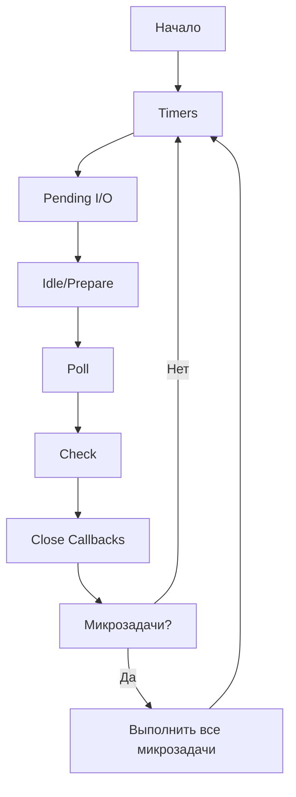
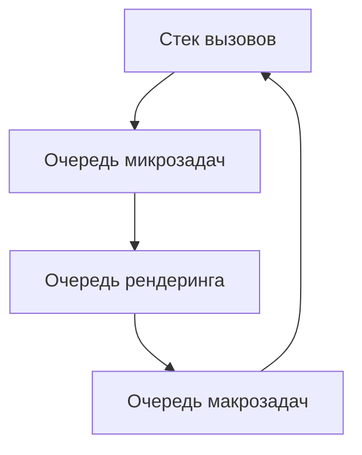

##### переменные/ let/const/var
https://doka.guide/js/var-let/
https://learn.javascript.ru/variables#itogo
https://learn.javascript.ru/var

###### **1. Область видимости (Scope)**
|           | `var`                  | `let`/`const`          |
|-----------|------------------------|------------------------|
| **Область** | Function-scoped       | Block-scoped          |
| **Доступ** | Видна во всей функции | Только внутри блока `{}` |

**Пример:**
```javascript
function test() {
  if (true) {
    var a = 1;    // Видна во всей функции
    let b = 2;    // Только внутри if
    const c = 3;  // Только внутри if
  }
  console.log(a); // 1
  console.log(b); // Ошибка: b is not defined
}
```

---

###### **2. Поднятие (Hoisting)**
|           | `var`                  | `let`/`const`          |
|-----------|------------------------|------------------------|
| **Поднятие** | Да (с `undefined`)    | Да (но в "TDZ")       |
| **TDZ**   | Нет                    | Есть (временная мёртвая зона) |

**Пример:**
```javascript
console.log(x); // undefined (var поднято)
var x = 10;

console.log(y); // Ошибка: Cannot access 'y' before initialization
let y = 20;
```

---

###### **3. Переопределение и обновление**
|           | `var`       | `let`       | `const`     |
|-----------|-------------|-------------|-------------|
| **Переопределение** | Можно      | Можно       | Нельзя      |
| **Обновление**   | Можно      | Можно       | Можно*      |

**Пример:**
```javascript
var name = "John";
var name = "Anna"; // OK

let age = 30;
let age = 40; // Ошибка: Identifier 'age' already declared

const pi = 3.14;
pi = 3.1415; // Ошибка: Assignment to constant variable
```
> *`const` запрещает переприсваивание, но можно менять свойства объектов/массивов:
> ```javascript
> const user = { name: "John" };
> user.name = "Anna"; // OK
> ```

---

###### **4. Глобальная видимость**
При объявлении в глобальной области:
- `var` создаёт свойство в `window` (браузер).
- `let`/`const` не добавляются в `window`.

**Пример:**
```javascript
var globalVar = "I'm global";
let globalLet = "I'm global too";

console.log(window.globalVar); // "I'm global"
console.log(window.globalLet); // undefined
```

---

###### **Когда что использовать?**
1. **`const`** – по умолчанию для всех переменных, которые не нужно переопределять.
2. **`let`** – если переменная будет изменяться (счётчики, условия в циклах).
3. **`var`** – почти никогда (устаревший вариант, есть только для обратной совместимости).

**Примеры:**
```javascript
// Хороший стиль:
const API_URL = "https://api.example.com"; // Константа
let isLoading = true;                      // Флаг, который будет меняться

// Плохой стиль:
var counter = 0;                          // Устаревший синтаксис
```

---

###### **Сводная таблица**
| Характеристика       | `var`            | `let`            | `const`          |
|----------------------|------------------|------------------|------------------|
| **Область видимости** | Function-scoped  | Block-scoped     | Block-scoped     |
| **Поднятие**         | Да (с undefined) | Да (в TDZ)       | Да (в TDZ)       |
| **Переопределение**  | Да               | Нет              | Нет              |
| **Изменение значения** | Да              | Да               | Нет*             |
| **Глобальная видимость** | Добавляет в `window` | Не добавляет в `window` | Не добавляет в `window` |

> *Для объектов/массивов, объявленных через `const`, можно менять внутренние свойства.

---

###### **Почему `var` устарел?**
1. **Неочевидная область видимости** (видна во всей функции, а не только в блоке).
2. **Поднятие** может приводить к неожиданным ошибкам.
3. **Загрязнение глобального объекта** (`window` в браузерах).

**Плохой пример с `var`:**
```javascript
for (var i = 0; i < 3; i++) {
  setTimeout(() => console.log(i), 100); // Выведет 3, 3, 3 (из-за function-scoped)
}
// С let выведет 0, 1, 2
```

---

###### **Итог**
- Всегда начинайте с `const`.  
- Используйте `let`, если переменная будет меняться.  
- Избегайте `var` в современном коде.  
- Для объектов/массивов, которые нужно защитить от изменений, используйте `Object.freeze()`:
  ```javascript
  const immutableObj = Object.freeze({ key: 'value' });
  immutableObj.key = 'new'; // Не изменится (в strict mode — ошибка)
  ```

##### **TDZ (Temporal Dead Zone, Временная мёртвая зона)**  

**TDZ** — это период времени, когда переменные `let` и `const` уже существуют в области видимости (благодаря **поднятию**, Hoisting), но к ним **нельзя обратиться** до их объявления.  

---

###### **Как работает TDZ?**
1. **Объявление `let`/`const` поднимается (hoisting)** в начало своей области видимости (блока `{}`).  
2. Но переменная остаётся в **TDZ** до момента её **инициализации** (присваивания значения).  
3. При попытке доступа к переменной в TDZ — **ошибка `ReferenceError`**.  

---

###### 1. Простой пример
```javascript
console.log(x); // ReferenceError: Cannot access 'x' before initialization
let x = 10;
```
- Переменная `x` **поднята**, но находится в TDZ до строки `let x = 10`.  

###### 2. Внутри блока `{}`
```javascript
{
  console.log(y); // ReferenceError: y is not defined
  let y = 20;
}
```
- `y` существует только внутри блока, но до объявления — TDZ.  

###### 3. В цикле
```javascript
for (let i = 0; i < 3; i++) {
  console.log(i); // 0, 1, 2 (нет TDZ, так как i уже инициализирована)
}
```
- В отличие от `var`, `let` в цикле **не выходит за его пределы**.  

---

###### **Чем TDZ отличается от `var`?**
| Особенность      | `var`                          | `let`/`const` (TDZ)          |
|------------------|--------------------------------|-----------------------------|
| **Поднятие**     | Да, с `undefined`              | Да, но нельзя использовать  |
| **Область**      | Function-scoped                | Block-scoped                |
| **Доступ до объявления** | `undefined`            | **Ошибка `ReferenceError`** |

**Пример:**
```javascript
console.log(a); // undefined (var поднят)
var a = 5;

console.log(b); // ReferenceError (let в TDZ)
let b = 10;
```

---

###### **Почему TDZ существует?**
1. **Предотвращение ошибок** — нельзя использовать переменную до её объявления.  
2. **Улучшение отладки** — явная ошибка лучше, чем неожиданное `undefined`.  
3. **Строгая блоковая область видимости** — `let`/`const` ведут себя предсказуемо.  

---

###### **Как избежать TDZ?**
1. **Всегда объявляйте переменные в начале блока**:
   ```javascript
   let x = 10; // Инициализация перед использованием
   console.log(x); // 10
   ```
2. **Не используйте `var`** — он не имеет TDZ, но приводит к путанице.  
3. **Для `const` — всегда задавайте начальное значение**:
   ```javascript
   const PI = 3.14; // Без TDZ, т.к. сразу инициализирована
   ```

---

###### **Примеры, где TDZ важен**
###### 1. В функциях
```javascript
function run() {
  console.log(value); // ReferenceError (TDZ)
  let value = "Hello";
}
run();
```

###### 2. В блоках `if`/`for`
```javascript
if (true) {
  console.log(tmp); // ReferenceError (TDZ)
  let tmp = 123;
}
```

---

###### **Вывод**
- **TDZ** — это механизм, который делает `let`/`const` безопаснее `var`.  
- **Всегда инициализируйте переменные до использования**, чтобы избежать ошибок.  
- **`const` должен иметь значение сразу**, `let` — лучше объявлять заранее.  

**Итоговая таблица:**  

| Особенность         | `var`            | `let`        | `const`      |
| ------------------- | ---------------- | ------------ | ------------ |
| **Поднятие**        | Да (`undefined`) | Да (TDZ)     | Да (TDZ)     |
| **Область**         | Function-scoped  | Block-scoped | Block-scoped |
| **TDZ**             | Нет              | Да           | Да           |
| **Переопределение** | Да               | Нет          | Нет          |
##### В чём разница между `null`, `undefined` и объявленной переменной без начального значения? (`let foo;`)

`null` задаётся переменной явно и означает, что она является объектом, но структура этого объекта ещё не определена. `undefined` присваивается переменной (переменная не декларирует объект), когда она была объявлена, но не было определено её начальное значение. Функция может возвращать `undefined` или `null`. Всё зависит от того, что мы ожидаем в результате работы функции. Если мы ожидаем объект, но по каким-то причинам функция его вернуть не может, то возвращаем `null`. Если функция должна вернуть, например, число (главное, не объект), но не может этого сделать, то она возвращает `undefined`.

Без начального значения можно оставлять только переменную, объявленную через `let` или `var`. Если объявить переменную через `const` и не задать ей начального значения, будет ошибка: `Uncaught SyntaxError: Missing initializer in const declaration`.

Поговорим немного о [приведении типов](https://doka.guide/js/typecasting/). Для начала, пример:

```js

console.log(null + null); // 0
console.log(undefined + undefined); // NaN

```

Почему так?

По [спецификации EcmaScript](https://262.ecma-international.org/7.0/#sec-tonumber)

- `null` во время сложения приводится к нулю;
- `undefined` во время сложения приводится к `NaN`. `NaN` это аббревиатура от "not a number" — не число. Результат арифметической операции равен `NaN`, если во время операции произошла ошибка и ожидаемый числовой результат не может быть выражен числом.

Есть ещё один хитрый пример:

```js

console.log(null + []); // "null"

```

Почему так?

Подсказка, почему так, кроется именно в типе результате: "null" — строка. А не примитивное значение `null`.

JavaScript сначала приводит массив к примитивному значению. Для этого вызывается метод `toString()`, который вызывает метод `join()`. Т.к. массив пустой, то `join()` вернёт пустую строку `""`. А сложение чего-то со строкой в JS возвращает строку. Поэтому `null` уже никуда не приводится, а возращается строка `"null"`.

Немного упомяну и про оператор нулевого слияния (`??`). В выражении между двумя операндами он будет возвращать первый операнд, если он не равен `null` или `undefined`. Можно сказать, что `??` приравнивает смысл `undefined` и `null` к «ничего не содержит», и, в этом случае, кладёт в переменную значение второго операнда.
##### **Замыкания (Closures) в JavaScript**
https://ru.wikipedia.org/wiki/%D0%97%D0%B0%D0%BC%D1%8B%D0%BA%D0%B0%D0%BD%D0%B8%D0%B5_(%D0%BF%D1%80%D0%BE%D0%B3%D1%80%D0%B0%D0%BC%D0%BC%D0%B8%D1%80%D0%BE%D0%B2%D0%B0%D0%BD%D0%B8%D0%B5)
https://learn.javascript.ru/closure
https://developer.mozilla.org/ru/docs/Web/JavaScript/Guide/Closures

Замыкание — это комбинация **функции** и **лексического окружения**, в котором эта функция была объявлена. Оно позволяет функции **запоминать и получать доступ** к переменным из внешней (родительской) области видимости, даже после того, как родительская функция завершила выполнение.

###### 🔹 **Как работают замыкания?**
1. **Функция внутри функции**  
   Внутренняя функция "запоминает" (имеет доступ к) переменные внешней функции.

2. **Сохранение состояния**  
   Даже после завершения внешней функции, её переменные остаются доступными для внутренней.

---

###### 🔹 **Пример замыкания**
```javascript
function outer() {
  let count = 0; // Локальная переменная внешней функции

  function inner() {
    count++; // Внутренняя функция использует переменную из внешней
    console.log(count);
  }

  return inner; // Возвращаем inner (но не вызываем её!)
}

const counter = outer(); // counter = функция inner + запомненное окружение (count)

counter(); // 1 (count = 0 + 1)
counter(); // 2 (count = 1 + 1)
counter(); // 3 (count = 2 + 1)
```

###### **Что произошло?**
1. `outer()` вызывается и возвращает `inner`.  
2. Переменная `count` **не уничтожается**, потому что `inner` сохраняет ссылку на неё.  
3. Каждый вызов `counter()` изменяет **одну и ту же `count`**.

---

###### 🔹 **Где применяются замыкания?**
###### **1. Создание приватных переменных**
```javascript
function createCounter() {
  let value = 0; // "Приватная" переменная

  return {
    increment() { value++; },
    decrement() { value--; },
    getValue() { return value; }
  };
}

const counter = createCounter();
counter.increment();
console.log(counter.getValue()); // 1
console.log(counter.value); // undefined (нельзя получить напрямую)
```
- `value` нельзя изменить извне, только через методы.

###### **2. Каррирование (частичное применение функций)**
```javascript
function multiply(a) {
  return function(b) {
    return a * b;
  };
}

const double = multiply(2);
console.log(double(5)); // 10 (2 * 5)
```

###### **3. Мемоизация (кэширование результатов)**
```javascript
function memoizedAdd() {
  const cache = {}; // Замыкание сохраняет cache между вызовами

  return function(n) {
    if (n in cache) {
      console.log("Из кэша:", cache[n]);
      return cache[n];
    } else {
      console.log("Вычисление...");
      cache[n] = n + 10;
      return cache[n];
    }
  };
}

const add = memoizedAdd();
console.log(add(5)); // Вычисление... 15
console.log(add(5)); // Из кэша: 15
```

---

###### 🔹 **Как избежать утечек памяти?**
Замыкания сохраняют ссылки на внешние переменные, что может приводить к утечкам памяти, если:
- Объект больше не нужен, но функция внутри замыкания держит ссылку на него.

**Решение:**  
- Явно обнулять ссылки (`someVar = null`).  
- Использовать **WeakMap** или **WeakSet**, если нужно хранить объекты.

---

###### 🔹 **Итог**
✅ **Замыкания** позволяют функциям запоминать внешние переменные.  
✅ Полезны для **приватных данных**, **каррирования**, **мемоизации**.  
⚠️ Могут вызывать **утечки памяти**, если неаккуратно использовать.  

**Пример на практике:**
```javascript
function createTimer() {
  let startTime = Date.now();

  return function() {
    return Date.now() - startTime;
  };
}

const getElapsedTime = createTimer();
setTimeout(() => console.log(getElapsedTime()), 1000); // ~1000 мс
```


[Замыкание](https://ru.wikipedia.org/wiki/%D0%97%D0%B0%D0%BC%D1%8B%D0%BA%D0%B0%D0%BD%D0%B8%D0%B5_\(%D0%BF%D1%80%D0%BE%D0%B3%D1%80%D0%B0%D0%BC%D0%BC%D0%B8%D1%80%D0%BE%D0%B2%D0%B0%D0%BD%D0%B8%D0%B5\)) – это функция, которая запоминает свои внешние переменные и может получить к ним доступ. В некоторых языках это невозможно, или функция должна быть написана специальным образом, чтобы получилось замыкание. Но, как было описано выше, в JavaScript, все функции изначально являются замыканиями (есть только одно исключение, про которое будет рассказано в [Синтаксис "new Function"](https://learn.javascript.ru/new-function)).

То есть они автоматически запоминают, где были созданы, с помощью скрытого свойства `[[Environment]]`, и все они могут получить доступ к внешним переменным.

Когда на собеседовании фронтенд-разработчику задают вопрос: «что такое замыкание?», – правильным ответом будет определение замыкания и объяснения того факта, что все функции в JavaScript являются замыканиями, и, может быть, несколько слов о технических деталях: свойстве `[[Environment]]` и о том, как работает лексическое окружение.

Замыкание — это комбинация функции и лексического окружения, в котором эта функция была определена. Другими словами, замыкание даёт вам доступ к [Scope](https://developer.mozilla.org/en-US/docs/Glossary/Scope) внешней функции из внутренней функции. В JavaScript замыкания создаются каждый раз при создании функции, во время её создания.
##### рекурсия
https://learn.javascript.ru/recursion
https://doka.guide/js/recursion/

Рекурсия — это процесс, когда **функция вызывает саму себя** до тех пор, пока не достигнет **базового случая** (условия выхода). Это мощный инструмент для решения задач, которые можно разбить на более мелкие подзадачи того же типа.

###### 🔹 **Как работает рекурсия?**
1. **Рекурсивный случай** — функция вызывает саму себя с изменёнными аргументами.
2. **Базовый случай** — условие, при котором рекурсия останавливается.

###### 🔥 **Простой пример: Факториал**
```javascript
function factorial(n) {
  if (n === 1) return 1; // Базовый случай
  return n * factorial(n - 1); // Рекурсивный вызов
}

console.log(factorial(5)); // 120 (5! = 5 * 4 * 3 * 2 * 1)
```

###### **Что происходит?**
1. `factorial(5)` → `5 * factorial(4)`
2. `factorial(4)` → `4 * factorial(3)`
3. `factorial(3)` → `3 * factorial(2)`
4. `factorial(2)` → `2 * factorial(1)`
5. `factorial(1)` → `1` (базовый случай, рекурсия останавливается)

---

###### 🔹 **Где применяется рекурсия?**
###### **1. Обход древовидных структур (DOM, JSON)**
```javascript
function traverseDOM(node) {
  console.log(node.tagName); // Выводим текущий элемент
  for (const child of node.children) {
    traverseDOM(child); // Рекурсивно обходим детей
  }
}

traverseDOM(document.body); // Обход всего DOM
```

###### **2. Алгоритмы (быстрая сортировка, бинарный поиск)**
```javascript
function binarySearch(arr, target, left = 0, right = arr.length - 1) {
  if (left > right) return -1; // Базовый случай: элемент не найден
  
  const mid = Math.floor((left + right) / 2);
  
  if (arr[mid] === target) return mid; // Нашли элемент
  if (arr[mid] < target) return binarySearch(arr, target, mid + 1, right);
  return binarySearch(arr, target, left, mid - 1);
}

const arr = [1, 3, 5, 7, 9];
console.log(binarySearch(arr, 5)); // 2 (индекс элемента)
```

###### **3. Генерация последовательностей (числа Фибоначчи)**
```javascript
function fibonacci(n) {
  if (n <= 1) return n; // Базовый случай
  return fibonacci(n - 1) + fibonacci(n - 2);
}

console.log(fibonacci(6)); // 8 (0, 1, 1, 2, 3, 5, 8)
```

---

###### 🔹 **Проблемы рекурсии и как их избежать**
###### **1. Переполнение стека (Stack Overflow)**
Если рекурсия слишком глубокая, JavaScript выдаст ошибку:
```javascript
function infiniteRecursion() {
  infiniteRecursion(); // Бесконечный вызов → RangeError
}
```

**Решение:**  
- Использовать **хвостовую рекурсию** (если движок её поддерживает).  
- Переписать алгоритм **итеративно** (через циклы).

###### **2. Медленная работа (например, Фибоначчи)**
Рекурсивный Фибоначчи без оптимизации работает за **O(2ⁿ)**.

**Решение:** **Мемоизация** (кэширование результатов).  
```javascript
const memo = {};

function fibonacciMemo(n) {
  if (n <= 1) return n;
  if (memo[n]) return memo[n]; // Возвращаем кэшированный результат
  
  memo[n] = fibonacciMemo(n - 1) + fibonacciMemo(n - 2);
  return memo[n];
}

console.log(fibonacciMemo(50)); // Быстро, даже для больших n
```

---

###### 🔹 **Рекурсия vs Итерация**
| Критерий          | Рекурсия                  | Итерация (циклы)          |
|-------------------|---------------------------|---------------------------|
| **Читаемость**    | Выше (для некоторых задач)| Ниже                      |
| **Производительность** | Может быть медленнее | Обычно быстрее            |
| **Использование памяти** | Заполняет стек вызовов | Использует меньше памяти  |
| **Где применять** | Деревья, вложенные структуры | Простые линейные задачи |

---

###### 🔹 **Итог**
✅ **Рекурсия** полезна для задач с **вложенной структурой** (деревья, графы).  
⚠️ **Без базового случая** приводит к **бесконечной рекурсии**.  
🚀 **Оптимизация:** мемоизация, хвостовая рекурсия, итеративные решения.  

**Пример хвостовой рекурсии (ES6):**
```javascript
function factorialTail(n, acc = 1) {
  if (n === 1) return acc;
  return factorialTail(n - 1, n * acc); // Хвостовой вызов (оптимизируется в некоторых движках)
}
```

##### this
https://doka.guide/js/function-context/
https://developer.mozilla.org/en-US/docs/Web/JavaScript/Reference/Operators/this
https://learn.javascript.ru/object-methods
https://habr.com/ru/companies/ruvds/articles/419371/
https://docs.google.com/presentation/d/1LDJMSHmTkrYYdXQCinUIAQ9BMV2jIrctHhMfGSJDlXQ/edit?slide=id.g23ce763670e_0_2#slide=id.g23ce763670e_0_2


##### event loop
https://habr.com/ru/articles/762618/
https://developer.mozilla.org/en-US/docs/Web/JavaScript/Reference/Execution_model
https://habr.com/ru/companies/otus/articles/801249/
https://www.youtube.com/watch?v=eiC58R16hb8

##### методы массивов
https://learn.javascript.ru/array-methods
https://habr.com/ru/companies/plarium/articles/483958/
https://doka.guide/js/arrays/
##### **Промисы (Promises) в JavaScript**
https://developer.mozilla.org/en-US/docs/Web/JavaScript/Reference/Global_Objects/Promise
https://doka.guide/js/promise/
https://learn.javascript.ru/promise-basics
Промисы — это объекты, представляющие результат **асинхронной операции** (например, запроса к серверу, чтения файла, таймера). Они позволяют удобно работать с асинхронным кодом, избегая "ада колбэков" (callback hell).

---

###### **1. Состояния промиса**
У промиса есть 3 возможных состояния:
1. **`pending`** (ожидание) — начальное состояние, операция не завершена.
2. **`fulfilled`** (выполнено) — операция успешно завершена.
3. **`rejected`** (отклонено) — операция завершилась с ошибкой.

```javascript
const promise = new Promise((resolve, reject) => {
    if (/* успех */) {
        resolve("Успех!"); // переводит в fulfilled
    } else {
        reject("Ошибка!"); // переводит в rejected
    }
});
```

---

###### **2. Обработка результатов**
###### **`.then()` — обработка успешного выполнения**
```javascript
promise.then(
    (result) => console.log(result), // сработает при resolve
    (error) => console.error(error)  // сработает при reject (необязательно)
);
```
###### **`.catch()` — обработка ошибок**
```javascript
promise
    .then((result) => console.log(result))
    .catch((error) => console.error(error)); // ловит reject и ошибки в then
```
###### **`.finally()` — выполнится в любом случае**
```javascript
promise
    .then((result) => console.log(result))
    .catch((error) => console.error(error))
    .finally(() => console.log("Завершено!"));
```

---

###### **3. Цепочки промисов**
Позволяют последовательно выполнять асинхронные операции:
```javascript
fetch("https://api.example.com/data")
    .then((response) => response.json())
    .then((data) => console.log(data))
    .catch((error) => console.error(error));
```
- Если в любом `then` произойдёт ошибка или `reject`, управление перейдёт к ближайшему `catch`.

---

###### **4. Статические методы**
###### **`Promise.resolve()` — создаёт успешный промис**
```javascript
Promise.resolve(42).then((val) => console.log(val)); // 42
```
###### **`Promise.reject()` — создаёт отклонённый промис**
```javascript
Promise.reject("Error").catch((err) => console.log(err)); // Error
```
###### **`Promise.all()` — ждёт выполнения всех промисов**
```javascript
Promise.all([promise1, promise2, promise3])
    .then((results) => console.log(results)) // массив результатов
    .catch((error) => console.error(error)); // если хотя бы один упадёт
```
###### **`Promise.race()` — возвращает первый завершённый промис**
```javascript
Promise.race([promise1, promise2])
    .then((result) => console.log(result)); // результат первого выполнившегося
```

---

###### **5. Async/Await — синтаксический сахар для промисов**
- **`async`** делает функцию асинхронной (она всегда возвращает промис).
- **`await`** ждёт выполнения промиса (работает только внутри `async`).

```javascript
async function fetchData() {
    try {
        const response = await fetch("https://api.example.com/data");
        const data = await response.json();
        console.log(data);
    } catch (error) {
        console.error(error);
    }
}
fetchData();
```

---

###### **6. Примеры**
###### **Пример 1: Таймер с промисом**
```javascript
function delay(ms) {
    return new Promise((resolve) => setTimeout(resolve, ms));
}

delay(2000).then(() => console.log("Прошло 2 секунды!"));
```
###### **Пример 2: Загрузка данных с `fetch`**
```javascript
fetch("https://jsonplaceholder.typicode.com/todos/1")
    .then((response) => response.json())
    .then((data) => console.log(data))
    .catch((error) => console.error("Ошибка:", error));
```

---

###### **7. Зачем нужны промисы?**
- Избегают **callback hell** (вложенных колбэков).
- Упрощают обработку ошибок через `.catch()`.
- Позволяют писать линейный код с `async/await`.
- Поддерживают **цепочки вызовов** (`then().then().catch()`).

---

###### **Вывод**
Промисы — это мощный инструмент для работы с асинхронностью в JavaScript. Они делают код чище и удобнее, особенно в сочетании с `async/await`. 🚀
##### статические методы Promise
https://learn.javascript.ru/promise-api

###### Promise API

В классе `Promise` есть 6 статических методов. Давайте познакомимся с ними.

###### Promise.all

Допустим, нам нужно запустить множество промисов параллельно и дождаться, пока все они выполнятся.

Например, параллельно загрузить несколько файлов и обработать результат, когда он готов.

Для этого как раз и пригодится `Promise.all`.

Синтаксис:

```js
let promise = Promise.all(iterable);
```

Метод `Promise.all` принимает массив промисов (может принимать любой перебираемый объект, но обычно используется массив) и возвращает новый промис.

Новый промис завершится, когда завершится весь переданный список промисов, и его результатом будет массив их результатов.

Например, `Promise.all`, представленный ниже, выполнится спустя 3 секунды, его результатом будет массив `[1, 2, 3]`:

```js run
Promise.all([
  new Promise(resolve => setTimeout(() => resolve(1), 3000)), // 1
  new Promise(resolve => setTimeout(() => resolve(2), 2000)), // 2
  new Promise(resolve => setTimeout(() => resolve(3), 1000))  // 3
]).then(alert); // когда все промисы выполнятся, результат будет 1,2,3
// каждый промис даёт элемент массива
```

Обратите внимание, что порядок элементов массива в точности соответствует порядку исходных промисов. Даже если первый промис будет выполняться дольше всех, его результат всё равно будет первым в массиве.

Часто применяемый трюк - пропустить массив данных через map-функцию, которая для каждого элемента создаст задачу-промис, и затем обернуть получившийся массив в `Promise.all`.

Например, если у нас есть массив ссылок, то мы можем загрузить их вот так:

```js run
let urls = [
  'https://api.github.com/users/iliakan',
  'https://api.github.com/users/remy',
  'https://api.github.com/users/jeresig'
];

// Преобразуем каждый URL в промис, возвращённый fetch
let requests = urls.map(url => fetch(url));

// Promise.all будет ожидать выполнения всех промисов
Promise.all(requests)
  .then(responses => responses.forEach(
    response => alert(`${response.url}: ${response.status}`)
  ));
```

А вот пример побольше, с получением информации о пользователях GitHub по их логинам из массива (мы могли бы получать массив товаров по их идентификаторам, логика та же):

```js run
let names = ['iliakan', 'remy', 'jeresig'];

let requests = names.map(name => fetch(`https://api.github.com/users/${name}`));

Promise.all(requests)
  .then(responses => {
    // все промисы успешно завершены
    for(let response of responses) {
      alert(`${response.url}: ${response.status}`); // покажет 200 для каждой ссылки
    }

    return responses;
  })
  // преобразовать массив ответов response в response.json(),
  // чтобы прочитать содержимое каждого
  .then(responses => Promise.all(responses.map(r => r.json())))
  // все JSON-ответы обработаны, users - массив с результатами
  .then(users => users.forEach(user => alert(user.name)));
```

**Если любой из промисов завершится с ошибкой, то промис, возвращённый `Promise.all`, немедленно завершается с этой ошибкой.**

Например:

```js run
Promise.all([
  new Promise((resolve, reject) => setTimeout(() => resolve(1), 1000)),
*!*
  new Promise((resolve, reject) => setTimeout(() => reject(new Error("Ошибка!")), 2000)),
*/!*
  new Promise((resolve, reject) => setTimeout(() => resolve(3), 3000))
]).catch(alert); // Error: Ошибка!
```

Здесь второй промис завершится с ошибкой через 2 секунды. Это приведёт к немедленной ошибке в `Promise.all`, так что выполнится `.catch`: ошибка этого промиса становится ошибкой всего `Promise.all`.

```warn header="В случае ошибки, остальные результаты игнорируются"
Если один промис завершается с ошибкой, то весь `Promise.all` завершается с ней, полностью забывая про остальные промисы в списке. Их результаты игнорируются.

Например, если сделано несколько вызовов `fetch`, как в примере выше, и один не прошёл, то остальные будут всё ещё выполняться, но `Promise.all` за ними уже не смотрит. Скорее всего, они так или иначе завершатся, но их результаты будут проигнорированы.

`Promise.all` ничего не делает для их отмены, так как в промисах вообще нет концепции "отмены". В главе <info:fetch-abort> мы рассмотрим `AbortController`, который помогает с этим, но он не является частью Promise API.
```

````smart header="`Promise.all(iterable)` разрешает передавать не-промисы в `iterable` (перебираемом объекте)"
Обычно, `Promise.all(...)` принимает перебираемый объект промисов (чаще всего массив). Но если любой из этих объектов не является промисом, он передаётся в итоговый массив "как есть".

Например, здесь результат: `[1, 2, 3]`

```js run
Promise.all([
  new Promise((resolve, reject) => {
    setTimeout(() => resolve(1), 1000)
  }),
  2,
  3  
]).then(alert); // 1, 2, 3
```

Таким образом, мы можем передавать уже готовые значения, которые не являются промисами, в `Promise.all`, иногда это бывает удобно.

###### Promise.allSettled


Синтаксис:

```js
let promise = Promise.allSettled(iterable);
```

`Promise.all` завершается с ошибкой, если она возникает в любом из переданных промисов. Это подходит для ситуаций "всё или ничего", когда нам нужны *все* результаты для продолжения:

```js
Promise.all([
  fetch('/template.html'),
  fetch('/style.css'),
  fetch('/data.json')
]).then(render); // методу render нужны результаты всех fetch
```

Метод `Promise.allSettled` всегда ждёт завершения всех промисов. В массиве результатов будет

- `{status:"fulfilled", value:результат}` для успешных завершений,
- `{status:"rejected", reason:ошибка}` для ошибок.

Например, мы хотели бы загрузить информацию о множестве пользователей. Даже если в каком-то запросе ошибка, нас всё равно интересуют остальные.

Используем для этого `Promise.allSettled`:

```js run
let urls = [
  'https://api.github.com/users/iliakan',
  'https://api.github.com/users/remy',
  'https://no-such-url'
];

Promise.allSettled(urls.map(url => fetch(url)))
  .then(results => { // (*)
    results.forEach((result, num) => {
      if (result.status == "fulfilled") {
        alert(`${urls[num]}: ${result.value.status}`);
      }
      if (result.status == "rejected") {
        alert(`${urls[num]}: ${result.reason}`);
      }
    });
  });
```

Массив `results` в строке `(*)` будет таким:
```js
[
  {status: 'fulfilled', value: ...объект ответа...},
  {status: 'fulfilled', value: ...объект ответа...},
  {status: 'rejected', reason: ...объект ошибки...}
]
```

То есть, для каждого промиса у нас есть его статус и значение/ошибка.

###### Полифил

Если браузер не поддерживает `Promise.allSettled`, для него легко сделать полифил:

```js
if(!Promise.allSettled) {
  Promise.allSettled = function(promises) {
    return Promise.all(promises.map(p => Promise.resolve(p).then(value => ({
      status: 'fulfilled',
      value: value
    }), error => ({
      status: 'rejected',
      reason: error
    }))));
  };
}
```

В этом коде `promises.map` берёт аргументы, превращает их в промисы (на всякий случай) и добавляет каждому обработчик `.then`.

Этот обработчик превращает успешный результат `value` в `{state:'fulfilled', value: value}`, а ошибку `error` в `{state:'rejected', reason: error}`. Это как раз и есть формат результатов `Promise.allSettled`.

Затем мы можем использовать `Promise.allSettled`, чтобы получить результаты *всех* промисов, даже если при выполнении какого-то возникнет ошибка.

###### Promise.race

Метод очень похож на `Promise.all`, но ждёт только первый *выполненный* промис, из которого берёт результат (или ошибку).

Синтаксис:

```js
let promise = Promise.race(iterable);
```

Например, тут результат будет `1`:

```js run
Promise.race([
  new Promise((resolve, reject) => setTimeout(() => resolve(1), 1000)),
  new Promise((resolve, reject) => setTimeout(() => reject(new Error("Ошибка!")), 2000)),
  new Promise((resolve, reject) => setTimeout(() => resolve(3), 3000))
]).then(alert); // 1
```

Быстрее всех выполнился первый промис, он и дал результат. После этого остальные промисы игнорируются.

###### Promise.any

Метод очень похож на `Promise.race`, но ждёт только первый *успешно выполненный* промис, из которого берёт результат. 

Если ни один из переданных промисов не завершится успешно, тогда возвращённый объект Promise будет отклонён с помощью `AggregateError` – специального объекта ошибок, который хранит все ошибки промисов в своём свойстве `errors`.

Синтаксис:

```js
let promise = Promise.any(iterable);
```

Например, здесь, результатом будет `1`:

```js run
Promise.any([
  new Promise((resolve, reject) => setTimeout(() => reject(new Error("Ошибка!")), 1000)),
  new Promise((resolve, reject) => setTimeout(() => resolve(1), 2000)),
  new Promise((resolve, reject) => setTimeout(() => resolve(3), 3000))
]).then(alert); // 1
```

Первый промис в этом примере был самым быстрым, но он был отклонён, поэтому результатом стал второй. После того, как первый успешно выполненный промис "выиграет гонку", все дальнейшие результаты будут проигнорированы.

Вот пример, в котором все промисы отклоняются:

```js run
Promise.any([
  new Promise((resolve, reject) => setTimeout(() => reject(new Error("Ошибка!")), 1000)),
  new Promise((resolve, reject) => setTimeout(() => reject(new Error("Ещё одна ошибка!")), 2000))
]).catch(error => {
  console.log(error.constructor.name); // AggregateError
  console.log(error.errors[0]); // Error: Ошибка!
  console.log(error.errors[1]); // Error: Ещё одна ошибка!
});
```

Как вы можете видеть, объекты ошибок для отклонённых промисов доступны в свойстве `errors` объекта `AggregateError`.

###### Promise.resolve/reject

Методы `Promise.resolve` и `Promise.reject` редко используются в современном коде, так как синтаксис `async/await` (мы рассмотрим его [чуть позже](info:async-await)) делает их, в общем-то, не нужными.

Мы рассмотрим их здесь для полноты картины, а также для тех, кто по каким-то причинам не может использовать `async/await`.

###### Promise.resolve

- `Promise.resolve(value)` создаёт успешно выполненный промис с результатом `value`.

То же самое, что:

```js
let promise = new Promise(resolve => resolve(value));
```

Этот метод используют для совместимости: когда ожидается, что функция возвратит именно промис.

Например, функция `loadCached` ниже загружает URL и запоминает (кеширует) его содержимое. При будущих вызовах с тем же URL он тут же читает предыдущее содержимое из кеша, но использует `Promise.resolve`, чтобы сделать из него промис, для того, чтобы возвращаемое значение всегда было промисом:

```js
let cache = new Map();

function loadCached(url) {
  if (cache.has(url)) {
*!*
    return Promise.resolve(cache.get(url)); // (*)
*/!*
  }

  return fetch(url)
    .then(response => response.text())
    .then(text => {
      cache.set(url,text);
      return text;
    });
}
```

Мы можем писать `loadCached(url).then(…)`, потому что функция `loadCached` всегда возвращает промис. Мы всегда можем использовать `.then` после `loadCached`. Это и есть цель использования `Promise.resolve` в строке `(*)`.

###### Promise.reject

- `Promise.reject(error)` создаёт промис, завершённый с ошибкой `error`.

То же самое, что:

```js
let promise = new Promise((resolve, reject) => reject(error));
```

На практике этот метод почти никогда не используется.

###### Итого

Мы ознакомились с шестью статическими методами класса `Promise`:

1. `Promise.all(promises)` -- ожидает выполнения всех промисов и возвращает массив с результатами. Если любой из указанных промисов вернёт ошибку, то результатом работы `Promise.all` будет эта ошибка, результаты остальных промисов будут игнорироваться.
2. `Promise.allSettled(promises)` (добавлен недавно) -- ждёт, пока все промисы завершатся и возвращает их результаты в виде массива с объектами, у каждого объекта два свойства:
    - `status`: `"fulfilled"`, если выполнен успешно или `"rejected"`, если ошибка,
    - `value` - результат, если успешно или `reason` - ошибка, если нет.
3. `Promise.race(promises)` -- ожидает первый *выполненный* промис, который становится его результатом, остальные игнорируются.
4. `Promise.any(promises)` (добавлен недавно) -- ожидает первый *успешно выполненный* промис, который становится его результатом, остальные игнорируются. Если все переданные промисы отклонены, [`AggregateError`](mdn:js/AggregateError) становится ошибкой `Promise.any`.
5. `Promise.resolve(value)` -- возвращает успешно выполнившийся промис с результатом `value`.
6. `Promise.reject(error)` -- возвращает промис с ошибкой `error`.


##### Fetch: прерывание запроса

https://developer.mozilla.org/en-US/docs/Web/API/AbortController
https://habr.com/ru/articles/731644/
https://doka.guide/js/abort-controller/

Как мы знаем, метод `fetch` возвращает промис. А в JavaScript в целом нет понятия "отмены" промиса. Как же прервать запрос `fetch`?

Для таких целей существует специальный встроенный объект: `AbortController`, который можно использовать для отмены не только `fetch`, но и других асинхронных задач.

Использовать его достаточно просто:

- Шаг 1: создаём контроллер:

    ```js
    let controller = new AbortController();
    ```

    Контроллер `controller` - чрезвычайно простой объект.

    - Он имеет единственный метод `abort()` и единственное свойство `signal`.
    - При вызове `abort()`:
        - генерируется событие с именем `abort` на объекте `controller.signal`
        - свойство `controller.signal.aborted` становится равным `true`.

    Все, кто хочет узнать о вызове `abort()`, ставят обработчики на `controller.signal`, чтобы отслеживать его.

    Вот так (пока без `fetch`):

    ```js run
    let controller = new AbortController();
    let signal = controller.signal;

    // срабатывает при вызове controller.abort()
    signal.addEventListener('abort', () => alert("отмена!"));

    controller.abort(); // отмена!

    alert(signal.aborted); // true
    ```

- Шаг 2: передайте свойство `signal` опцией в метод `fetch`:

    ```js
    let controller = new AbortController();
    fetch(url, {
      signal: controller.signal
    });
    ```

    Метод `fetch` умеет работать с `AbortController`, он слушает событие `abort` на `signal`.

- Шаг 3: чтобы прервать выполнение `fetch`, вызовите `controller.abort()`:

    ```js
    controller.abort();
    ```

    Вот и всё: `fetch` получает событие из `signal` и прерывает запрос.

Когда `fetch` отменяется, его промис завершается с ошибкой `AbortError`, поэтому мы должны обработать её, например, в `try..catch`:

```js run async
// прервать через 1 секунду
let controller = new AbortController();
setTimeout(() => controller.abort(), 1000);

try {
  let response = await fetch('/article/fetch-abort/demo/hang', {
    signal: controller.signal
  });
} catch(err) {
  if (err.name == 'AbortError') { // обработать ошибку от вызова abort()
    alert("Прервано!");
  } else {
    throw err;
  }
}
```

**`AbortController` - масштабируемый, он позволяет отменить несколько вызовов `fetch` одновременно.**

Например, здесь мы запрашиваем много URL параллельно, и контроллер прерывает их все:

```js
let urls = [...]; // список URL для параллельных fetch

let controller = new AbortController();

let fetchJobs = urls.map(url => fetch(url, {
  signal: controller.signal
}));

let results = await Promise.all(fetchJobs);

// если откуда-то вызвать controller.abort(),
// то это прервёт все вызовы fetch
```

Если у нас есть собственные асинхронные задачи, отличные от `fetch`, мы можем использовать один `AbortController` для их остановки вместе с `fetch`.

Нужно лишь слушать его событие `abort`:

```js
let urls = [...];
let controller = new AbortController();

let ourJob = new Promise((resolve, reject) => { // наша задача
  ...
  controller.signal.addEventListener('abort', reject);
});

let fetchJobs = urls.map(url => fetch(url, { // запросы fetch
  signal: controller.signal
}));

// ожидать выполнения нашей задачи и всех запросов
let results = await Promise.all([...fetchJobs, ourJob]);

// вызов откуда-нибудь ещё:
// controller.abort() прервёт все вызовы fetch и наши задачи
```

Так что `AbortController` существует не только для `fetch`, это универсальный объект для отмены асинхронных задач, в `fetch` встроена интеграция с ним.


##### Прототипное наследование

В программировании мы часто хотим взять что-то и расширить.

Например, у нас есть объект `user` со своими свойствами и методами, и мы хотим создать объекты `admin` и `guest` как его слегка изменённые варианты. Мы хотели бы повторно использовать то, что есть у объекта `user`, не копировать/переопределять его методы, а просто создать новый объект на его основе.

*Прототипное наследование* — это возможность языка, которая помогает в этом.

###### [[Prototype]]

В JavaScript объекты имеют специальное скрытое свойство `[[Prototype]]` (так оно названо в спецификации), которое либо равно `null`, либо ссылается на другой объект. Этот объект называется "прототип":


Прототип даёт нам немного "магии". Когда мы хотим прочитать свойство из `object`, а оно отсутствует, JavaScript автоматически берёт его из прототипа. В программировании такой механизм называется "прототипным наследованием". Многие интересные возможности языка и техники программирования основываются на нём.

Свойство `[[Prototype]]` является внутренним и скрытым, но есть много способов задать его.

Одним из них является использование `__proto__`, например так:

```js
let animal = {
  eats: true
};

let rabbit = {
  jumps: true
};

*!*
rabbit.__proto__ = animal;
*/!*
```

Если мы ищем свойство в `rabbit`, а оно отсутствует, JavaScript автоматически берёт его из `animal`.

Например:

```js run
let animal = {
  eats: true
};

let rabbit = {
  jumps: true
};

*!*
rabbit.__proto__ = animal; // (*)
*/!*

// теперь мы можем найти оба свойства в rabbit:
*!*
alert( rabbit.eats ); // true (**)
*/!*
alert( rabbit.jumps ); // true
```

Здесь строка `(*)` устанавливает `animal` как прототип для `rabbit`.

Затем, когда `alert` пытается прочитать свойство `rabbit.eats` `(**)`, его нет в `rabbit`, поэтому JavaScript следует по ссылке `[[Prototype]]` и находит его в `animal` (смотрите снизу вверх):


Здесь мы можем сказать, что "`animal` является прототипом `rabbit`" или "`rabbit` прототипно наследует от `animal`".

Так что если у `animal` много полезных свойств и методов, то они автоматически становятся доступными у `rabbit`. Такие свойства называются "унаследованными".

Если у нас есть метод в `animal`, он может быть вызван на `rabbit`:

```js run
let animal = {
  eats: true,
*!*
  walk() {
    alert("Animal walk");
  }
*/!*
};

let rabbit = {
  jumps: true,
  __proto__: animal
};

// walk взят из прототипа
*!*
rabbit.walk(); // Animal walk
*/!*
```

Метод автоматически берётся из прототипа:


Цепочка прототипов может быть длиннее:

```js run
let animal = {
  eats: true,
  walk() {
    alert("Animal walk");
  }
};

let rabbit = {
  jumps: true,
*!*
  __proto__: animal
*/!*
};

let longEar = {
  earLength: 10,
*!*
  __proto__: rabbit
*/!*
};

// walk взят из цепочки прототипов
longEar.walk(); // Animal walk
alert(longEar.jumps); // true (из rabbit)
```


Теперь, если мы прочтём что-нибудь из `longEar`, и оно будет отсутствовать, JavaScript будет искать его в `rabbit`, а затем в `animal`.

Есть только два ограничения:

1. Ссылки не могут идти по кругу. JavaScript выдаст ошибку, если мы попытаемся назначить `__proto__` по кругу.
2. Значение `__proto__` может быть объектом или `null`. Другие типы игнорируются.

Это вполне очевидно, но всё же: может быть только один `[[Prototype]]`. Объект не может наследоваться от двух других объектов.

```smart header="Свойство `__proto__` — исторически обусловленный геттер/сеттер для `[[Prototype]]`"
Это распространённая ошибка начинающих разработчиков - не знать разницы между этими двумя понятиями.

Обратите внимание, что `__proto__` — *не то же самое*, что внутреннее свойство `[[Prototype]]`. Это геттер/сеттер для `[[Prototype]]`. Позже мы увидим ситуации, когда это имеет значение, а пока давайте просто будем иметь это в виду, поскольку мы строим наше понимание языка JavaScript.

Свойство `__proto__` немного устарело, оно существует по историческим причинам. Современный JavaScript предполагает, что мы должны использовать функции `Object.getPrototypeOf/Object.setPrototypeOf` вместо того, чтобы получать/устанавливать прототип. Мы также рассмотрим эти функции позже.

По спецификации `__proto__` должен поддерживаться только браузерами, но по факту все среды, включая серверную, поддерживают его. Так что мы вполне безопасно его используем.

Далее мы будем в примерах использовать `__proto__`, так как это самый короткий и интуитивно понятный способ установки и чтения прототипа.


###### Операция записи не использует прототип

Прототип используется только для чтения свойств.

Операции записи/удаления работают напрямую с объектом.

В приведённом ниже примере мы присваиваем `rabbit` собственный метод `walk`:

```js run
let animal = {
  eats: true,
  walk() {
    /* этот метод не будет использоваться в rabbit */  
  }
};

let rabbit = {
  __proto__: animal
};

*!*
rabbit.walk = function() {
  alert("Rabbit! Bounce-bounce!");
};
*/!*

rabbit.walk(); // Rabbit! Bounce-bounce!


Теперь вызов `rabbit.walk()` находит метод непосредственно в объекте и выполняет его, не используя прототип:


Свойства-аксессоры - исключение, так как запись в него обрабатывается функцией-сеттером. То есть это фактически вызов функции.

По этой причине `admin.fullName` работает корректно в приведённом ниже коде:

```js run
let user = {
  name: "John",
  surname: "Smith",

  set fullName(value) {
    [this.name, this.surname] = value.split(" ");
  },

  get fullName() {
    return `${this.name} ${this.surname}`;
  }
};

let admin = {
  __proto__: user,
  isAdmin: true
};

alert(admin.fullName); // John Smith (*)

// срабатывает сеттер!
admin.fullName = "Alice Cooper"; // (**)
alert(admin.name); // Alice
alert(admin.surname); // Cooper
```

Здесь в строке `(*)` свойство `admin.fullName` имеет геттер в прототипе `user`, поэтому вызывается он. В строке `(**)` свойство также имеет сеттер в прототипе, который и будет вызван.

###### Значение "this"

В приведённом выше примере может возникнуть интересный вопрос: каково значение `this` внутри `set fullName(value)`? Куда записаны свойства `this.name` и `this.surname`: в `user` или в `admin`?

Ответ прост: прототипы никак не влияют на `this`.

**Неважно, где находится метод: в объекте или его прототипе. При вызове метода `this` — всегда объект перед точкой.**

Таким образом, вызов сеттера `admin.fullName=` в качестве `this` использует `admin`, а не `user`.

Это на самом деле очень важная деталь, потому что у нас может быть большой объект со множеством методов, от которого можно наследовать. Затем наследующие объекты могут вызывать его методы, но они будут изменять своё состояние, а не состояние объекта-родителя.

Например, здесь `animal` представляет собой "хранилище методов", и `rabbit` использует его.

Вызов `rabbit.sleep()` устанавливает `this.isSleeping` для объекта `rabbit`:

```js run
// методы animal
let animal = {
  walk() {
    if (!this.isSleeping) {
      alert(`I walk`);
    }
  },
  sleep() {
    this.isSleeping = true;
  }
};

let rabbit = {
  name: "White Rabbit",
  __proto__: animal
};

// модифицирует rabbit.isSleeping
rabbit.sleep();

alert(rabbit.isSleeping); // true
alert(animal.isSleeping); // undefined (нет такого свойства в прототипе)
```

Картинка с результатом:


Если бы у нас были другие объекты, такие как `bird`, `snake` и т.д., унаследованные от `animal`, они также получили бы доступ к методам `animal`. Но `this` при вызове каждого метода будет соответствовать объекту (перед точкой), на котором происходит вызов, а не `animal`. Поэтому, когда мы записываем данные в `this`, они сохраняются в этих объектах.

В результате методы являются общими, а состояние объекта — нет.

###### Цикл for..in

Цикл `for..in` проходит не только по собственным, но и по унаследованным свойствам объекта.

Например:

```js run
let animal = {
  eats: true
};

let rabbit = {
  jumps: true,
  __proto__: animal
};

*!*
// Object.keys возвращает только собственные ключи
alert(Object.keys(rabbit)); // jumps
*/!*

*!*
// for..in проходит и по своим, и по унаследованным ключам
for(let prop in rabbit) alert(prop); // jumps, затем eats
*/!*
```

Если унаследованные свойства нам не нужны, то мы можем отфильтровать их при помощи встроенного метода [obj.hasOwnProperty(key)](mdn:js/Object/hasOwnProperty): он возвращает `true`, если у `obj` есть собственное, не унаследованное, свойство с именем `key`.

Пример такой фильтрации:

```js run
let animal = {
  eats: true
};

let rabbit = {
  jumps: true,
  __proto__: animal
};

for(let prop in rabbit) {
  let isOwn = rabbit.hasOwnProperty(prop);

  if (isOwn) {
    alert(`Our: ${prop}`); // Our: jumps
  } else {
    alert(`Inherited: ${prop}`); // Inherited: eats
  }
}
```

В этом примере цепочка наследования выглядит так: `rabbit` наследует от `animal`, который наследует от `Object.prototype` (так как `animal` - литеральный объект `{...}`, то это по умолчанию), а затем `null` на самом верху:


Заметим ещё одну деталь. Откуда взялся метод `rabbit.hasOwnProperty`? Мы его явно не определяли. Если посмотреть на цепочку прототипов, то видно, что он берётся из `Object.prototype.hasOwnProperty`. То есть он унаследован.

...Но почему `hasOwnProperty` не появляется в цикле `for..in` в отличие от `eats` и `jumps`? Он ведь перечисляет все унаследованные свойства.

Ответ простой: оно не перечислимо. То есть у него внутренний флаг `enumerable` стоит `false`, как и у других свойств `Object.prototype`. Поэтому оно и не появляется в цикле.

```smart header="Почти все остальные методы получения ключей/значений игнорируют унаследованные свойства"
Почти все остальные методы, получающие ключи/значения, такие как `Object.keys`, `Object.values` и другие - игнорируют унаследованные свойства.

Они учитывают только свойства самого объекта, не его прототипа.
```

###### Итого

- В JavaScript все объекты имеют скрытое свойство `[[Prototype]]`, которое является либо другим объектом, либо `null`.
- Мы можем использовать `obj.__proto__` для доступа к нему (исторически обусловленный геттер/сеттер, есть другие способы, которые скоро будут рассмотрены).
- Объект, на который ссылается `[[Prototype]]`, называется "прототипом".
- Если мы хотим прочитать свойство `obj` или вызвать метод, которого не существует у `obj`, тогда JavaScript попытается найти его в прототипе.
- Операции записи/удаления работают непосредственно с объектом, они не используют прототип (если это обычное свойство, а не сеттер).
- Если мы вызываем `obj.method()`, а метод при этом взят из прототипа, то `this` всё равно ссылается на `obj`. Таким образом, методы всегда работают с текущим объектом, даже если они наследуются.
- Цикл `for..in` перебирает как свои, так и унаследованные свойства. Остальные методы получения ключей/значений работают только с собственными свойствами объекта.

##### DOM

###### Архитектура DOM

DOM представляет собой **иерархическое дерево объектов**, где каждый узел соответствует части документа. Эта модель:

1. **Не зависит от платформы и языка** - хотя мы рассматриваем JavaScript-реализацию, DOM существует как стандарт для различных языков
2. **Ориентирована на объекты** - каждый узел является объектом с свойствами и методами
3. **Логически структурирована** - отражает семантическую структуру документа

###### Типы узлов (Node types)

Полная классификация узлов согласно спецификации:

| Константа | Значение | Описание |
|-----------|----------|----------|
| `Node.ELEMENT_NODE` | 1 | Элемент (тег) |
| `Node.ATTRIBUTE_NODE` | 2 | Атрибут (устарело в DOM4) |
| `Node.TEXT_NODE` | 3 | Текстовый узел |
| `Node.CDATA_SECTION_NODE` | 4 | CDATA-секция |
| `Node.PROCESSING_INSTRUCTION_NODE` | 7 | Инструкция обработки XML |
| `Node.COMMENT_NODE` | 8 | Комментарий |
| `Node.DOCUMENT_NODE` | 9 | Документ (корень) |
| `Node.DOCUMENT_TYPE_NODE` | 10 | <!DOCTYPE> |
| `Node.DOCUMENT_FRAGMENT_NODE` | 11 | Фрагмент документа |

###### Детали процесса парсинга

###### Фазы построения DOM

1. **Токенизация**:
   - Лексер разбивает HTML на токены (старт-теги, энд-теги, атрибуты и т.д.)
   - Особые случаи:
     - Автозакрытие тегов (``)
     - Обработка некорректного HTML
     - Учет специфичных правил (например, для `<table>`)

2. **Построение дерева**:
   - Используется стек для отслеживания вложенности
   - Алгоритм восстановления при ошибках включает:
     - Неявное закрытие тегов
     - Перемещение элементов в правильный контекст
     - Удаление лишних закрывающих тегов

3. **Построение CSSOM** (параллельно):
   - Каскадные таблицы стилей анализируются в CSSOM
   - Особенности:
     - CSS парсится справа налево для селекторов
     - Специфичность и наследование вычисляются на этом этапе

###### Взаимодействие с JavaScript

**Блокирующая природа парсинга**:
- Когда парсер встречает `<script>`, он должен:
  1. Остановить парсинг HTML
  2. Загрузить скрипт (если внешний)
  3. Выполнить скрипт
  4. Продолжить парсинг

**Оптимизации**:
- `async` - скрипт выполняется асинхронно после загрузки
- `defer` - скрипт выполняется после парсинга, но до DOMContentLoaded
- `type="module"` - по умолчанию ведет себя как defer

###### Внутреннее представление DOM в браузерах

Современные браузеры используют сложные оптимизации:

1. **Инкрементальное обновление**:
   - Изменения DOM применяются минимально необходимым образом
   - Перестроение всего дерева не происходит

2. **Слои рендеринга** (Render Layers):
   - Браузер группирует элементы в слои для эффективного перерисовывания
   - Свойства типа `will-change`, `transform` создают новые слои

3. **Отложенное выполнение**:
   - Некоторые операции (например, чтение layout-свойств) могут вызывать синхронный пересчет ("layout thrashing")

###### Производительность и оптимизация

###### Критические метрики

1. **Time to First Byte (TTFB)** - время до начала получения документа
2. **DOMContentLoaded** - момент полного парсинга HTML (без ожидания стилей и изображений)
3. **Load Event** - полная загрузка всех ресурсов

###### Оптимизационные стратегии

1. **Минимизация глубины DOM**:
   - Оптимально 32 узла в глубину
   - Максимально 60 узлов (после чего производительность падает)

2. **Эффективные селекторы**:
   - Избегайте сложных селекторов типа `div > ul > li > a`
   - Классы обычно быстрее, чем атрибуты

3. **Использование DocumentFragment**:
   ```javascript
   const fragment = document.createDocumentFragment();
   // Добавляем элементы во фрагмент
   fragment.appendChild(createElement('div'));
   // Однократное добавление в DOM
   document.body.appendChild(fragment);
   ```

###### Виртуальный DOM: детали реализации

###### Алгоритм сравнения (Diffing)

1. **Поуровневое сравнение**:
   - React и другие библиотеки сравнивают деревья уровень за уровнем
   - Если тип элемента изменился, поддерево полностью перестраивается

2. **Ключи (Keys)**:
   - Позволяют отслеживать идентичность элементов при изменениях порядка
   - Оптимизируют переупорядочивание списков

3. **Пакетное обновление**:
   - Изменения накапливаются и применяются одним пакетом
   - Избегает множественных перерисовок

###### Преимущества и недостатки

**Преимущества**:
- Абстракция от нативного DOM API
- Более декларативный подход
- Оптимизированные обновления

**Недостатки**:
- Дополнительное потребление памяти
- Накладные расходы на сравнение деревьев
- В некоторых случаях может быть менее эффективен, чем ручное управление


###### Расширенные концепции Shadow DOM

Компонентная модель, обеспечивающая инкапсуляцию:
```javascript
const element = document.createElement('div');
const shadowRoot = element.attachShadow({ mode: 'open' });
shadowRoot.innerHTML = `<style>div { color: red; }</style><div>Текст</div>`;
```

###### MutationObserver

API для отслеживания изменений DOM:
```javascript
const observer = new MutationObserver((mutations) => {
  mutations.forEach((mutation) => {
    console.log('Изменения в:', mutation.target);
  });
});

observer.observe(document.body, {
  childList: true,
  subtree: true,
  attributes: true
});
```

###### Intersection Observer

Эффективное отслеживание видимости элементов:
```javascript
const observer = new IntersectionObserver((entries) => {
  entries.forEach(entry => {
    if (entry.isIntersecting) {
      console.log('Элемент появился в viewport');
    }
  });
});

observer.observe(document.querySelector('.target'));
```

###### Заключение

DOM - это сложная и высокооптимизированная система, которая:
1. Преобразует статический HTML в динамическую объектную модель
2. Обеспечивает программный интерфейс для управления документом
3. Постоянно эволюционирует для удовлетворения потребностей современных веб-приложений

Понимание внутренних механизмов DOM позволяет писать более эффективный код и лучше оптимизировать веб-приложения.
##### события

https://learn.javascript.ru/introduction-browser-events
https://developer.mozilla.org/ru/docs/Web/Events
https://doka.guide/js/events/


*Событие* - это сигнал от браузера о том, что что-то произошло. Все DOM-узлы подают такие сигналы (хотя события бывают и не только в DOM).

Вот список самых часто используемых DOM-событий, пока просто для ознакомления:

**События мыши:**
- `click` -- происходит, когда кликнули на элемент левой кнопкой мыши (на устройствах с сенсорными экранами оно происходит при касании).
- `contextmenu` -- происходит, когда кликнули на элемент правой кнопкой мыши.
- `mouseover` / `mouseout` -- когда мышь наводится на / покидает элемент.
- `mousedown` / `mouseup` -- когда нажали / отжали кнопку мыши на элементе.
- `mousemove` -- при движении мыши.

**События на элементах управления:**
- `submit` -- пользователь отправил форму `<form>`.
- `focus` -- пользователь фокусируется на элементе, например нажимает на `<input>`.

**Клавиатурные события:**
- `keydown` и `keyup` -- когда пользователь нажимает / отпускает клавишу.

**События документа:**
- `DOMContentLoaded` -- когда HTML загружен и обработан, DOM документа полностью построен и доступен.

**CSS events:**
- `transitionend` -- когда CSS-анимация завершена.

Существует множество других событий. Мы подробно разберём их в последующих главах.

###### Обработчики событий

Событию можно назначить *обработчик*, то есть функцию, которая сработает, как только событие произошло.

Именно благодаря обработчикам JavaScript-код может реагировать на действия пользователя.

Есть несколько способов назначить событию обработчик. Сейчас мы их рассмотрим, начиная с самого простого.

###### Использование атрибута HTML

Обработчик может быть назначен прямо в разметке, в атрибуте, который называется `on<событие>`.

Например, чтобы назначить обработчик события `click` на элементе `input`, можно использовать атрибут `onclick`, вот так:

```html run
<input value="Нажми меня" *!*onclick="alert('Клик!')"*/!* type="button">
```

При клике мышкой на кнопке выполнится код, указанный в атрибуте `onclick`.

Обратите внимание, для содержимого атрибута `onclick` используются одинарные кавычки, так как сам атрибут находится в двойных. Если мы забудем об этом и поставим двойные кавычки внутри атрибута, вот так: `onclick="alert("Click!")"`, код не будет работать.

Атрибут HTML-тега - не самое удобное место для написания большого количества кода, поэтому лучше создать отдельную JavaScript-функцию и вызвать её там.

Следующий пример по клику запускает функцию `countRabbits()`:

```html autorun height=50
<script>
  function countRabbits() {
    for(let i=1; i<=3; i++) {
      alert("Кролик номер " + i);
    }
  }
</script>

<input type="button" *!*onclick="countRabbits()"*/!* value="Считать кроликов!">
```

Как мы помним, атрибут HTML-тега не чувствителен к регистру, поэтому `ONCLICK` будет работать так же, как `onClick` и `onCLICK`... Но, как правило, атрибуты пишут в нижнем регистре: `onclick`.

###### Использование свойства DOM-объекта

Можно назначать обработчик, используя свойство DOM-элемента `on<событие>`.

К примеру, `elem.onclick`:

```html autorun
<input id="elem" type="button" value="Нажми меня!">
<script>
*!*
  elem.onclick = function() {
    alert('Спасибо');
  };
*/!*
</script>
```

Если обработчик задан через атрибут, то браузер читает HTML-разметку, создаёт новую функцию из содержимого атрибута и записывает в свойство.

Этот способ, по сути, аналогичен предыдущему.

**Обработчик всегда хранится в свойстве DOM-объекта, а атрибут – лишь один из способов его инициализации.**

Эти два примера кода работают одинаково:

1. Только HTML:

    ```html autorun height=50
    <input type="button" *!*onclick="alert('Клик!')"*/!* value="Кнопка">
    ```
2. HTML + JS:

    ```html autorun height=50
    <input type="button" id="button" value="Кнопка">
    <script>
    *!*
      button.onclick = function() {
        alert('Клик!');
      };
    */!*
    </script>
    ```

**Так как у элемента DOM может быть только одно свойство с именем `onclick`, то назначить более одного обработчика так нельзя.**

В примере ниже назначение через JavaScript перезапишет обработчик из атрибута:

```html run height=50 autorun
<input type="button" id="elem" onclick="alert('Было')" value="Нажми меня">
<script>
*!*
  elem.onclick = function() { // перезапишет существующий обработчик
    alert('Станет'); // выведется только это
  };
*/!*
</script>
```

Кстати, обработчиком можно назначить и уже существующую функцию:

```js
function sayThanks() {
  alert('Спасибо!');
}

elem.onclick = sayThanks;
```

Убрать обработчик можно назначением `elem.onclick = null`.

###### Доступ к элементу через this

Внутри обработчика события `this` ссылается на текущий элемент, то есть на тот, на котором, как говорят, "висит" (т.е. назначен) обработчик.

В коде ниже `button` выводит своё содержимое, используя `this.innerHTML`:

```html height=50 autorun
<button onclick="alert(this.innerHTML)">Нажми меня</button>
```

###### Частые ошибки

Если вы только начинаете работать с событиями, обратите внимание на следующие моменты.

**Функция должна быть присвоена как `sayThanks`, а не `sayThanks()`.**

```js
// правильно
button.onclick = sayThanks;

// неправильно
button.onclick = sayThanks();
```

Если добавить скобки, то `sayThanks()` -- это уже вызов функции, результат которого (равный `undefined`, так как функция ничего не возвращает) будет присвоен `onclick`. Так что это не будет работать.

...А вот в разметке, в отличие от свойства, скобки нужны:

```html
<input type="button" id="button" onclick="sayThanks()">
```

Это различие просто объяснить. При создании обработчика браузером из атрибута, он автоматически создаёт функцию с *телом из значения атрибута*: `sayThanks()`.

Так что разметка генерирует такое свойство:
```js
button.onclick = function() {
*!*
  sayThanks(); // содержимое атрибута
*/!*
};
```

**Используйте именно функции, а не строки.**

Назначение обработчика строкой `elem.onclick = "alert(1)"` также сработает. Это сделано из соображений совместимости, но делать так не рекомендуется.

**Не используйте `setAttribute` для обработчиков.**

Такой вызов работать не будет:

```js run no-beautify
// при нажатии на body будут ошибки,
// атрибуты всегда строки, и функция станет строкой
document.body.setAttribute('onclick', function() { alert(1) });
```

**Регистр DOM-свойства имеет значение.**

Используйте `elem.onclick`, а не `elem.ONCLICK`, потому что DOM-свойства чувствительны к регистру.

###### addEventListener

Фундаментальный недостаток описанных выше способов назначения обработчика – невозможность повесить несколько обработчиков на одно событие.

Например, одна часть кода хочет при клике на кнопку делать её подсвеченной, а другая – выдавать сообщение.

Мы хотим назначить два обработчика для этого. Но новое DOM-свойство перезапишет предыдущее:

```js no-beautify
input.onclick = function() { alert(1); }
// ...
input.onclick = function() { alert(2); } // заменит предыдущий обработчик
```

Разработчики стандартов достаточно давно это поняли и предложили альтернативный способ назначения обработчиков при помощи специальных методов `addEventListener` и `removeEventListener`. Они свободны от указанного недостатка.

Синтаксис добавления обработчика:

```js
element.addEventListener(event, handler, [options]);
```

`event`
: Имя события, например `"click"`.

`handler`
: Ссылка на функцию-обработчик.

`options`
: Дополнительный объект со свойствами:
    - `once`: если `true`, тогда обработчик будет автоматически удалён после выполнения.
    - `capture`: фаза, на которой должен сработать обработчик, подробнее об этом будет рассказано в главе <info:bubbling-and-capturing>. Так исторически сложилось, что `options` может быть `false/true`, это то же самое, что `{capture: false/true}`.
    - `passive`: если `true`, то указывает, что обработчик никогда не вызовет `preventDefault()`, подробнее об этом будет рассказано в главе <info:default-browser-action>.


Для удаления обработчика следует использовать `removeEventListener`:

```js
element.removeEventListener(event, handler, [options]);
```

````warn header="Удаление требует именно ту же функцию"
Для удаления нужно передать именно ту функцию-обработчик которая была назначена.

Вот так не сработает:

```js no-beautify
elem.addEventListener( "click" , () => alert('Спасибо!'));
// ....
elem.removeEventListener( "click", () => alert('Спасибо!'));
```

Обработчик не будет удалён, т.к. в `removeEventListener` передана не та же функция, а другая, с одинаковым кодом, но это не важно.

Вот так правильно:

```js
function handler() {
  alert( 'Спасибо!' );
}

input.addEventListener("click", handler);
// ....
input.removeEventListener("click", handler);
```

Обратим внимание -- если функцию обработчик не сохранить где-либо, мы не сможем её удалить. Нет метода, который позволяет получить из элемента обработчики событий, назначенные через `addEventListener`.
````

Метод `addEventListener` позволяет добавлять несколько обработчиков на одно событие одного элемента, например:

```html run no-beautify
<input id="elem" type="button" value="Нажми меня"/>

<script>
  function handler1() {
    alert('Спасибо!');
  };

  function handler2() {
    alert('Спасибо ещё раз!');
  }

*!*
  elem.onclick = () => alert("Привет");
  elem.addEventListener("click", handler1); // Спасибо!
  elem.addEventListener("click", handler2); // Спасибо ещё раз!
*/!*
</script>
```

Как видно из примера выше, можно одновременно назначать обработчики и через DOM-свойство и через `addEventListener`. Однако, во избежание путаницы, рекомендуется выбрать один способ.

````warn header="Обработчики некоторых событий можно назначать только через `addEventListener`"
Существуют события, которые нельзя назначить через DOM-свойство, но можно через `addEventListener`.

Например, таково событие `DOMContentLoaded`, которое срабатывает, когда завершена загрузка и построение DOM документа.

```js
document.onDOMContentLoaded = function() {
  alert("DOM построен"); // не будет работать
};
```

```js
document.addEventListener("DOMContentLoaded", function() {
  alert("DOM построен"); // а вот так сработает
});
```
Так что `addEventListener` более универсален. Хотя заметим, что таких событий меньшинство, это скорее исключение, чем правило.
````

## Объект события

Чтобы хорошо обработать событие, могут понадобиться детали того, что произошло. Не просто "клик" или "нажатие клавиши", а также -- какие координаты указателя мыши, какая клавиша нажата и так далее.

Когда происходит событие,  браузер создаёт *объект события*, записывает в него детали и передаёт его в качестве аргумента функции-обработчику.

Пример ниже демонстрирует получение координат мыши из объекта события:

```html run
<input type="button" value="Нажми меня" id="elem">

<script>
  elem.onclick = function(*!*event*/!*) {
    // вывести тип события, элемент и координаты клика
    alert(event.type + " на " + event.currentTarget);
    alert("Координаты: " + event.clientX + ":" + event.clientY);
  };
</script>
```

Некоторые свойства объекта `event`:

`event.type`
: Тип события, в данном случае `"click"`.

`event.currentTarget`
: Элемент, на котором сработал обработчик. Значение -- обычно такое же, как и у `this`, но если обработчик является функцией-стрелкой или при помощи `bind` привязан другой объект в качестве `this`, то мы можем получить элемент из `event.currentTarget`.

`event.clientX / event.clientY`
: Координаты курсора в момент клика относительно окна, для событий мыши.

Есть также и ряд других свойств, в зависимости от типа событий, которые мы разберём в дальнейших главах.

````smart header="Объект события доступен и в HTML"
При назначении обработчика в HTML, тоже можно использовать объект `event`, вот так:

```html autorun height=60
<input type="button" onclick="*!*alert(event.type)*/!*" value="Тип события">
```

Это возможно потому, что когда браузер из атрибута создаёт функцию-обработчик, то она выглядит так: `function(event) { alert(event.type) }`. То есть, её первый аргумент называется `"event"`, а тело взято из атрибута.
````


###### Объект-обработчик: handleEvent

Мы можем назначить обработчиком не только функцию, но и объект при помощи `addEventListener`. В этом случае, когда происходит событие, вызывается метод объекта `handleEvent`.

К примеру:


```html run
<button id="elem">Нажми меня</button>

<script>
  elem.addEventListener('click', {
    handleEvent(event) {
      alert(event.type + " на " + event.currentTarget);
    }
  });
</script>
```

Как видим, если `addEventListener` получает объект в качестве обработчика, он вызывает `object.handleEvent(event)`, когда происходит событие.

Мы также можем использовать класс для этого:


```html run
<button id="elem">Нажми меня</button>

<script>
  class Menu {
    handleEvent(event) {
      switch(event.type) {
        case 'mousedown':
          elem.innerHTML = "Нажата кнопка мыши";
          break;
        case 'mouseup':
          elem.innerHTML += "...и отжата.";
          break;
      }
    }
  }

*!*
  let menu = new Menu();
  elem.addEventListener('mousedown', menu);
  elem.addEventListener('mouseup', menu);
*/!*
</script>
```

Здесь один и тот же объект обрабатывает оба события. Обратите внимание, мы должны явно назначить оба обработчика через `addEventListener`. Тогда объект `menu` будет получать события `mousedown` и `mouseup`, но не другие (не назначенные) типы событий.

Метод `handleEvent` не обязательно должен выполнять всю работу сам. Он может вызывать другие методы, которые заточены под обработку конкретных типов событий, вот так:

```html run
<button id="elem">Нажми меня</button>

<script>
  class Menu {
    handleEvent(event) {
      // mousedown -> onMousedown
      let method = 'on' + event.type[0].toUpperCase() + event.type.slice(1);
      this[method]();
    }

    onMousedown() {
      elem.innerHTML = "Кнопка мыши нажата";
    }

    onMouseup() {
      elem.innerHTML += "...и отжата.";
    }
  }

  let menu = new Menu();
  elem.addEventListener('mousedown', menu);
  elem.addEventListener('mouseup', menu);
</script>
```

Теперь обработка событий разделена по методам, что упрощает поддержку кода.

###### Итого

Есть три способа назначения обработчиков событий:

1. Атрибут HTML: `onclick="..."`.
2. DOM-свойство: `elem.onclick = function`.
3. Специальные методы: `elem.addEventListener(event, handler[, phase])` для добавления, `removeEventListener` для удаления.

HTML-атрибуты используются редко потому, что JavaScript в HTML-теге выглядит немного странно. К тому же много кода там не напишешь.

DOM-свойства вполне можно использовать, но мы не можем назначить больше одного обработчика на один тип события. Во многих случаях с этим ограничением можно мириться.

Последний способ самый гибкий, однако нужно писать больше всего кода. Есть несколько типов событий, которые работают только через него, например, `DOMContentLoaded`. Также `addEventListener` поддерживает объекты в качестве обработчиков событий. В этом случае вызывается метод объекта `handleEvent`.

Не важно, как вы назначаете обработчик -- он получает объект события первым аргументом. Этот объект содержит подробности о том, что произошло.

Мы изучим больше о событиях и их типах в следующих главах.

##### всплытие/погружение

Давайте начнём с примера.

Этот обработчик для `<div>` сработает, если вы кликните по любому из вложенных тегов, будь то `<em>` или `<code>`:

```html autorun height=60
<div onclick="alert('Обработчик!')">
  <em>Если вы кликните на <code>EM</code>, сработает обработчик на <code>DIV</code></em>
</div>
```

Вам не кажется это странным? Почему же сработал обработчик на `<div>`, если клик произошёл на `<em>`?

###### Всплытие

Принцип всплытия очень простой.

**Когда на элементе происходит событие, обработчики сначала срабатывают на нём, потом на его родителе, затем выше и так далее, вверх по цепочке предков.**

Например, есть 3 вложенных элемента `FORM > DIV > P` с обработчиком на каждом:

```html run autorun
<style>
  body * {
    margin: 10px;
    border: 1px solid blue;
  }
</style>

<form onclick="alert('form')">FORM
  <div onclick="alert('div')">DIV
    <p onclick="alert('p')">P</p>
  </div>
</form>
```

Клик по внутреннему `<p>` вызовет обработчик `onclick`:
1. Сначала на самом `<p>`.
2. Потом на внешнем `<div>`.
3. Затем на внешнем `<form>`.
4. И так далее вверх по цепочке до самого `document`.


Поэтому если кликнуть на `<p>`, то мы увидим три оповещения: `p` -> `div` -> `form`.

Этот процесс называется "всплытием", потому что события "всплывают" от внутреннего элемента вверх через родителей подобно тому, как всплывает пузырёк воздуха в воде.

```warn header="*Почти* все события всплывают."
Ключевое слово в этой фразе -- "почти".

Например, событие `focus` не всплывает. В дальнейшем мы увидим и другие примеры. Однако, стоит понимать, что это скорее исключение, чем правило, всё-таки большинство событий всплывают.
```

###### event.target

Всегда можно узнать, на каком конкретно элементе произошло событие.

**Самый глубокий элемент, который вызывает событие, называется *целевым* элементом, и он доступен через `event.target`.**

Отличия от `this` (=`event.currentTarget`):

- `event.target` -- это "целевой" элемент, на котором произошло событие, в процессе всплытия он неизменен.
- `this` -- это "текущий" элемент, до которого дошло всплытие, на нём сейчас выполняется обработчик.

Например, если стоит только один обработчик `form.onclick`, то он "поймает" все клики внутри формы. Где бы ни был клик внутри -- он всплывёт до элемента `<form>`, на котором сработает обработчик.

При этом внутри обработчика `form.onclick`:

- `this` (=`event.currentTarget`) всегда будет элемент `<form>`, так как обработчик сработал на ней.
- `event.target` будет содержать ссылку на конкретный элемент внутри формы, на котором произошёл клик.

Попробуйте сами:

[codetabs height=220 src="bubble-target"]

Возможна и ситуация, когда `event.target` и `this` -- один и тот же элемент, например, если клик был непосредственно на самом элементе `<form>`, а не на его подэлементе.

###### Прекращение всплытия

Всплытие идёт с "целевого" элемента прямо наверх. По умолчанию событие будет всплывать до элемента `<html>`, а затем до объекта `document`, а иногда даже до `window`, вызывая все обработчики на своём пути.

Но любой промежуточный обработчик может решить, что событие полностью обработано, и остановить всплытие.

Для этого нужно вызвать метод `event.stopPropagation()`.

Например, здесь при клике на кнопку `<button>` обработчик `body.onclick` не сработает:

```html run autorun height=60
<body onclick="alert(`сюда всплытие не дойдёт`)">
  <button onclick="event.stopPropagation()">Кликни меня</button>
</body>
```

```smart header="event.stopImmediatePropagation()"
Если у элемента есть несколько обработчиков на одно событие, то даже при прекращении всплытия все они будут выполнены.

То есть, `event.stopPropagation()` препятствует продвижению события дальше, но на текущем элементе все обработчики будут вызваны.

Для того, чтобы полностью остановить обработку, существует метод `event.stopImmediatePropagation()`. Он не только предотвращает всплытие, но и останавливает обработку событий на текущем элементе.
```

```warn header="Не прекращайте всплытие без необходимости!"
Всплытие -- это удобно. Не прекращайте его без явной нужды, очевидной и архитектурно прозрачной.

Зачастую прекращение всплытия через `event.stopPropagation()` имеет свои подводные камни, которые со временем могут стать проблемами.

Например:

1. Мы делаем вложенное меню.  Каждое подменю обрабатывает клики на своих элементах и делает для них `stopPropagation`, чтобы не срабатывало внешнее меню.
2. Позже мы решили отслеживать все клики в окне для какой-то своей функциональности, к примеру, для статистики – где вообще у нас кликают люди. Некоторые системы аналитики так делают. Обычно используют `document.addEventListener('click'…)`, чтобы отлавливать все клики.
3. Наша аналитика не будет работать над областью, где клики прекращаются `stopPropagation`. Увы, получилась "мёртвая зона".

Зачастую нет никакой необходимости прекращать всплытие. Задача, которая, казалось бы, требует этого, может быть решена иначе. Например, с помощью создания своего уникального события, о том, как это делать, мы поговорим позже. Также мы можем записывать какую-то служебную информацию в объект `event` в одном обработчике, а читать в другом, таким образом мы можем сообщить обработчикам на родительских элементах информацию о том, что событие уже было как-то обработано.
```


###### Погружение

Существует ещё одна фаза из жизненного цикла события -- "погружение" (иногда её называют "перехват"). Она очень редко используется в реальном коде, однако тоже может быть полезной.

Стандарт [DOM Events](https://www.w3.org/TR/DOM-Level-3-Events/) описывает 3 фазы прохода события:

1. Фаза погружения (capturing phase) -- событие сначала идёт сверху вниз.
2. Фаза цели (target phase) -- событие достигло целевого(исходного) элемента.
3. Фаза всплытия (bubbling stage) -- событие начинает всплывать.

Картинка из спецификации демонстрирует, как это работает при клике по ячейке `<td>`, расположенной внутри таблицы:


То есть при клике на `<td>` событие путешествует по цепочке родителей сначала вниз к элементу (погружается), затем оно достигает целевой элемент (фаза цели), а потом идёт наверх (всплытие), вызывая по пути обработчики.

**Ранее мы говорили только о всплытии, потому что другие стадии, как правило, не используются и проходят незаметно для нас.**

Обработчики, добавленные через `on<event>`-свойство или через HTML-атрибуты, или через `addEventListener(event, handler)` с двумя аргументами, ничего не знают о фазе погружения, а работают только на 2-ой и 3-ей фазах.

Чтобы поймать событие на стадии погружения, нужно использовать третий аргумент `capture` вот так:

```js
elem.addEventListener(..., {capture: true})
// или просто "true", как сокращение для {capture: true}
elem.addEventListener(..., true)
```

Существуют два варианта значений опции `capture`:

- Если аргумент `false` (по умолчанию), то событие будет поймано при всплытии.
- Если аргумент `true`, то событие будет перехвачено при погружении.

Обратите внимание, что хоть и формально существует 3 фазы, 2-ую фазу ("фазу цели": событие достигло элемента) нельзя обработать отдельно, при её достижении вызываются все обработчики: и на всплытие, и на погружение.

Давайте посмотрим и всплытие и погружение в действии:

```html run autorun height=140 edit
<style>
  body * {
    margin: 10px;
    border: 1px solid blue;
  }
</style>

<form>FORM
  <div>DIV
    <p>P</p>
  </div>
</form>

<script>
  for(let elem of document.querySelectorAll('*')) {
    elem.addEventListener("click", e => alert(`Погружение: ${elem.tagName}`), true);
    elem.addEventListener("click", e => alert(`Всплытие: ${elem.tagName}`));
  }
</script>
```

Здесь обработчики навешиваются на *каждый* элемент в документе, чтобы увидеть в каком порядке они вызываются по мере прохода события.

Если вы кликните по `<p>`, то последовательность следующая:

1. `HTML` -> `BODY` -> `FORM` -> `DIV` (фаза погружения, первый обработчик)
2. `P` (фаза цели, срабатывают обработчики, установленные и на погружение и на всплытие, так что выведется два раза)
3. `DIV` -> `FORM` -> `BODY` -> `HTML` (фаза всплытия, второй обработчик)

Существует свойство `event.eventPhase`, содержащее номер фазы, на которой событие было поймано. Но оно используется редко, мы обычно и так знаем об этом в обработчике.

```smart header="Чтобы убрать обработчик `removeEventListener`, нужна та же фаза"
Если мы добавили обработчик вот так `addEventListener(..., true)`, то мы должны передать то же значение аргумента `capture` в `removeEventListener(..., true)`, когда снимаем обработчик.


````smart header="На каждой фазе разные обработчики на одном элементе срабатывают в порядке назначения"
Если у нас несколько обработчиков одного события, назначенных `addEventListener` на один элемент, в рамках одной фазы, то их порядок срабатывания - тот же, в котором они установлены:

```js
elem.addEventListener("click", e => alert(1)); // всегда сработает перед следующим
elem.addEventListener("click", e => alert(2));
```
````

###### Итого

При наступлении события - самый глубоко вложенный элемент, на котором оно произошло, помечается как "целевой" (`event.target`).

- Затем событие сначала двигается вниз от корня документа к `event.target`, по пути вызывая обработчики, поставленные через `addEventListener(...., true)`, где `true` -- это сокращение для `{capture: true}`.
- Далее обработчики вызываются на целевом элементе.
- Далее событие двигается от `event.target` вверх к корню документа, по пути вызывая обработчики, поставленные через `on<event>` и `addEventListener` без третьего аргумента или с третьим аргументом равным `false`.

Каждый обработчик имеет доступ к свойствам события `event`:

- `event.target` -- самый глубокий элемент, на котором произошло событие.
- `event.currentTarget` (=`this`) -- элемент, на котором в данный момент сработал обработчик (тот, на котором "висит" конкретный обработчик)
- `event.eventPhase` -- на какой фазе он сработал (погружение=1, фаза цели=2, всплытие=3).

Любой обработчик может остановить событие вызовом `event.stopPropagation()`, но делать это не рекомендуется, так как в дальнейшем это событие может понадобиться, иногда для самых неожиданных вещей.

В современной разработке стадия погружения используется очень редко, обычно события обрабатываются во время всплытия. И в этом есть логика.

В реальном мире, когда происходит чрезвычайная ситуация, местные службы реагируют первыми. Они знают лучше всех местность, в которой это произошло, и другие детали. Вышестоящие инстанции подключаются уже после этого и при необходимости.

Тоже самое справедливо для обработчиков событий. Код, который "навесил" обработчик на конкретный элемент, знает максимум деталей об элементе и его предназначении. Например, обработчик на определённом `<td>` скорее всего подходит только для этого конкретного `<td>`, он знает все о нём, поэтому он должен отработать первым. Далее имеет смысл передать обработку события родителю -- он тоже понимает, что происходит, но уже менее детально, далее – выше, и так далее, до самого объекта `document`, обработчик на котором реализовывает самую общую функциональность уровня документа.

Всплытие и погружение являются основой для "делегирования событий" -- очень мощного приёма обработки событий. Его мы изучим в следующей главе.

##### делегирование событий

Всплытие и перехват событий позволяет реализовать один из самых важных приёмов разработки -- *делегирование*.

Идея в том, что если у нас есть много элементов, события на которых нужно обрабатывать похожим образом, то вместо того, чтобы назначать обработчик каждому, мы ставим один обработчик на их общего предка.

Из него можно получить целевой элемент `event.target`, понять на каком именно потомке произошло событие и обработать его.

Рассмотрим пример -- [диаграмму Ба-Гуа](https://ru.wikipedia.org/wiki/%D0%92%D0%BE%D1%81%D0%B5%D0%BC%D1%8C_%D1%82%D1%80%D0%B8%D0%B3%D1%80%D0%B0%D0%BC%D0%BC). Это таблица, отражающая древнюю китайскую философию.

Вот она:

[iframe height=350 src="bagua" edit link]

Её HTML (схематично):

```html
<table>
  <tr>
    <th colspan="3">Квадрат <em>Bagua</em>: Направление, Элемент, Цвет, Значение</th>
  </tr>
  <tr>
    <td>...<strong>Северо-Запад</strong>...</td>
    <td>...</td>
    <td>...</td>
  </tr>
  <tr>...ещё 2 строки такого же вида...</tr>
  <tr>...ещё 2 строки такого же вида...</tr>
</table>
```

В этой таблице всего 9 ячеек, но могло бы быть и 99, и даже 9999, не важно.

**Наша задача - реализовать подсветку ячейки `<td>` при клике.**

Вместо того, чтобы назначать обработчик `onclick` для каждой ячейки `<td>` (их может быть очень много) -- мы повесим "единый" обработчик на элемент `<table>`.

Он будет использовать `event.target`, чтобы получить элемент, на котором произошло событие, и подсветить его.

Код будет таким:

```js
let selectedTd;

*!*
table.onclick = function(event) {
  let target = event.target; // где был клик?

  if (target.tagName != 'TD') return; // не на TD? тогда не интересует

  highlight(target); // подсветить TD
};
*/!*

function highlight(td) {
  if (selectedTd) { // убрать существующую подсветку, если есть
    selectedTd.classList.remove('highlight');
  }
  selectedTd = td;
  selectedTd.classList.add('highlight'); // подсветить новый td
}
```

Такому коду нет разницы, сколько ячеек в таблице. Мы можем добавлять, удалять `<td>` из таблицы динамически в любое время, и подсветка будет стабильно работать.

Однако, у текущей версии кода есть недостаток.

Клик может быть не на теге `<td>`, а внутри него.

В нашем случае, если взглянуть на HTML-код таблицы внимательно, видно, что ячейка `<td>` содержит вложенные теги, например `<strong>`:

```html
<td>
*!*
  <strong>Северо-Запад</strong>
*/!*
  ...
</td>
```

Естественно, если клик произойдёт на элементе `<strong>`, то он станет значением `event.target`.


Внутри обработчика `table.onclick` мы должны по `event.target` разобраться, был клик внутри `<td>` или нет.

Вот улучшенный код:

```js
table.onclick = function(event) {
  let td = event.target.closest('td'); // (1)

  if (!td) return; // (2)

  if (!table.contains(td)) return; // (3)

  highlight(td); // (4)
};
```

Разберём пример:
1. Метод `elem.closest(selector)` возвращает ближайшего предка, соответствующего селектору. В данном случае нам нужен `<td>`, находящийся выше по дереву от исходного элемента.
2. Если `event.target` не содержится внутри элемента `<td>`, то вызов вернёт `null`, и ничего не произойдёт.
3. Если таблицы вложенные, `event.target` может содержать элемент `<td>`, находящийся вне текущей таблицы. В таких случаях мы должны проверить, действительно ли это `<td>` *нашей таблицы*.
4. И если это так, то подсвечиваем его.

В итоге мы получили короткий код подсветки, быстрый и эффективный, которому совершенно не важно, сколько всего в таблице `<td>`.

###### Применение делегирования: действия в разметке

Есть и другие применения делегирования.

Например, нам нужно сделать меню с разными кнопками: "Сохранить (save)", "Загрузить (load)", "Поиск (search)" и т.д. И есть объект с соответствующими методами `save`, `load`, `search`... Как их состыковать?

Первое, что может прийти в голову – это найти каждую кнопку и назначить ей свой обработчик среди методов объекта. Но существует более элегантное решение. Мы можем добавить один обработчик для всего меню и атрибуты `data-action` для каждой кнопки в соответствии с методами, которые они вызывают:

```html
<button *!*data-action="save"*/!*>Нажмите, чтобы Сохранить</button>
```

Обработчик считывает содержимое атрибута и выполняет метод. Взгляните на рабочий пример:

```html autorun height=60 run untrusted
<div id="menu">
  <button data-action="save">Сохранить</button>
  <button data-action="load">Загрузить</button>
  <button data-action="search">Поиск</button>
</div>

<script>
  class Menu {
    constructor(elem) {
      elem.onclick = this.onClick.bind(this); // (*)
    }

    save() {
      alert('сохраняю');
    }

    load() {
      alert('загружаю');
    }

    search() {
      alert('ищу');
    }

    onClick(event) {
*!*
      let action = event.target.dataset.action;
      if (action) {
        this[action]();
      }
*/!*
    }
  }

  new Menu(menu);
</script>
```

Обратите внимание, что метод `this.onClick` в строке, отмеченной звёздочкой `(*)`, привязывается к контексту текущего объекта `this`. Это важно, т.к. иначе `this` внутри него будет ссылаться на DOM-элемент (`elem`), а не на объект `Menu`, и `this[action]` будет не тем, что нам нужно.

Так что же даёт нам здесь делегирование?

```compare
+ Не нужно писать код, чтобы присвоить обработчик каждой кнопке. Достаточно просто создать один метод и поместить его в разметку.
+ Структура HTML становится по-настоящему гибкой. Мы можем добавлять/удалять кнопки в любое время.
```

Мы также можем использовать классы `.action-save`, `.action-load`, но подход с использованием атрибутов `data-action` является более семантичным. Их можно использовать и для стилизации в правилах CSS.

###### Приём проектирования "поведение"

Делегирование событий можно использовать для добавления элементам "поведения" (behavior), *декларативно* задавая хитрые обработчики установкой специальных HTML-атрибутов и классов.

Приём проектирования "поведение" состоит из двух частей:
1. Элементу ставится пользовательский атрибут, описывающий его поведение.
2. При помощи делегирования ставится обработчик на документ, который ловит все клики (или другие события) и, если элемент имеет нужный атрибут, производит соответствующее действие.

###### Поведение: "Счётчик"

Например, здесь HTML-атрибут `data-counter` добавляет кнопкам поведение: "увеличить значение при клике":

```html run autorun height=60
Счётчик: <input type="button" value="1" data-counter>
Ещё счётчик: <input type="button" value="2" data-counter>

<script>
  document.addEventListener('click', function(event) {

    if (event.target.dataset.counter != undefined) { // если есть атрибут...
      event.target.value++;
    }

  });
</script>
```

Если нажать на кнопку -- значение увеличится. Конечно, нам важны не счётчики, а общий подход, который здесь продемонстрирован.

Элементов с атрибутом `data-counter` может быть сколько угодно. Новые могут добавляться в HTML-код в любой момент. При помощи делегирования мы фактически добавили новый "псевдостандартный" атрибут в HTML, который добавляет элементу новую возможность ("поведение").

```warn header="Всегда используйте метод `addEventListener` для обработчиков на уровне документа"
Когда мы устанавливаем обработчик событий на объект `document`, мы всегда должны использовать метод `addEventListener`, а не `document.on<событие>`, т.к. в случае последнего могут возникать конфликты: новые обработчики будут перезаписывать уже существующие.

Для реального проекта совершенно нормально иметь много обработчиков на элементе `document`, установленных из разных частей кода.
```

### Поведение: "Переключатель" (Toggler)

Ещё один пример поведения. Сделаем так, что при клике на элемент с атрибутом `data-toggle-id` будет скрываться/показываться элемент с заданным `id`:

```html autorun run height=60
<button *!*data-toggle-id="subscribe-mail"*/!*>
  Показать форму подписки
</button>

<form id="subscribe-mail" hidden>
  Ваша почта: <input type="email">
</form>

<script>
*!*
  document.addEventListener('click', function(event) {
    let id = event.target.dataset.toggleId;
    if (!id) return;

    let elem = document.getElementById(id);

    elem.hidden = !elem.hidden;
  });
*/!*
</script>
```

Ещё раз подчеркнём, что мы сделали. Теперь для того, чтобы добавить скрытие-раскрытие любому элементу, даже не надо знать JavaScript, можно просто написать атрибут `data-toggle-id`.

Это бывает очень удобно -- не нужно писать JavaScript-код для каждого элемента, который должен так себя вести. Просто используем поведение. Обработчики на уровне документа сделают это возможным для элемента в любом месте страницы.

Мы можем комбинировать несколько вариантов поведения на одном элементе.

Шаблон "поведение" может служить альтернативой для фрагментов JS-кода в вёрстке.

###### Итого

Делегирование событий -- это здорово! Пожалуй, это один из самых полезных приёмов для работы с DOM.

Он часто используется, если есть много элементов, обработка которых очень схожа, но не только для этого.

Алгоритм:

1. Вешаем обработчик на контейнер.
2. В обработчике проверяем исходный элемент `event.target`.
3. Если событие произошло внутри нужного нам элемента, то обрабатываем его.

Зачем использовать:

```compare
+ Упрощает процесс инициализации и экономит память: не нужно вешать много обработчиков.
+ Меньше кода: при добавлении и удалении элементов не нужно ставить или снимать обработчики.
+ Удобство изменений DOM: можно массово добавлять или удалять элементы путём изменения `innerHTML` и ему подобных.
```

Конечно, у делегирования событий есть свои ограничения:

```compare
- Во-первых, событие должно всплывать. Некоторые события этого не делают. Также, низкоуровневые обработчики не должны вызывать `event.stopPropagation()`.
- Во-вторых, делегирование создаёт дополнительную нагрузку на браузер, ведь обработчик запускается, когда событие происходит в любом месте контейнера, не обязательно на элементах, которые нам интересны. Но обычно эта нагрузка настолько пустяковая, что её даже не стоит принимать во внимание.
```

##### объект события
https://doka.guide/js/event/

Объект `Event` описывает событие, произошедшее на странице.
Некоторые свойства объекта `event`:

`event.type`

Тип события, в данном случае `"click"`.

`event.currentTarget`

Элемент, на котором сработал обработчик. Значение – обычно такое же, как и у `this`, но если обработчик является функцией-стрелкой или при помощи `bind` привязан другой объект в качестве `this`, то мы можем получить элемент из `event.currentTarget`.

`event.clientX / event.clientY`

Координаты курсора в момент клика относительно окна, для событий мыши.

Есть также и ряд других свойств, в зависимости от типа событий, которые мы разберём в дальнейших главах.


##### Разница между `this`, `currentTarget` и `target` в обработчиках событий

В обработчиках событий JavaScript эти три понятия часто вызывают путаницу. Давайте разберём их различия на примерах.

###### Основные отличия

| Понятие | Описание | Всегда ли равно элементу, на котором висит обработчик? |
|---------|----------|--------------------------------------------------------|
| `this` | Контекст выполнения функции (в обработчиках событий обычно указывает на элемент) | Да |
| `event.currentTarget` | Элемент, на котором в данный момент выполняется обработчик события | Да |
| `event.target` | Исходный элемент, который фактически вызвал событие (где произошёл клик) | Нет |


###### `event.target`
Это исходный элемент, который инициировал событие. Он остаётся неизменным на всём пути всплытия события.

```html
<div id="outer" style="padding: 50px; background: lightblue;">
  <button id="inner">Click me</button>
</div>

<script>
document.getElementById('outer').addEventListener('click', function(event) {
  console.log('target:', event.target.id); // Будет "inner" при клике на кнопку
});
</script>
```

###### `event.currentTarget` и `this`
Эти значения всегда указывают на элемент, к которому прикреплён текущий обработчик события.

```html
<div id="outer" style="padding: 50px; background: lightblue;">
  <button id="inner">Click me</button>
</div>

<script>
document.getElementById('outer').addEventListener('click', function(event) {
  console.log('currentTarget:', event.currentTarget.id); // Всегда "outer"
  console.log('this:', this.id); // Всегда "outer" (если не привязан другой контекст)
});
</script>
```

###### Практический пример с вложенными элементами

Рассмотрим более сложный пример:

```html
<ul id="menu" style="background: #eee; padding: 20px;">
  <li>Item 1</li>
  <li>Item 2 <button>X</button></li>
  <li>Item 3</li>
</ul>

<script>
document.getElementById('menu').addEventListener('click', function(event) {
  console.log('this:', this.tagName); // UL
  console.log('currentTarget:', event.currentTarget.tagName); // UL
  console.log('target:', event.target.tagName); // Может быть LI или BUTTON
  
  // Делегирование событий - полезный паттерн
  if (event.target.tagName === 'BUTTON') {
    console.log('Кликнут button, удаляем элемент');
    event.target.closest('li').remove();
  }
});
</script>
```

###### Когда что использовать?

1. **`event.target`** - когда нужно знать, на каком именно элементе произошло событие
   - Полезно для делегирования событий
   - Например, при клике по таблице определить, по какой ячейке кликнули

2. **`event.currentTarget` или `this`** - когда нужен элемент с обработчиком
   - Например, при обработке клика по кнопке, если не важно, по какой именно её части кликнули

3. **Особенности стрелочных функций**:
   ```javascript
   element.addEventListener('click', (event) => {
     console.log(this); // Будет window (или undefined в strict mode)
     // В стрелочных функциях this не привязан к элементу!
     // Поэтому в таких случаях используйте event.currentTarget
   });
   ```

###### Итоговая таблица сравнения

| Ситуация | `this` | `event.currentTarget` | `event.target` |
|----------|--------|-----------------------|----------------|
| Клик по кнопке в div (обработчик на div) | `<div>` | `<div>` | `<button>` |
| Клик прямо по div (обработчик на div) | `<div>` | `<div>` | `<div>` |
| Стрелочная функция | Глобальный объект | `<div>` | `<button>` |
| Всплытие события | Текущий элемент в цепочке | Текущий элемент в цепочке | Исходный элемент |

Правильное понимание этих различий особенно важно при работе с делегированием событий и сложными DOM-структурами.


##### Действия браузера по умолчанию

Многие события автоматически влекут за собой действие браузера.

Например:

- Клик по ссылке инициирует переход на новый URL.
- Нажатие на кнопку "отправить" в форме – отсылку её на сервер.
- Зажатие кнопки мыши над текстом и её движение в таком состоянии – инициирует его выделение.

Если мы обрабатываем событие в JavaScript, то зачастую такое действие браузера нам не нужно. К счастью, его можно отменить.

###### Отмена действия браузера

Есть два способа отменить действие браузера:

- Основной способ – это воспользоваться объектом `event`. Для отмены действия браузера существует стандартный метод `event.preventDefault()`.
- Если же обработчик назначен через `on<событие>` (не через `addEventListener`), то также можно вернуть `false` из обработчика.

В следующем примере при клике по ссылке переход не произойдёт:

```html autorun height=60 no-beautify
<a href="/" onclick="return false">Нажми здесь</a>
или
<a href="/" onclick="event.preventDefault()">здесь</a>
```

```warn header="Возврат `false` из обработчика - это исключение"
Обычно значение, которое возвращает обработчик события, игнорируется.

Единственное исключение – это `return false` из обработчика, назначенного через `on<событие>`.

В других случаях `return` не нужен, он никак не обрабатывается.
```

### Пример: меню

Рассмотрим меню для сайта, например:

```html
<ul id="menu" class="menu">
  <li><a href="/html">HTML</a></li>
  <li><a href="/javascript">JavaScript</a></li>
  <li><a href="/css">CSS</a></li>
</ul>
```

Данный пример при помощи CSS может выглядеть так:

[iframe height=70 src="menu" link edit]

В HTML-разметке все элементы меню являются не кнопками, а ссылками, то есть тегами `<a>`. В этом подходе есть некоторые преимущества, например:

- Некоторые посетители очень любят сочетание "правый клик – открыть в новом окне". Если мы будем использовать `<button>` или `<span>`, то данное сочетание работать не будет.
- Поисковые движки переходят по ссылкам `<a href="...">` при индексации.

Поэтому в разметке мы используем `<a>`. Но нам необходимо обрабатывать клики в JavaScript, а стандартное действие браузера (переход по ссылке) - отменить.

Например, вот так:

```js
menu.onclick = function(event) {
  if (event.target.nodeName != 'A') return;

  let href = event.target.getAttribute('href');
  alert( href ); // может быть подгрузка с сервера, генерация интерфейса и т.п.

*!*
  return false; // отменить действие браузера (переход по ссылке)
*/!*
};
```

Если мы уберём `return false`, то после выполнения обработчика события браузер выполнит "действие по умолчанию" - переход по адресу из `href`. А это нам здесь не нужно, мы обрабатываем клик сами.

Кстати, использование здесь делегирования событий делает наше меню очень гибким. Мы можем добавить вложенные списки и стилизовать их с помощью CSS – обработчик не потребует изменений.

````smart header="События, вытекающие из других"
Некоторые события естественным образом вытекают друг из друга. Если мы отменим первое событие, то последующие не возникнут.

Например, событие `mousedown` для поля `<input>` приводит к фокусировке на нём и запускает событие `focus`. Если мы отменим событие `mousedown`, то фокусирования не произойдёт.

В следующем примере попробуйте нажать на первом `<input>` -- происходит событие `focus`. Но если вы нажимаете по второму элементу, то события `focus` не будет.

```html run autorun
<input value="Фокус работает" onfocus="this.value=''">
<input *!*onmousedown="return false"*/!* onfocus="this.value=''" value="Кликни меня">
```

Это потому, что отменено стандартное действие `mousedown`. Впрочем, фокусировка на элементе всё ещё возможна, если мы будем использовать другой способ. Например, нажатием клавиши `key:Tab` можно перейти от первого поля ввода ко второму. Но только не через клик мышью на элемент, это больше не работает.
````

###### Опция "passive" для обработчика

Необязательная опция `passive: true` для `addEventListener` сигнализирует браузеру, что обработчик не собирается выполнять `preventDefault()`.

Почему это может быть полезно?

Есть некоторые события, как `touchmove` на мобильных устройствах (когда пользователь перемещает палец по экрану), которое по умолчанию начинает прокрутку, но мы можем отменить это действие, используя `preventDefault()` в обработчике.

Поэтому, когда браузер обнаружит такое событие, он должен для начала запустить все обработчики и после, если `preventDefault` не вызывается нигде, он может начать прокрутку. Это может вызвать ненужные задержки в пользовательском интерфейсе.

Опция `passive: true` сообщает браузеру, что обработчик не собирается отменять прокрутку. Тогда браузер начинает её немедленно, обеспечивая максимально плавный интерфейс, параллельно обрабатывая событие.

Для некоторых браузеров (Firefox, Chrome) опция `passive` по умолчанию включена в `true` для таких событий, как `touchstart` и `touchmove`.


###### event.defaultPrevented

Свойство `event.defaultPrevented` установлено в `true`, если действие по умолчанию было предотвращено, и `false`, если нет.

Рассмотрим практическое применение этого свойства для улучшения архитектуры.

Помните, в главе <info:bubbling-and-capturing> мы говорили о `event.stopPropagation()` и упоминали, что останавливать "всплытие" - плохо?

Иногда вместо этого мы можем использовать `event.defaultPrevented`, чтобы просигналить другим обработчикам, что событие обработано.

Давайте посмотрим практический пример.

По умолчанию браузер при событии `contextmenu` (клик правой кнопкой мыши) показывает контекстное меню со стандартными опциями. Мы можем отменить событие по умолчанию и показать своё меню, как здесь:

```html autorun height=50 no-beautify run
<button>Правый клик вызывает контекстное меню браузера</button>

<button *!*oncontextmenu="alert('Рисуем наше меню'); return false"*/!*>
  Правый клик вызывает наше контекстное меню
</button>
```

Теперь в дополнение к этому контекстному меню реализуем контекстное меню для всего документа.

При правом клике должно показываться ближайшее контекстное меню.

```html autorun height=80 no-beautify run
<p>Правый клик здесь вызывает контекстное меню документа</p>
<button id="elem">Правый клик здесь вызывает контекстное меню кнопки</button>

<script>
  elem.oncontextmenu = function(event) {
    event.preventDefault();
    alert("Контекстное меню кнопки");
  };

  document.oncontextmenu = function(event) {
    event.preventDefault();
    alert("Контекстное меню документа");
  };
</script>
```

Проблема заключается в том, что когда мы кликаем по элементу `elem`, то мы получаем два меню: контекстное меню для кнопки и (событие всплывает вверх) контекстное меню для документа.

Как это поправить? Одно из решений - это подумать: "Когда мы обрабатываем правый клик в обработчике на кнопке, остановим всплытие", и вызвать `event.stopPropagation()`:

```html autorun height=80 no-beautify run
<p>Правый клик вызывает меню документа</p>
<button id="elem">Правый клик вызывает меню кнопки (добавлен event.stopPropagation)</button>

<script>
  elem.oncontextmenu = function(event) {
    event.preventDefault();
*!*
    event.stopPropagation();
*/!*
    alert("Контекстное меню кнопки");
  };

  document.oncontextmenu = function(event) {
    event.preventDefault();
    alert("Контекстное меню документа");
  };
</script>
```

Теперь контекстное меню для кнопки работает как задумано. Но цена слишком высока. Мы навсегда запретили доступ к информации о правых кликах для любого внешнего кода, включая счётчики, которые могли бы собирать статистику, и т.п. Это слегка неразумно.

Альтернативным решением было бы проверить в обработчике `document`, было ли отменено действие по умолчанию? Если да, тогда событие было обработано, и нам не нужно на него реагировать.


```html autorun height=80 no-beautify run
<p>Правый клик вызывает меню документа (добавлена проверка event.defaultPrevented)</p>
<button id="elem">Правый клик вызывает меню кнопки</button>

<script>
  elem.oncontextmenu = function(event) {
    event.preventDefault();
    alert("Контекстное меню кнопки");
  };

  document.oncontextmenu = function(event) {
*!*
    if (event.defaultPrevented) return;
*/!*

    event.preventDefault();
    alert("Контекстное меню документа");
  };
</script>
```

Сейчас всё работает правильно. Если у нас есть вложенные элементы и каждый из них имеет контекстное меню, то код также будет работать. Просто убедитесь, что проверяете `event.defaultPrevented` в каждом обработчике `contextmenu`.

```smart header="event.stopPropagation() и event.preventDefault()"
Как мы можем видеть, `event.stopPropagation()` и `event.preventDefault()` (также известный как `return false`)  - это две разные функции. Они никак не связаны друг с другом.
```

```smart header="Архитектура вложенных контекстных меню"
Есть также несколько альтернативных путей, чтобы реализовать вложенные контекстные меню. Одним из них является единый глобальный объект с обработчиком `document.oncontextmenu` и методами, позволяющими хранить в нём другие обработчики.

Объект будет перехватывать любой клик правой кнопкой мыши, просматривать сохранённые обработчики и запускать соответствующий.

Но при этом каждый фрагмент кода, которому требуется контекстное меню, должен знать об этом объекте и использовать его вместо собственного обработчика `contextmenu`.
```

###### Итого

Действий браузера по умолчанию достаточно много:

- `mousedown` -- начинает выделять текст (если двигать мышкой).
- `click` на `<input type="checkbox">` --  ставит или убирает галочку в `input`.
- `submit` -- при нажатии на `<input type="submit">` или при нажатии клавиши `key:Enter` в форме данные отправляются на сервер.
- `keydown` -- при нажатии клавиши в поле ввода появляется символ.
- `contextmenu` -- при правом клике показывается контекстное меню браузера.
- ...и многие другие...

Все эти действия можно отменить, если мы хотим обработать событие исключительно при помощи JavaScript.

Чтобы отменить действие браузера по умолчанию, используйте `event.preventDefault()` или  `return false`. Второй метод работает, только если обработчик назначен через `on<событие>`.

Опция `passive: true` для `addEventListener` сообщает браузеру, что действие по умолчанию не будет отменено. Это очень полезно для некоторых событий на мобильных устройствах, таких как `touchstart` и `touchmove`, чтобы сообщить браузеру, что он не должен ожидать выполнения всех обработчиков, а ему следует сразу приступать к выполнению действия по умолчанию, например, к прокрутке.

Если событие по умолчанию отменено, то значение `event.defaultPrevented` становится `true`, иначе `false`.

```warn header="Сохраняйте семантику, не злоупотребляйте"
Технически, отменяя действия браузера по умолчанию и добавляя JavaScript, мы можем настроить поведение любого элемента. Например, мы можем заставить ссылку `<a>` работать как кнопку, а кнопку `<button>` вести себя как ссылка (перенаправлять на другой URL).

Но нам следует сохранять семантическое значение HTML элементов. Например, не кнопки, а тег `<a>` должен применяться для переходов по ссылкам.

Помимо того, что это "хорошо", это делает ваш HTML лучше с точки зрения доступности для людей с ограниченными возможностями и с особых устройств.

Также, если мы рассматриваем пример с тегом `<a>`, то обратите внимание: браузер предоставляет возможность открывать ссылки в новом окне (кликая правой кнопкой мыши или используя другие возможности). И пользователям это нравится. Но если мы заменим ссылку кнопкой и стилизуем её как ссылку, используя CSS, то специфичные функции браузера для тега `<a>` всё равно работать не будут.
```
##### логические операторы

В JavaScript есть семь логических операторов:

- `||` (ИЛИ)
  - `||=` (Оператор логического присваивания ИЛИ)
- `&&` (И)
  - `&&=` (Оператор логического присваивания И)
- `!` (НЕ)
- `??` (Оператор нулевого слияния)
  - `??=` (Оператор нулевого присваивания)

Здесь мы рассмотрим первые пять, операторы `??` и `??=` будут в следующей статье.

Несмотря на своё название, данные операторы могут применяться к значениям любых типов. Полученные результаты также могут иметь различный тип.

Давайте рассмотрим их подробнее.

###### || (ИЛИ)

Оператор "ИЛИ" выглядит как двойной символ вертикальной черты:

```js
result = a || b;
```

Традиционно в программировании ИЛИ предназначено только для манипулирования булевыми значениями: в случае, если какой-либо из аргументов `true`, он вернёт `true`, в противоположной ситуации возвращается  `false`.

В JavaScript, как мы увидим далее, этот оператор работает несколько иным образом. Но давайте сперва посмотрим, что происходит с булевыми значениями.

Существует всего четыре возможные логические комбинации:

```js run
alert( true || true );   // true
alert( false || true );  // true
alert( true || false );  // true
alert( false || false ); // false
```

Как мы можем наблюдать, результат операций всегда равен `true`, за исключением случая, когда оба аргумента `false`.

Если значение не логического типа,  то оно к нему приводится в целях вычислений.

Например, число `1` будет воспринято как `true`, а `0` – как `false`:

```js run
if (1 || 0) { // работает как if( true || false )
  alert( 'истинно!' );
}
```

Обычно оператор `||` используется в `if` для проверки истинности любого из заданных условий.

К примеру:

```js run
let hour = 9;

*!*
if (hour < 10 || hour > 18) {
*/!*
  alert( 'Офис закрыт.' );
}
```

Можно передать и больше условий:

```js run
let hour = 12;
let isWeekend = true;

if (hour < 10 || hour > 18 || isWeekend) {
  alert( 'Офис закрыт.' ); // это выходной
}
```

###### ИЛИ "||" находит первое истинное значение [#or-finds-the-first-truthy-value]

Описанная выше логика соответствует традиционной. Теперь давайте поработаем с "дополнительными" возможностями JavaScript.

Расширенный алгоритм работает следующим образом.

При выполнении ИЛИ `||` с несколькими значениями:

```js
result = value1 || value2 || value3;
```

Оператор `||` выполняет следующие действия:

- Вычисляет операнды слева направо.
- Каждый операнд конвертирует в логическое значение. Если результат `true`, останавливается и возвращает исходное значение этого операнда.
- Если все операнды являются ложными (`false`), возвращает последний из них.

Значение возвращается в исходном виде, без преобразования.

Другими словами, цепочка ИЛИ `||` возвращает первое истинное значение или последнее, если такое значение не найдено.

Например:

```js run
alert( 1 || 0 ); // 1 (1 - истинное значение)
alert( true || 'какая-то строка' ); // true

alert( null || 1 ); // 1 (первое истинное значение)
alert( null || 0 || 1 ); // 1 (первое истинное значение)
alert( undefined || null || 0 ); // 0 (поскольку все ложно, возвращается последнее значение)
```

Это делает возможным более интересное применение оператора по сравнению с "чистым, традиционным, только булевым ИЛИ".

1. **Получение первого истинного значения из списка переменных или выражений.**

    Например, у нас есть переменные `firstName`, `lastName` и `nickName`, все они необязательные (т.е. они могут быть неопределенными или иметь ложные значения).

    Давайте воспользуемся оператором ИЛИ `||`, чтобы выбрать ту переменную, в которой есть данные, и показать её (или "Аноним", если ни в одной переменной данных нет):

    ```js run
    let firstName = "";
    let lastName = "";
    let nickName = "Суперкодер";
    
    *!*alert( firstName || lastName || nickName || "Аноним"); // Суперкодер*/!*
    ```

    Если бы все переменные были ложными, в качестве результата мы бы наблюдали `"Аноним"`.
2. **Сокращённое вычисление.**

    Ещё одной отличительной особенностью оператора ИЛИ `||` является так называемое «сокращённое вычисление».

    Это означает, что ИЛИ `||` обрабатывает свои операнды до тех пор, пока не будет достигнуто первое истинностное значение, и затем это значение сразу же возвращается, даже не затрагивая другие операнды.

    Важность этой особенности становится очевидной, если операнд -- это не просто значение, а выражение с сопутствующим эффектом, как, например, присваивание переменной или вызов функции.

    В приведенном ниже примере срабатывает только второй `alert`:

    ```js run
    *!*true*/!* || alert("никогда не сработает");
    *!*false*/!* || alert("сработает");
    ```

    В первой строке оператор ИЛИ `||` останавливает выполнение сразу после того, как сталкивается с истинным значением (`true`), поэтому сообщение не показывается.

    Иногда люди используют эту возможность для выполнения инструкций только в том случае, если условие в левой части является ложным.

###### ||= (Логическое присваивание ИЛИ)

[recent browser="new"]

Оператор логического присваивания ИЛИ `||=` записывается как обычный ИЛИ `||` с добавлением символа присваивания `=`. Такая запись не случайна, так как результат выполнения данного оператора напрямую зависит от действий уже известного нам `||`.

Вот его синтаксис:

```js
a ||= b;
```

Оператор `||=` принимает два операнда и выполняет следующие действия:

- Вычисляет операнды слева направо.
- Конвертирует `a` в логическое значение.
- Если `a` ложно, присваивает `a` значение `b`.

Концепция оператора `||=` заключается в «сокращённом вычислении», принцип работы которого мы разобрали ранее.

Теперь давайте перепишем `a ||= b` под вид «сокращённого вычисления»:

```js
a || (a = b);
```

Мы уже знаем, что ИЛИ `||` возвращает *первое истинное значение*, поэтому, если `a` является таковым, вычисление до правой части выражения не дойдёт.

Вот пример с очевидным использованием оператора `||=`:

```js run
let johnHasCar = false;

johnHasCar ||= "У Джона нет машины!"; // то же самое, что false || (johnHasCar = "...")

alert( johnHasCar ); // "У Джона нет машины!"
```

...А здесь происходит преобразование к логическому значению:

```js run
let manufacturer = ""; // оператор ||= преобразует пустую строку "" к логическому значению false

manufacturer ||= "Неизвестный производитель"; // то же самое, что false || (manufacturer = "...")

alert( manufacturer ); // "Неизвестный производитель"
```

Оператор логического присваивания ИЛИ `||=` -- это «[синтаксический сахар](https://ru.wikipedia.org/wiki/Синтаксический_сахар)», добавленный в язык в качестве более короткого варианта записи `if`-выражений с присваиванием.

Мы можем переписать приведённые выше примеры с использованием обычного `if`:

```js run
let johnHasCar = false;

if (johnHasCar == false) {
  johnHasCar = "У Джона нет машины!";
}

alert(johnHasCar); // "У Джона нет машины!"

let manufacturer = "";

if (manufacturer == false) {
  manufacturer = "Неизвестный производитель";
}

alert(manufacturer); // "Неизвестный производитель"
```

###### && (И)

Оператор И пишется как два амперсанда `&&`:

```js
result = a && b;
```

В традиционном программировании И возвращает `true`, если оба аргумента истинны, а иначе – `false`:

```js run
alert( true && true );   // true
alert( false && true );  // false
alert( true && false );  // false
alert( false && false ); // false
```

Пример с `if`:

```js run
let hour = 12;
let minute = 30;

if (hour == 12 && minute == 30) {
  alert( 'Время 12:30' );
}
```

Как и в случае с ИЛИ, любое значение допускается в качестве операнда И:

```js run
if (1 && 0) { // вычисляется как true && false
  alert( "не сработает, так как результат ложный" );
}
```


###### И "&&" находит первое ложное значение

При нескольких подряд операторах И:

```js
result = value1 && value2 && value3;
```

Оператор `&&` выполняет следующие действия:

- Вычисляет операнды слева направо.
- Каждый операнд преобразует в логическое значение. Если результат `false`, останавливается и возвращает исходное значение этого операнда.
- Если все операнды были истинными, возвращается последний.

Другими словами, И возвращает первое ложное значение. Или последнее, если ничего не найдено.

Вышеуказанные правила схожи с поведением ИЛИ. Разница в том, что И возвращает первое *ложное* значение, а ИЛИ -  первое *истинное*.

Примеры:

```js run
// Если первый операнд истинный,
// И возвращает второй:
alert( 1 && 0 ); // 0
alert( 1 && 5 ); // 5

// Если первый операнд ложный,
// И возвращает его. Второй операнд игнорируется
alert( null && 5 ); // null
alert( 0 && "какая-то строка" ); // 0
```

Можно передать несколько значений подряд. В таком случае возвратится первое "ложное" значение, на котором остановились вычисления.

```js run
alert( 1 && 2 && null && 3 ); // null
```

Когда все значения верны, возвращается последнее

```js run
alert( 1 && 2 && 3 ); // 3
```

````smart header="Приоритет оператора `&&` больше, чем у `||`"
Приоритет оператора И `&&` больше, чем ИЛИ `||`, так что он выполняется раньше.

Таким образом, код `a && b || c && d` по существу такой же, как если бы выражения `&&` были в круглых скобках: `(a && b) || (c && d)`.
````

````warn header="Не заменяйте `if` на `||` или `&&`"
Иногда люди используют оператор И `&&` как «более короткий способ записи `if`-выражения».

Например:

```js run
let x = 1;

(x > 0) && alert( 'x больше нуля!' );
```

Инструкция в правой части `&&` будет выполнена только в том случае, если вычисление дойдет до нее. То есть, только если `(x > 0)` истинно.

Таким образом, мы имеем аналог для следующего кода:

```js run
let x = 1;

if (x > 0) alert( 'x больше нуля!' );
```

Несмотря на то, что вариант с `&&` кажется более коротким, `if` более нагляден и, как правило, более читабелен. Поэтому мы рекомендуем использовать каждую конструкцию по назначению: использовать `if`, если нам нужно `if`, и использовать `&&`, если нам нужно И.
````

###### &&= (Логическое присваивание И)

[recent browser="new"]

Оператор логического присваивания И `&&=` записывается как два амперсанда `&&` и символ присваивания `=`.

Вот его синтаксис:

```js
a &&= b;
```

Принцип действия `&&=` практически такой же, как и у оператора логического присваивания ИЛИ `||=`. Единственное отличие заключается в том, что `&&=` присвоит `a` значение `b` только в том случае, если `a` *истинно*.

Концепция оператора логического присваивания И `&&=` также основывается на «сокращённом вычислении»:

```js
a && (a = b);
```

Пример использования:

```js run
let greeting = "Привет"; // строка непустая, поэтому будет преобразована к логическому значению true оператором &&=

greeting &&= greeting + ", пользователь!"; // то же самое, что true && (greeting = greeting + "...")

alert( greeting ) // "Привет, пользователь!"
```

Так как оператор логического присваивания И `&&=` также как и `||=` является «синтаксическим сахаром», мы можем без проблем переписать пример выше с использованием привычного для нас `if`:

```js run
let greeting = "Привет";

if (greeting) {
  greeting = greeting + ", пользователь!"
}

alert( greeting ) // "Привет, пользователь!"
```

На практике, в отличие от `||=`, оператор `&&=` используется достаточно редко -- обычно, в комбинации с более сложными языковыми конструкциями, о которых мы будем говорить позже. Подобрать контекст для применения данного оператора -- довольно непростая задача.

###### ! (НЕ)

Оператор НЕ представлен восклицательным знаком `!`.

Синтаксис довольно прост:

```js
result = !value;
```

Оператор принимает один аргумент и выполняет следующие действия:

1. Сначала приводит аргумент к логическому типу `true/false`.
2. Затем возвращает противоположное значение.

Например:

```js run
alert( !true ); // false
alert( !0 ); // true
```

В частности, двойное НЕ `!!` используют для преобразования значений к логическому типу:

```js run
alert( !!"непустая строка" ); // true
alert( !!null ); // false
```

То есть первое НЕ преобразует значение в логическое значение и возвращает обратное, а второе НЕ снова инвертирует его. В конце мы имеем простое преобразование значения в логическое.

Есть немного более подробный способ сделать то же самое - встроенная функция `Boolean`:

```js run
alert( Boolean("непустая строка") ); // true
alert( Boolean(null) ); // false
```

Приоритет НЕ `!` является наивысшим из всех логических операторов, поэтому он всегда выполняется первым, перед `&&` или `||`.

##### Map, Set, WeakMap, WeakSet

Сейчас мы знаем о следующих сложных структурах данных:

- Объекты для хранения именованных коллекций.
- Массивы для хранения упорядоченных коллекций.

Но этого не всегда достаточно для решения повседневных задач. Поэтому также существуют `Map` и `Set`.

###### Map

[Map](https://developer.mozilla.org/en-US/docs/Web/JavaScript/Reference/Global_Objects/Map) -- это коллекция ключ/значение, как и `Object`. Но основное отличие в том, что `Map` позволяет использовать ключи любого типа.

Методы и свойства:

- [`new Map()`](https://developer.mozilla.org/en-US/docs/Web/JavaScript/Reference/Global_Objects/Map/Map) -- создаёт коллекцию.
- [`map.set(key, value)`](https://developer.mozilla.org/en-US/docs/Web/JavaScript/Reference/Global_Objects/Map/set) -- записывает по ключу `key` значение `value`.
- [`map.get(key)`](https://developer.mozilla.org/en-US/docs/Web/JavaScript/Reference/Global_Objects/Map/get) -- возвращает значение по ключу или `undefined`, если ключ `key` отсутствует.
- [`map.has(key)`](https://developer.mozilla.org/en-US/docs/Web/JavaScript/Reference/Global_Objects/Map/has) -- возвращает `true`, если ключ `key` присутствует в коллекции, иначе `false`.
- [`map.delete(key)`](https://developer.mozilla.org/en-US/docs/Web/JavaScript/Reference/Global_Objects/Map/delete) -- удаляет элемент (пару "ключ/значение") по ключу `key`.
- [`map.clear()`](https://developer.mozilla.org/en-US/docs/Web/JavaScript/Reference/Global_Objects/Map/clear) -- очищает коллекцию от всех элементов.
- [`map.size`](https://developer.mozilla.org/en-US/docs/Web/JavaScript/Reference/Global_Objects/Map/size) -- возвращает текущее количество элементов.

Например:

```js run
let map = new Map();

map.set("1", "str1");    // строка в качестве ключа
map.set(1, "num1");      // цифра как ключ
map.set(true, "bool1");  // булево значение как ключ

// помните, обычный объект Object приводит ключи к строкам?
// Map сохраняет тип ключей, так что в этом случае сохранится 2 разных значения:
alert(map.get(1)); // "num1"
alert(map.get("1")); // "str1"

alert(map.size); // 3
```

Как мы видим, в отличие от объектов, ключи не были приведены к строкам. Можно использовать любые типы данных для ключей.

```smart header="`map[key]` это не совсем правильный способ использования `Map`"
Хотя `map[key]` также работает, например, мы можем установить `map[key] = 2`, в этом случае`map` рассматривался бы как обычный JavaScript объект, таким образом это ведёт ко всем соответствующим ограничениям (только строки/символьные ключи и так далее).

Поэтому нам следует использовать методы `map`: `set`, `get` и так далее.
```

**Map может использовать объекты в качестве ключей.**

Например:

```js run
let john = { name: "John" };

// давайте сохраним количество посещений для каждого пользователя
let visitsCountMap = new Map();

// объект john - это ключ для значения в объекте Map
visitsCountMap.set(john, 123);

alert(visitsCountMap.get(john)); // 123
```

Использование объектов в качестве ключей - одна из наиболее заметных и важных функций `Map`. Это то что невозможно для `Object`. Строка в качестве ключа в `Object` - это нормально, но мы не можем использовать другой `Object` в качестве ключа в `Object`.

Давайте попробуем заменить `Map` на `Object`:

```js run
let john = { name: "John" };
let ben = { name: "Ben" };

let visitsCountObj = {}; // попробуем использовать объект

visitsCountObj[ben] = 234; // пробуем использовать объект ben в качестве ключа
visitsCountObj[john] = 123; // пробуем использовать объект john в качестве ключа, при этом объект ben будет замещён

*!*
// Вот что там было записано!
alert( visitsCountObj["[object Object]"] ); // 123 
*/!*
```

Так как `visitsCountObj` является объектом, он преобразует все ключи `Object`, такие как `john` и `ben`, в одну и ту же строку `"[object Object]"`. Это определенно не то, чего мы хотим.

```smart header="Как объект `Map` сравнивает ключи"
Чтобы сравнивать ключи, объект `Map` использует алгоритм [SameValueZero](https://tc39.github.io/ecma262/#sec-samevaluezero). Это почти такое же сравнение, что и `===`, с той лишь разницей, что `NaN` считается равным `NaN`. Так что `NaN` также может использоваться в качестве ключа.

Этот алгоритм не может быть заменён или модифицирован.

````smart header="Цепочка вызовов"
Каждый вызов `map.set` возвращает объект map, так что мы можем объединить вызовы в цепочку:

```js
map.set("1", "str1")
  .set(1, "num1")
  .set(true, "bool1");
```
````

###### Перебор Map

Для перебора коллекции `Map` есть 3 метода:

- [`map.keys()`](https://developer.mozilla.org/en-US/docs/Web/JavaScript/Reference/Global_Objects/Map/keys) -- возвращает итерируемый объект по ключам,
- [`map.values()`](https://developer.mozilla.org/en-US/docs/Web/JavaScript/Reference/Global_Objects/Map/values) -- возвращает итерируемый объект по значениям,
- [`map.entries()`](https://developer.mozilla.org/en-US/docs/Web/JavaScript/Reference/Global_Objects/Map/entries) -- возвращает итерируемый объект по парам вида `[ключ, значение]`, этот вариант используется по умолчанию в `for..of`.

Например:

```js run
let recipeMap = new Map([
  ["огурец", 500],
  ["помидор", 350],
  ["лук",    50]
]);

// перебор по ключам (овощи)
for (let vegetable of recipeMap.keys()) {
  alert(vegetable); // огурец, помидор, лук
}

// перебор по значениям (числа)
for (let amount of recipeMap.values()) {
  alert(amount); // 500, 350, 50
}

// перебор по элементам в формате [ключ, значение]
for (let entry of recipeMap) { // то же самое, что и recipeMap.entries()
  alert(entry); // огурец,500 (и так далее)
}
```

```smart header="Используется порядок вставки"
В отличие от обычных объектов `Object`, в `Map` перебор происходит в том же  порядке, в каком происходило добавление элементов.
```

Кроме этого, `Map` имеет встроенный метод `forEach`, схожий со встроенным методом массивов `Array`:

```js
// выполняем функцию для каждой пары (ключ, значение)
recipeMap.forEach((value, key, map) => {
  alert(`${key}: ${value}`); // огурец: 500 и так далее
});
```

###### Object.entries: Map из Object

При создании `Map` мы можем указать массив (или другой итерируемый объект) с парами ключ-значение для инициализации, как здесь:

```js run
// массив пар [ключ, значение]
let map = new Map([
  ['1',  'str1'],
  [1,    'num1'],
  [true, 'bool1']
]);

alert( map.get('1') ); // str1
```

Если у нас уже есть обычный объект, и мы хотели бы создать `Map` из него, то поможет встроенный метод [Object.entries(obj)](mdn:js/Object/entries), который получает объект и возвращает массив пар ключ-значение для него, как раз в этом формате.

Так что мы можем создать `Map` из обычного объекта следующим образом:

```js run
let obj = {
  name: "John",
  age: 30
};

*!*
let map = new Map(Object.entries(obj));
*/!*

alert( map.get('name') ); // John
```

Здесь `Object.entries` возвращает массив пар ключ-значение: `[ ["name","John"], ["age", 30] ]`. Это именно то, что нужно для создания `Map`.

###### Object.fromEntries: Object из Map

Мы только что видели, как создать `Map` из обычного объекта при помощи `Object.entries(obj)`.

Есть метод `Object.fromEntries`, который делает противоположное: получив массив пар вида `[ключ, значение]`, он создаёт из них объект:

```js run
let prices = Object.fromEntries([
  ['banana', 1],
  ['orange', 2],
  ['meat', 4]
]);

// prices = { banana: 1, orange: 2, meat: 4 }

alert(prices.orange); // 2
```

Мы можем использовать `Object.fromEntries`, чтобы получить обычный объект из `Map`.

К примеру, у нас данные в `Map`, но их нужно передать в сторонний код, который ожидает обычный объект.

Вот как это сделать:

```js run
let map = new Map();
map.set('banana', 1);
map.set('orange', 2);
map.set('meat', 4);

*!*
let obj = Object.fromEntries(map.entries()); // создаём обычный объект (*)
*/!*

// готово!
// obj = { banana: 1, orange: 2, meat: 4 }

alert(obj.orange); // 2
```

Вызов `map.entries()` возвращает итерируемый объект пар ключ/значение, как раз в нужном формате для `Object.fromEntries`.

Мы могли бы написать строку `(*)` ещё короче:

```js
let obj = Object.fromEntries(map); // убрать .entries()
```

Это то же самое, так как `Object.fromEntries` ожидает перебираемый объект в качестве аргумента, не обязательно массив. А перебор `map` как раз возвращает пары ключ/значение, так же, как и `map.entries()`. Так что в итоге у нас будет обычный объект с теми же ключами/значениями, что и в `map`.

###### Set

Объект [`Set`](https://developer.mozilla.org/en-US/docs/Web/JavaScript/Reference/Global_Objects/Set) -- это особый вид коллекции: "множество" значений (без ключей), где каждое значение может появляться только один раз.

Его основные методы это:

- [`new Set(iterable)`](https://developer.mozilla.org/en-US/docs/Web/JavaScript/Reference/Global_Objects/Set/Set) -- создаёт `Set`, и если в качестве аргумента был предоставлен итерируемый объект (обычно это массив), то копирует его значения в новый `Set`.
- [`set.add(value)`](https://developer.mozilla.org/en-US/docs/Web/JavaScript/Reference/Global_Objects/Set/add) -- добавляет значение (если оно уже есть, то ничего не делает), возвращает тот же объект `set`.
- [`set.delete(value)`](https://developer.mozilla.org/en-US/docs/Web/JavaScript/Reference/Global_Objects/Set/delete) -- удаляет значение, возвращает `true`, если `value` было в множестве на момент вызова, иначе `false`.
- [`set.has(value)`](https://developer.mozilla.org/en-US/docs/Web/JavaScript/Reference/Global_Objects/Set/has) -- возвращает `true`, если значение присутствует в множестве, иначе `false`.
- [`set.clear()`](https://developer.mozilla.org/en-US/docs/Web/JavaScript/Reference/Global_Objects/Set/clear) -- удаляет все имеющиеся значения.
- [`set.size`](https://developer.mozilla.org/en-US/docs/Web/JavaScript/Reference/Global_Objects/Set/size) -- возвращает количество элементов в множестве.

Основная "изюминка" - это то, что при повторных вызовах `set.add()` с одним и тем же значением ничего не происходит, за счёт этого как раз и получается, что каждое значение появляется один раз.

Например, мы ожидаем посетителей, и нам необходимо составить их список. Но повторные визиты не должны приводить к дубликатам. Каждый посетитель должен появиться в списке только один раз.

Множество `Set` - как раз то, что нужно для этого:

```js run
let set = new Set();

let john = { name: "John" };
let pete = { name: "Pete" };
let mary = { name: "Mary" };

// считаем гостей, некоторые приходят несколько раз
set.add(john);
set.add(pete);
set.add(mary);
set.add(john);
set.add(mary);

// set хранит только 3 уникальных значения
alert(set.size); // 3

for (let user of set) {
  alert(user.name); // John (потом Pete и Mary)
}
```

Альтернативой множеству `Set` может выступать массив для хранения гостей и дополнительный код для проверки уже имеющегося элемента с помощью [arr.find](mdn:js/Array/find). Но в этом случае будет хуже производительность, потому что `arr.find` проходит весь массив для проверки наличия элемента. Множество `Set` лучше оптимизировано для добавлений, оно автоматически проверяет на уникальность.

###### Перебор объекта Set

Мы можем перебрать содержимое объекта set как с помощью метода `for..of`, так и используя `forEach`:

```js run
let set = new Set(["апельсин", "яблоко", "банан"]);

for (let value of set) alert(value);

// то же самое с forEach:
set.forEach((value, valueAgain, set) => {
  alert(value);
});
```

Заметим забавную вещь. Функция в `forEach` у `Set` имеет 3 аргумента: значение `value`, потом *снова то же самое значение* `valueAgain`, и только потом целевой объект. Это действительно так, значение появляется в списке аргументов дважды.

Это сделано для совместимости с объектом `Map`, в котором колбэк `forEach` имеет 3 аргумента. Выглядит немного странно, но в некоторых случаях может помочь легко заменить `Map` на `Set` и наоборот.

`Set` имеет те же встроенные методы, что и `Map`:

- [`set.values()`](https://developer.mozilla.org/en-US/docs/Web/JavaScript/Reference/Global_Objects/Set/values) -- возвращает перебираемый объект для значений,
- [`set.keys()`](https://developer.mozilla.org/en-US/docs/Web/JavaScript/Reference/Global_Objects/Set/keys) -- то же самое, что и `set.values()`, присутствует для обратной совместимости с `Map`,
- [`set.entries()`](https://developer.mozilla.org/en-US/docs/Web/JavaScript/Reference/Global_Objects/Set/entries) -- возвращает перебираемый объект для пар вида `[значение, значение]`, присутствует для обратной совместимости с `Map`.

###### Итого

[`Map`](https://developer.mozilla.org/en-US/docs/Web/JavaScript/Reference/Global_Objects/Map) -- коллекция пар ключ-значение.

Методы и свойства:

- [`new Map([iterable])`](https://developer.mozilla.org/en-US/docs/Web/JavaScript/Reference/Global_Objects/Map/Map) -- создаёт коллекцию, можно указать перебираемый объект (обычно массив) из пар `[ключ,значение]` для инициализации.
- [`map.set(key, value)`](https://developer.mozilla.org/en-US/docs/Web/JavaScript/Reference/Global_Objects/Map/set) -- записывает по ключу `key` значение `value`.
- [`map.get(key)`](https://developer.mozilla.org/en-US/docs/Web/JavaScript/Reference/Global_Objects/Map/get) -- возвращает значение по ключу или `undefined`, если ключ `key` отсутствует.
- [`map.has(key)`](https://developer.mozilla.org/en-US/docs/Web/JavaScript/Reference/Global_Objects/Map/has) -- возвращает `true`, если ключ `key` присутствует в коллекции, иначе `false`.
- [`map.delete(key)`](https://developer.mozilla.org/en-US/docs/Web/JavaScript/Reference/Global_Objects/Map/delete) -- удаляет элемент по ключу `key`.
- [`map.clear()`](https://developer.mozilla.org/en-US/docs/Web/JavaScript/Reference/Global_Objects/Map/clear) -- очищает коллекцию от всех элементов.
- [`map.size`](https://developer.mozilla.org/en-US/docs/Web/JavaScript/Reference/Global_Objects/Map/size) -- возвращает текущее количество элементов.

Отличия от обычного объекта `Object`:

- Что угодно может быть ключом, в том числе и объекты.
- Есть дополнительные методы, свойство `size`.

[`Set`](https://developer.mozilla.org/en-US/docs/Web/JavaScript/Reference/Global_Objects/Set) -- коллекция уникальных значений, так называемое "множество".

Методы и свойства:

- [`new Set(iterable)`](https://developer.mozilla.org/en-US/docs/Web/JavaScript/Reference/Global_Objects/Set/Set) -- создаёт `Set`, можно указать перебираемый объект со значениями для инициализации.
- [`set.add(value)`](https://developer.mozilla.org/en-US/docs/Web/JavaScript/Reference/Global_Objects/Set/add) -- добавляет значение (если оно уже есть, то ничего не делает), возвращает тот же объект `set`.
- [`set.delete(value)`](https://developer.mozilla.org/en-US/docs/Web/JavaScript/Reference/Global_Objects/Set/delete) -- удаляет значение, возвращает `true` если `value` было в множестве на момент вызова, иначе `false`.
- [`set.has(value)`](https://developer.mozilla.org/en-US/docs/Web/JavaScript/Reference/Global_Objects/Set/has) -- возвращает `true`, если значение присутствует в множестве, иначе `false`.
- [`set.clear()`](https://developer.mozilla.org/en-US/docs/Web/JavaScript/Reference/Global_Objects/Set/clear) -- удаляет все имеющиеся значения.
- [`set.size`](https://developer.mozilla.org/en-US/docs/Web/JavaScript/Reference/Global_Objects/Set/size) -- возвращает количество элементов в множестве.

Перебор `Map` и `Set` всегда осуществляется в порядке добавления элементов, так что нельзя сказать, что это -- неупорядоченные коллекции, но поменять порядок элементов или получить элемент напрямую по его номеру нельзя.


###### WeakMap и WeakSet

Как мы знаем из главы <info:garbage-collection>, движок JavaScript хранит значения в памяти до тех пор, пока они достижимы (то есть, эти значения могут быть использованы).

Например:

```js
let john = { name: "John" };

// объект доступен, переменная john — это ссылка на него

// перепишем ссылку
john = null;

*!*
// объект будет удалён из памяти
*/!*
```

Обычно свойства объекта, элементы массива или другой структуры данных считаются достижимыми и сохраняются в памяти до тех пор, пока эта структура данных содержится в памяти.

Например, если мы поместим объект в массив, то до тех пор, пока массив существует, объект также будет существовать в памяти, несмотря на то, что других ссылок на него нет.

Например:

```js
let john = { name: "John" };

let array = [ john ];

john = null; // перезаписываем ссылку на объект

*!*
// объект john хранится в массиве, поэтому он не будет удалён сборщиком мусора
// мы можем взять его значение как array[0]
*/!*
```

Аналогично, если мы используем объект как ключ в `Map`, то до тех пор, пока существует `Map`, также будет существовать и этот объект. Он занимает место в памяти и не может быть удалён сборщиком мусора.

Например:

```js
let john = { name: "John" };

let map = new Map();
map.set(john, "...");

john = null; // перезаписываем ссылку на объект

*!*
// объект john сохранён внутри объекта `Map`,
// он доступен через map.keys()
*/!*
```

`WeakMap` - принципиально другая структура в этом аспекте. Она не предотвращает удаление объектов сборщиком мусора, когда эти объекты выступают в качестве ключей.

Давайте посмотрим, что это означает, на примерах.

###### WeakMap

Первое его отличие от `Map` в том, что ключи в `WeakMap` должны быть объектами, а не примитивными значениями:

```js run
let weakMap = new WeakMap();

let obj = {};

weakMap.set(obj, "ok"); // работает (объект в качестве ключа)

*!*
// нельзя использовать строку в качестве ключа
weakMap.set("test", "Whoops"); // Ошибка, потому что "test" не объект
*/!*
```

Теперь, если мы используем объект в качестве ключа и если больше нет ссылок на этот объект, то он будет удалён из памяти (и из объекта `WeakMap`) автоматически.

```js
let john = { name: "John" };

let weakMap = new WeakMap();
weakMap.set(john, "...");

john = null; // перезаписываем ссылку на объект

// объект john удалён из памяти!
```

Сравните это поведение с поведением обычного `Map`, пример которого был приведён ранее. Теперь `john` существует только как ключ в `WeakMap` и может быть удалён оттуда автоматически.

`WeakMap` не поддерживает перебор и методы `keys()`, `values()`, `entries()`, так что нет способа взять все ключи или значения из неё.

В `WeakMap` присутствуют только следующие методы:

- `weakMap.get(key)`
- `weakMap.set(key, value)`
- `weakMap.delete(key)`
- `weakMap.has(key)`

К чему такие ограничения? Из-за особенностей технической реализации. Если объект станет недостижим (как объект `john` в примере выше), то он будет автоматически удалён сборщиком мусора. Но нет информации, *в какой момент произойдёт эта очистка*.

Решение о том, когда делать сборку мусора, принимает движок JavaScript. Он может посчитать необходимым как удалить объект прямо сейчас, так и отложить эту операцию, чтобы удалить большее количество объектов за раз позже. Так что технически количество элементов в коллекции `WeakMap` неизвестно. Движок может произвести очистку сразу или потом, или сделать это частично. По этой причине методы для доступа ко всем сразу ключам/значениям недоступны.

Но для чего же нам нужна такая структура данных?

###### Пример: дополнительные данные

В основном, `WeakMap` используется в качестве *дополнительного хранилища данных*.

Если мы работаем с объектом, который "принадлежит" другому коду, может быть даже сторонней библиотеке, и хотим сохранить у себя какие-то данные для него, которые должны существовать лишь пока существует этот объект, то `WeakMap` - как раз то, что нужно.

Мы кладём эти данные в `WeakMap`, используя объект как ключ, и когда сборщик мусора удалит объекты из памяти, ассоциированные с ними данные тоже автоматически исчезнут.

```js
weakMap.set(john, "секретные документы");
// если john умрёт, "секретные документы" будут автоматически уничтожены
```

Давайте рассмотрим один пример.

Предположим, у нас есть код, который ведёт учёт посещений для пользователей. Информация хранится в коллекции `Map`: объект, представляющий пользователя, является ключом, а количество визитов -- значением. Когда пользователь нас покидает (его объект удаляется сборщиком мусора), то больше нет смысла хранить соответствующий счётчик посещений.

Вот пример реализации счётчика посещений с использованием `Map`:

```js
// 📁 visitsCount.js
let visitsCountMap = new Map(); // map: пользователь => число визитов

// увеличиваем счётчик
function countUser(user) {
  let count = visitsCountMap.get(user) || 0;
  visitsCountMap.set(user, count + 1);
}
```

А вот другая часть кода, возможно, в другом файле, которая использует `countUser`:

```js
// 📁 main.js
let john = { name: "John" };

countUser(john); // ведём подсчёт посещений

// пользователь покинул нас
john = null;
```

Теперь объект `john` должен быть удалён сборщиком мусора, но он продолжает оставаться в памяти, так как является ключом в `visitsCountMap`.

Нам нужно очищать `visitsCountMap` при удалении объекта пользователя, иначе коллекция будет бесконечно расти. Подобная очистка может быть неудобна в реализации при сложной архитектуре приложения.

Проблемы можно избежать, если использовать `WeakMap`:

```js
// 📁 visitsCount.js
let visitsCountMap = new WeakMap(); // map: пользователь => число визитов

// увеличиваем счётчик
function countUser(user) {
  let count = visitsCountMap.get(user) || 0;
  visitsCountMap.set(user, count + 1);
}
```

Теперь нет необходимости вручную очищать `visitsCountMap`. После того, как объект  `john` стал недостижим другими способами, кроме как через `WeakMap`, он удаляется из памяти вместе с информацией по такому ключу из `WeakMap`.

###### Применение для кеширования

Другая частая сфера применения -- это кеширование, когда результат вызова функции должен где-то запоминаться ("кешироваться") для того, чтобы дальнейшие её вызовы на том же объекте могли просто брать уже готовый результат, повторно используя его.

Для хранения результатов мы можем использовать `Map`, вот так:

```js run
// 📁 cache.js
let cache = new Map();

// вычисляем и запоминаем результат
function process(obj) {
  if (!cache.has(obj)) {
    let result = /* тут какие-то вычисления результата для объекта */ obj;

    cache.set(obj, result);
  }

  return cache.get(obj);
}

*!*
// Теперь используем process() в другом файле:
*/!*

// 📁 main.js
let obj = {/* допустим, у нас есть какой-то объект */};

let result1 = process(obj); // вычислен результат

// ...позже, из другого места в коде...
let result2 = process(obj); // ранее вычисленный результат взят из кеша

// ...позже, когда объект больше не нужен:
obj = null;

alert(cache.size); // 1 (Упс! Объект всё ещё в кеше, занимает память!)
```

Многократные вызовы `process(obj)` с тем же самым объектом в качестве аргумента ведут к тому, что результат вычисляется только в первый раз, а затем последующие вызовы берут его из кеша. Недостатком является то, что необходимо вручную очищать `cache` от ставших ненужными объектов.

Но если мы будем использовать `WeakMap` вместо `Map`, то эта проблема исчезнет: закешированные результаты будут автоматически удалены из памяти сборщиком мусора.

```js run
// 📁 cache.js
*!*
let cache = new WeakMap();
*/!*

// вычисляем и запоминаем результат
function process(obj) {
  if (!cache.has(obj)) {
    let result = /* вычисляем результат для объекта */ obj;

    cache.set(obj, result);
  }

  return cache.get(obj);
}

// 📁 main.js
let obj = {/* какой-то объект */};

let result1 = process(obj);
let result2 = process(obj);

// ...позже, когда объект больше не нужен:
obj = null;

// Нет возможности получить cache.size, так как это WeakMap,
// но он равен 0 или скоро будет равен 0
// Когда сборщик мусора удаляет obj, связанные с ним данные из кеша тоже удаляются
```

###### WeakSet

Коллекция `WeakSet` ведёт себя похоже:

- Она аналогична `Set`, но мы можем добавлять в `WeakSet` только объекты (не примитивные значения).
- Объект присутствует в множестве только до тех пор, пока доступен где-то ещё.
- Как и `Set`, она поддерживает `add`, `has` и `delete`, но не `size`, `keys()` и не является перебираемой.

Будучи "слабой" версией оригинальной структуры данных, она тоже служит в качестве дополнительного хранилища. Но не для произвольных данных, а скорее для значений типа "да/нет". Присутствие во множестве `WeakSet` может что-то сказать нам об объекте.

Например, мы можем добавлять пользователей в `WeakSet` для учёта тех, кто посещал наш сайт:

```js run
let visitedSet = new WeakSet();

let john = { name: "John" };
let pete = { name: "Pete" };
let mary = { name: "Mary" };

visitedSet.add(john); // John заходил к нам
visitedSet.add(pete); // потом Pete
visitedSet.add(john); // John снова

// visitedSet сейчас содержит двух пользователей

// проверим, заходил ли John?
alert(visitedSet.has(john)); // true

// проверим, заходила ли Mary?
alert(visitedSet.has(mary)); // false

john = null;

// структура данных visitedSet будет очищена автоматически (объект john будет удалён из visitedSet)
```

Наиболее значительным ограничением `WeakMap` и `WeakSet` является то, что их нельзя перебрать или взять всё содержимое. Это может доставлять неудобства, но не мешает `WeakMap/WeakSet` выполнять их главную задачу -- быть дополнительным хранилищем данных для объектов, управляемых из каких-то других мест в коде.

###### Итого

`WeakMap` -- это `Map`-подобная коллекция, позволяющая использовать в качестве ключей только объекты, и автоматически удаляющая их вместе с соответствующими значениями, как только они становятся недостижимыми иными путями.

`WeakSet` -- это `Set`-подобная коллекция, которая хранит только объекты и удаляет их, как только они становятся недостижимыми иными путями.

Обе этих структуры данных не поддерживают методы и свойства, работающие со всем содержимым сразу или возвращающие информацию о размере коллекции. Возможны только операции на отдельном элементе коллекции.

`WeakMap` и `WeakSet` используются как вспомогательные структуры данных в дополнение к "основному" месту хранения объекта. Если объект удаляется из основного хранилища и нигде не используется, кроме как в качестве ключа в `WeakMap` или в `WeakSet`, то он будет удалён автоматически.
##### каррирование
https://learn.javascript.ru/currying-partials
https://habr.com/ru/companies/ruvds/articles/427295/
https://ru.wikipedia.org/wiki/%D0%9A%D0%B0%D1%80%D1%80%D0%B8%D1%80%D0%BE%D0%B2%D0%B0%D0%BD%D0%B8%D0%B5


[Каррирование](https://ru.wikipedia.org/wiki/%D0%9A%D0%B0%D1%80%D1%80%D0%B8%D1%80%D0%BE%D0%B2%D0%B0%D0%BD%D0%B8%D0%B5) - продвинутая техника для работы с функциями. Она используется не только в JavaScript, но и в других языках.

Каррирование - это трансформация функций таким образом, чтобы они принимали  аргументы не как `f(a, b, c)`, а как `f(a)(b)(c)`.

Каррирование не вызывает функцию. Оно просто трансформирует её.

Давайте сначала посмотрим на пример, чтобы лучше понять, о чём речь, а потом на практическое применение каррирования.

Создадим вспомогательную функцию `curry(f)`, которая выполняет каррирование функции `f` с двумя аргументами. Другими словами, `curry(f)` для функции `f(a, b)` трансформирует её в `f(a)(b)`.

```js run
*!*
function curry(f) { // curry(f) выполняет каррирование
  return function(a) {
    return function(b) {
      return f(a, b);
    };
  };
}
*/!*

// использование
function sum(a, b) {
  return a + b;
}

let curriedSum = curry(sum);

alert( curriedSum(1)(2) ); // 3
```

Как вы видите, реализация довольна проста: это две обёртки.

- Результат `curry(func)` -- обёртка `function(a)`.
- Когда она вызывается как `sum(1)`, аргумент сохраняется в лексическом окружении и возвращается новая обёртка `function(b)`.
- Далее уже эта обёртка вызывается с аргументом `2` и передаёт вызов к оригинальной функции `sum`.

Более продвинутые реализации каррирования, как например [_.curry](https://lodash.com/docs#curry) из библиотеки lodash, возвращают обёртку, которая позволяет запустить функцию как обычным образом, так и частично.

```js run
function sum(a, b) {
  return a + b;
}

let curriedSum = _.curry(sum); // используем _.curry из lodash

alert( curriedSum(1, 2) ); // 3, можно вызывать как обычно
alert( curriedSum(1)(2) ); // 3, а можно частично
```

###### Каррирование? Зачем?

Чтобы понять пользу от каррирования, нам определённо нужен пример из реальной жизни.

Например, у нас есть функция логирования `log(date, importance, message)`, которая форматирует и выводит информацию. В реальных проектах у таких функций есть много полезных возможностей, например, посылать логи по сети, здесь для простоты используем `alert`:

```js
function log(date, importance, message) {
  alert(`[${date.getHours()}:${date.getMinutes()}] [${importance}] ${message}`);
}
```

А теперь давайте применим к ней каррирование!

```js
log = _.curry(log);
```

После этого `log` продолжает работать нормально:

```js
log(new Date(), "DEBUG", "some debug"); // log(a, b, c)
```

...Но также работает вариант с каррированием:

```js
log(new Date())("DEBUG")("some debug"); // log(a)(b)(c)
```

Давайте сделаем удобную функцию для логов с текущим временем:

```js
// logNow будет частичным применением функции log с фиксированным первым аргументом
let logNow = log(new Date());

// используем её
logNow("INFO", "message"); // [HH:mm] INFO message
```

Теперь `logNow` - это `log` с фиксированным первым аргументом, иначе говоря, "частично применённая" или "частичная" функция.

Мы можем пойти дальше и сделать удобную функцию для именно отладочных логов с текущим временем:

```js
let debugNow = logNow("DEBUG");

debugNow("message"); // [HH:mm] DEBUG message
```

Итак:
1. Мы ничего не потеряли после каррирования: `log` всё так же можно вызывать нормально.
2. Мы можем легко создавать частично применённые функции, как сделали для логов с текущим временем.

###### Продвинутая реализация каррирования

В случае, если вам интересны детали, вот "продвинутая" реализация каррирования для функций с множеством аргументов, которую мы могли бы использовать выше.

Она очень короткая:

```js
function curry(func) {

  return function curried(...args) {
    if (args.length >= func.length) {
      return func.apply(this, args);
    } else {
      return function(...args2) {
        return curried.apply(this, args.concat(args2));
      }
    }
  };

}
```

Примеры использования:

```js
function sum(a, b, c) {
  return a + b + c;
}

let curriedSum = curry(sum);

alert( curriedSum(1, 2, 3) ); // 6, всё ещё можно вызывать нормально
alert( curriedSum(1)(2,3) ); // 6, каррирование первого аргумента
alert( curriedSum(1)(2)(3) ); // 6, каррирование всех аргументов
```

Новое `curry` выглядит сложновато, но на самом деле его легко понять.

Результат вызова `curry(func)` -- это обёртка `curried`, которая выглядит так:

```js
// func -- функция, которую мы трансформируем
function curried(...args) {
  if (args.length >= func.length) { // (1)
    return func.apply(this, args);
  } else {
    return function pass(...args2) { // (2)
      return curried.apply(this, args.concat(args2));
    }
  }
};
```

Когда мы запускаем её, есть две ветви выполнения `if`:

1. Вызвать сейчас: если количество переданных аргументов `args` совпадает с количеством аргументов при объявлении функции (`func.length`) или больше, тогда вызов просто переходит к ней.
2. Частичное применение: в противном случае `func` не вызывается сразу. Вместо этого, возвращается другая обёртка `pass`, которая снова применит `curried`, передав предыдущие аргументы вместе с новыми. Затем при новом вызове мы опять получим либо новое частичное применение (если аргументов недостаточно) либо, наконец, результат.

Например, давайте посмотрим, что произойдёт в случае `sum(a, b, c)`. У неё три аргумента, так что `sum.length = 3`.

Для вызова `curried(1)(2)(3)`:

1. Первый вызов `curried(1)` запоминает `1` в своём лексическом окружении и возвращает обёртку `pass`.
2. Обёртка `pass` вызывается с `(2)`: она берёт предыдущие аргументы (`1`), объединяет их с тем, что получила сама `(2)` и вызывает `curried(1, 2)` со всеми ними. Так как число аргументов всё ещё меньше 3-х, `curry` возвращает `pass`.
3. Обёртка `pass` вызывается снова с `(3)`. Для следующего вызова `pass(3)` берёт предыдущие аргументы (`1`, `2`) и добавляет к ним `3`, делая вызов `curried(1, 2, 3)` -- наконец 3 аргумента, и они передаются оригинальной функции.

Если всё ещё не понятно, просто распишите последовательность вызовов на бумаге.

```smart header="Только функции с фиксированным количеством аргументов"
Для каррирования необходима функция с фиксированным количеством аргументов.

Функцию, которая использует остаточные параметры, типа `f(...args)`, так каррировать не получится.
```

```smart header="Немного больше, чем каррирование"
По определению, каррирование должно превращать `sum(a, b, c)` в `sum(a)(b)(c)`.

Но, как было описано, большинство реализаций каррирования в JavaScript более продвинуты: они также оставляют вариант вызова функции с несколькими аргументами.
```

###### Итого

*Каррирование* -- это трансформация, которая превращает вызов `f(a, b, c)` в `f(a)(b)(c)`. В JavaScript реализация обычно позволяет вызывать функцию обоими вариантами: либо нормально, либо возвращает частично применённую функцию, если количество аргументов недостаточно.

Каррирование позволяет легко получать частичные функции. Как мы видели в примерах с логами: универсальная функция `log(date, importance, message)` после каррирования возвращает нам частично применённую функцию, когда вызывается с одним аргументом, как `log(date)` или двумя аргументами, как `log(date, importance)`.
##### webworkers
https://developer.mozilla.org/en-US/docs/Web/API/Web_Workers_API/Using_web_workers
https://doka.guide/js/web-workers/
https://habr.com/ru/articles/767494/

**Web Workers** — предоставляют простое средство для запуска скриптов в фоновом потоке. Поток Worker'а может выполнять задачи без вмешательства в пользовательский интерфейс.  
  
Имеет доступ к _Navigator, XMLHttpRequest, Array, Date, Math, String, setTimeout(), setInterval().  
_  
Имеет следующие ограничения: отсутсвие доступа к DOM, вместо window — глобальный объект self, отсутствует доступ к cookies/localStorage/sessionStorage, также недоступны часть браузерных API, например доступ к камере/микрофону. Также у них есть ограничения по ресурсам от самого браузера.  
  
Также Web Workers имеют свой собственный event loop, но он функционирует немного по‑другому, в отличии от главного потока.

В Web Workers существует единственный поток выполнения, который используется для обработки всех задач, включая события, сообщения и выполнение кода — _WorkerGlobalScope_. Он работает в асинхронном режиме и выполняет код в ответ на сообщения и события.

Если чуть проще, то Web Workers — это скрипт, который мы можем запустить параллельно с основным потоком и выполнять какие‑то операции не блокирующие основной поток и соответсвенно не мешающие взаимодействию пользователя с нашей страницей.
> **Dedicated Worker** — worker, который создает _отдельный_ и изолированный контекст выполнения, работающий параллельно с основным потоком в приложении. В основном используется для выполнения вычислений, обработки данных и задач, которые требуют много времени, не блокирующих основной поток.

> **Shared Worker** — worker, который создает _общий_ контекст выполнения, доступный для нескольких окон, вкладок или фреймов приложения. В основном используется для выполнения кода в фоновом режиме и обеспечивает общий доступ к данным и состоянию между разными частями приложения, что делает его особенно полезным в сценариях, где несколько пользователей или компонентов должны совместно использовать данные и взаимодействовать друг с другом.


###### Как работать с Dedicated Workers ?

Все взаимодействие происходит с помощью функции `postMessage()` и listener `onmessage`, далее мы подробно их рассмотрим. Общий workflow выглядит следующим образом:

1. Инициализируем Dedicated Worker с помощью конструктора
    
2. Делаем `postMessage` из Main Thread
    
3. Срабатывает listener в Worker Thread
    
4. Worker выполняет логику, которую вы написали
    
5. Worker с помощью `postMessage` отправляет событие обратно в Main Thread
    
6. Срабатываем listener в Main Thread
    


Схема работы Main Thread -> Worker

Мы можем создавать сколько угодно потоков(при этом, каждый из них будет иметь разный контекст), главное чтобы хватило ресурсов ПК и мы не уперлись в ограничения браузера.

> **Инициализация Dedicated Worker**

Для инициализации инстанса Worker'a, прокидываем в конструктор путь до файла нашего Worker файла

```
// new Worker('Путь до worker файла, относительно текущего файла')const worker = new Worker('worker.js');
```

Worker мы получили, далее рассмотрим основные функции для обмена данными между потоками

> `postMessage(message: any, transfer: Transferable[]): void` — метод для отправки сообщения из одного потока в другой.

- **message** — любое значение или объект, который может быть обработан [алгоритмом структурного клонирования](https://developer.mozilla.org/ru/docs/Web/API/Web_Workers_API/Structured_clone_algorithm), если коротко, то этот алгоритм продвинутее чем JSON сериализатор, например он может клонировать — Blob, File, ImageData, Buffers, может восстанавливать циклические ссылки, но не умеет в клонирование свойств и прототипов и не работает с Error, Function, DOM Elements.
    

- **transfer** — массив объектов(объекты могут быть только _ArrayBuffer_ | _MessagePort_ | _ImageBitmap_), которые перенесутся в контекст worker и больше не будут доступны в изначальном потоке, это может помочь при копировании большого объема данных, чтобы не потерять в производительности и памяти.
    

```
// Тут мы передаем buffer в контекст worker, в этом скрипте он больше не будет доступен const buffer = new ArrayBuffer(42);const data = { text: 'Hello, World!', buffer };worker.postMessage(data, [buffer]);
```

> `onmessage: ((this: Worker, event: MessageEvent) => any) | null` - слушатель отправки message.

- **event** — объект события полученный от worker/main thread
    

```
interface MessageEvent<T = any> extends Event {    // Переданные данные    readonly data: T;    // Последний идентификатор события (event ID) в случае событий, связанных с сервером    readonly lastEventId: string;    // Origin сообщения, используется, при работе с событиями связанными cross-document messaging, и позволяет определить источник отправителя сообщения.    readonly origin: string;    // Порты, по сути, открытые нами страницы, используются для обмена данными и сообщениями между веб-воркерами и основными потоками.    readonly ports: ReadonlyArray<MessagePort>;    // Предоставляет информацию об отправителе сообщения, такую как, например, какое окно отправило событие    readonly source: MessageEventSource | null;}
```

> **Пример использования**

Покажу пример использования Dedicated Worker, на примере работы с изображением(пример максимально абстрактный, без конкретных реализаций, но демонстрирует некоторые возможности).

Допустим вы пишете какое‑то подобие google docs и хотите сжимать картинку, если она больше определенного размера, и при этом не блокировать основной поток.

В основном потоке хэндлим событие выбора юзером файла изображения, отправляем его в Worker, и когда приходит обработанное изображение из Worker, добавляем эту картинку на страницу.
```js
const imageProcessingWorker = new Worker('worker.js');const imageSelect = document.getElementById('image-select');imageSelect.addEventListener('change', function(event) {  const selectedImage = event.target.files[0];  imageProcessingWorker.postMessage(selectedImage);});imageProcessingWorker.onmessage = function(event) {  const processedImage = event.data;  const imageContainer = document.getElementById('image-container');  imageContainer.appendChild(processedImage);};
```

worker.js

```js
self.onmessage = function(event) {  const image = event.data;  // Функция, которая производит какие-то преобразования с картинкой, например сжатие  const processedImage = processImage(image)    self.postMessage(processedImage);};
```

> **Убийство Dedicated Worker**

1. Когда Dedicated Worker вам больше не нужен, его можно убить с помощью `worker.terminate()`.
    
2. Dedicated Worker сам уничтожится, когда вы закроете вкладку с ним.
    

> **Use Cases**

- Обработка видео/аудио/картинок - ресайз, наложение фильтров и кодирование/декодирование медиаданных и тд.
    
- Загрузка, обработка и сохранение больших файлов.
    
- 3D-графика и различные анимации.
    
- Маппинг больших данных, например списков/различные сортировки и тд.
    

Можно самому ради интереса поискать Workers на сайтах, например, с помощью [devtools: sources → threads → smth with workers.js](https://developer.mozilla.org/en-US/docs/Web/API/Web_Workers_API/Using_web_workers#debugging_worker_threads)

###### Как работать с Shared Workers ?

Shared Worker работает похожим образом с Dedicated Worker, однако тут все взаимодействие проходит через `port: MessagePort,` и соответсвенно из‑за этого у нас появляется listener `onconnect` в файле Worker'a. Общий workflow выглядит следующим образом:

1. Инициализируем Shared Worker с помощью конструктора в наших файлах(в этом примере их 2)
    
2. Получаем port нашего Shared Worker'a
    
3. Делаем `port.postMessage()` из Main Threads
    
4. Устанавливаем connect с Main Threads из Worker Thread, с помощью `onconnect`
    
5. Получаем port из event'a, который прилетел нам на подключении, я пока рассматриваю случай, когда у меня 1 порт — `const port = event.ports[0];`, если у вас будет больше, выбирайте соответсвующий(порты создаются следующим образом — [тык](https://developer.mozilla.org/en-US/docs/Web/API/MessageChannel))
    
6. Worker с помощью `port.postMessage` отправляет событие обратно в Main Thread's всем портам, на которых висит `port.onmessage`
    
7. Срабатывает listeners в Main Thread's
    


Схема работы Shared Worker с двумя страницами index1.html и index2.html

Мы можем создавать сколько угодно потоков(при этом если мы создаем их из одного файла Worker'a, они будут иметь одинаковый контекст), главное чтобы хватило ресурсов ПК и мы не уперлись в ограничения браузера.

> **Инициализация Shared Worker**

```js
// new Worker('Путь до worker файла, относительно текущего файла')const worker = new SharedWorker('worker.js');// тут у нас в worker есть объект port он используется для управления Shared Worker
```

SharedWorker имеет такие же сигнатуры функции для `postMessage` и listener `onmessage,` а также `onconnect` имеет такую же сигантуру как `onmessage`

```js
postMessage(message: any, transfer: Transferable[]): voidonmessage: ((this: Worker, event: MessageEvent) => any) | nullonconnect: ((this: Worker, event: MessageEvent) => any) | null
```

> **Пример использования**

Покажу пример использования Shared Worker: сделаем формочку, где можно будет вбить сообщение и оно появится на странице, и с помощью нашего Worker'a отобразим его сразу на двух страницах(_index1.html_, _index2.html_). Откройте обе странички, чтобы заценить.

Инициализируем наших Shared Worker's в _index1.html, index2.html, где_

_index1.html_

1. Инициализируем Shared Worker, берем его port
    
2. При клике на кнопку Send отправляем в Shared Worker message, с помощью `port.postMessage()`
    
3. Создаем handler`onmessage`, в нем добавляем новую строку в наш контейнер с сообщениями
    

_index2.html_

1. Инициализируем Shared Worker, берем его port
    
2. Создаем handler `onmessage`, в нем добавляем новую строку в наш контейнер с сообщениями (тут не делаем нашей формочки, тут будет только список сообщений)
    

_worker.js_

1. Создаем массив, куда сложим все наши порты — `ports`(эти порты нам нужны, чтобы отправить сообщение сразу во все вкладки/iframe, где используется наш Worker, и отобразить там новое сообщение)
    
2. Создаем handler `onmessage` и отправляем сообщение на все наши `ports`
    
3. Вуаля, получаем на обеих страницах одинаковые `messages`

index1.html

```html
<!DOCTYPE html><html>  <head>    <title>Shared Worker 1</title>  </head>  <body>    <div class="message-container"></div>    <input type="text" class="message-input" />    <button class="send-message-button">Send</button>    <script>      const messageContainer = document.querySelector('.message-container');      const messageInput = document.querySelector('.message-input');      const sendMessageButton = document.querySelector('.send-message-button');      const worker = new SharedWorker('worker.js');      const port = worker.port;      sendMessageButton.addEventListener('click', () => {        const message = messageInput.value;        port.postMessage(message);        messageInput.value = '';      });            port.onmessage = (e) => {        messageContainer.innerHTML += e.data + '<br>';      };    </script>  </body></html>
```

index2.html

```html
<!DOCTYPE html><html>  <head>    <title>Shared Worker 2</title>  </head>  <body>    <div class="message-container"></div>    <script>      const messageContainer = document.querySelector('.message-container');          const worker = new SharedWorker('worker.js');      const port = worker.port;      port.onmessage = (e) => {        messageContainer.innerHTML += e.data + '<br>';      };    </script>  </body></html>
```

worker.js

```
const ports = [];self.onconnect = (event) => {  // Достаем порт с которого подключились и сохраняем его, чтобы потом отправить ему сообщение  const port = event.ports[0];  ports.push(port);  port.onmessage = (e) => {    const message = e.data;    for (const client of ports) {      client.postMessage(`Message: ${message}`);    }  };};
```

> **Убийство Shared Worker**

1. С помощью `worker.close()`
    
2. Когда закрыли все вкладки на которых был использован этот Shared Worker
    

> **Use Cases**

- Все, что связано с обменом данными между вкладками и окнами приложения.
    
- Управление общими ресурсами.
    
- Все тоже самое, что и у Dedicated Workers

##### Service Workers

https://web.dev/learn/pwa/service-workers
https://habr.com/ru/articles/532516/
https://habr.com/ru/companies/2gis/articles/345552/
https://developer.mozilla.org/en-US/docs/Web/API/Service_Worker_API


Во-первых, это скрипт, который браузер запускает в фоновом режиме, отдельно от страницы, открывая дверь для возможностей, не требующих веб-страницы или взаимодействия с пользователем. Сегодня они выполняют такие функции как push-уведомления и фоновая синхронизация, в будущем SW будут поддерживать и другие вещи. Ключевая их особенность — это возможность перехватывать и обрабатывать сетевые запросы, включая программное управление кэшированием ответов.  
  
Во-вторых, SW запускается в worker контексте, поэтому он не имеет доступа к DOM и работает в потоке, отдельном от основного потока JavaScript, управляющего вашим приложением, а следовательно — не блокирует его. Он призван быть полностью асинхронным, поэтому использовать синхронные API (XHR и LocalStorage) в SW нельзя.  
  
В-третьих, из соображений безопасности SW работают только по HTTPS, так как давать посторонним людям возможность изменять сетевые запросы крайне опасно.  
  
###### Что нужно кэшировать?

Для того чтобы приложение стало более отзывчивым, нам нужно кэшировать все статичные файлы:  

- js (vendor, chunks)
- css
- медиаконтент (фото, видео, шрифты)

###### Почему мы не можем использовать LocalStorage для подобной ситуации?

  
Всё очень просто. LocalStorage — синхронный API, имеет ограничение в 5MB и позволяет хранить только строки.  
  
У SW с этим всё лучше: он асинхронный, является прокси для запросов, что позволяет обрабатывать и кэшировать любой запрос и согласно статье [Offline Storage for Progressive Web Apps](https://medium.com/dev-channel/offline-storage-for-progressive-web-apps-70d52695513c) от Эдди Османи:  
  

- Chrome/Opera: оба хранилища будут хранить данные, пока не достигнут ограничения браузера. Фактически это безграничное пространство (подробнее в [Quota Management API](https://www.w3.org/TR/quota-api/) и [Persistent Storage](https://developers.google.com/web/updates/2016/06/persistent-storage)).
- Firefox: нет ограничений, подтверждение после 50MB.
- Mobile Safari: ограничение в 50MB.
- Desktop Safari: нет ограничений, подтверждение после 5MB.
- IE10+: максимум 250MB и подтверждение при 10MB.

###### Мне уже нравится Service Worker. Как его использовать?

Ниже я расскажу про рецепты приготовления SW для создания отзывчивых и понятных приложений.  
  
###### Заготовки для приготовления Service Workers

Для написания своего собственного SW нам понадобятся:  
  
- index.html
- index.js
- sw.js


Всё, что нужно сделать, это в index.html подключить index.js, в котором будет происходить регистрация файла sw.js  
  
```
// Проверка того, что наш браузер поддерживает Service Worker API.if ('serviceWorker' in navigator) {    // Весь код регистрации у нас асинхронный.    navigator.serviceWorker.register('./sw.js')      .then(() => navigator.serviceWorker.ready.then((worker) => {        worker.sync.register('syncdata');      }))      .catch((err) => console.log(err));}
```

  
В файле sw.js нам нужно лишь определить базовые события, на которые будет реагировать SW.  
  

```
self.addEventListener('install', (event) => {    console.log('Установлен');});self.addEventListener('activate', (event) => {    console.log('Активирован');});self.addEventListener('fetch', (event) => {    console.log('Происходит запрос на сервер');});
```

  
Подробности про lifecycle для SW вы можете узнать из [данной](https://developers.google.com/web/fundamentals/primers/service-workers/lifecycle) статьи.  
  

###### Рецепт №1 — Network or cache

  
Подходит для медийных сайтов, где очень много медиа-контента. Картинки и видео могут отдаваться долго, наша задача закэшировать их. При последующих запросах на сервер мы будем отдавать данные из кэша. Имеем в виду, что данные могут быть уже неактуальными, для нас главное здесь — избавить пользователя от ожидания загрузки файлов.  
  
  
**Решение**  
  
Данный вариант подойдёт, если скорость загрузки контента для вас приоритетна, но хотелось бы показать наиболее актуальные данные.  
  
Механизм работы следующий: идёт запрос на ресурс с ограничением по времени, например 400ms, если данные не были получены в течении этого времени, мы отдаём их из кэша.  
  
SW в этом рецепте пытается получить самый актуальный контент из сети, но если запрос занимает слишком много времени, то данные будут взяты из кэша. Эту проблему можно решить путём выставления timeout’а на запрос.  
  

```
const CACHE = 'network-or-cache-v1';const timeout = 400;// При установке воркера мы должны закешировать часть данных (статику).self.addEventListener('install', (event) => {    event.waitUntil(        caches.open(CACHE).then((cache) => cache.addAll([                '/img/background'            ])        ));});// при событии fetch, мы и делаем запрос, но используем кэш, только после истечения timeout.self.addEventListener('fetch', (event) => {    event.respondWith(fromNetwork(event.request, timeout)      .catch((err) => {          console.log(`Error: ${err.message()}`);          return fromCache(event.request);      }));});// Временно-ограниченный запрос.function fromNetwork(request, timeout) {    return new Promise((fulfill, reject) => {        var timeoutId = setTimeout(reject, timeout);        fetch(request).then((response) => {            clearTimeout(timeoutId);            fulfill(response);        }, reject);    });}function fromCache(request) {// Открываем наше хранилище кэша (CacheStorage API), выполняем поиск запрошенного ресурса.// Обратите внимание, что в случае отсутствия соответствия значения Promise выполнится успешно, но со значением `undefined`    return caches.open(CACHE).then((cache) =>        cache.match(request).then((matching) =>            matching || Promise.reject('no-match')        ));}
```

  

###### Рецепт №2 — Cache only

  
Идеальный рецепт для лендингов, задача которых — продемонстрировать пользователю продукт и тем самым задержать его внимание на сайте. Медленная загрузка контента при плохом соединении в данном случае просто неприемлема, поэтому приоритет данного рецепта — отдача данных из кэша при любом соединении. Исключение — первый запрос и чистка кэша. Минус способа в том, что если вы измените контент, то у пользователей перемена произойдет после того, как кэш станет невалидным. По умолчанию SW делают перерегистрацию через 24 часа после установки.  
  
  
**Решение**  
  
Всё, что мы делаем, это при регистрации SW складываем в кэш все наши статичные ресурсы; при последующих обращениях к ресурсам SW всегда будет отвечать данными из кэша.  
  

```
const CACHE = 'cache-only-v1';// При установке воркера мы должны закешировать часть данных (статику).self.addEventListener('install', (event) => {    event.waitUntil(        caches.open(CACHE).then((cache) => {            return cache.addAll([                '/img/background'            ]);        })    );});// При запросе на сервер (событие fetch), используем только данные из кэша.self.addEventListener('fetch', (event) =>    event.respondWith(fromCache(event.request)););function fromCache(request) {    return caches.open(CACHE).then((cache) =>      cache.match(request)          .then((matching) => matching || Promise.reject('no-match'))    );}
```

  

###### Рецепт №3 — Cache and update

  
Данный рецепт решает проблему актуальности данных, чего не было в рецепте №2.  
Иными словами мы получим обновлённый контент, но с задержкой до следующей загрузки страницы.  
  
  
**Решение**  
  
Как и в предыдущем варианте, в данном рецепте SW сначала отвечает из кэша, чтобы доставить быстрые ответы, но при этом обновляет данные кэша из сети.  
  

```
const CACHE = 'cache-and-update-v1';// При установке воркера мы должны закешировать часть данных (статику).self.addEventListener('install', (event) => {    event.waitUntil(        caches.open(CACHE).then((cache) =>            cache.addAll(['/img/background']))    );});// при событии fetch, мы используем кэш, и только потом обновляем его данным с сервераself.addEventListener('fetch', function(event) {    // Мы используем `respondWith()`, чтобы мгновенно ответить без ожидания ответа с сервера.    event.respondWith(fromCache(event.request));    // `waitUntil()` нужен, чтобы предотвратить прекращение работы worker'a до того как кэш обновиться.    event.waitUntil(update(event.request));});function fromCache(request) {    return caches.open(CACHE).then((cache) =>        cache.match(request).then((matching) =>            matching || Promise.reject('no-match')        ));}function update(request) {    return caches.open(CACHE).then((cache) =>        fetch(request).then((response) =>            cache.put(request, response)        )    );}
```

  

###### Рецепт №4 — Cache, update and refresh

  
Расширение рецепта №3. В данном решении мы обновляем контент в фоне, но всегда можем указать пользователю, что данные на странице поменялись. Примером может служить создание приложений, в которых происходит редактирование контента в фоне. Так, вы читаете статью на новостом сайте и получаете уведомление о том, что данные на странице обновились и появилась более свежая информация.  
  
  
  
  
**Решение**  
  
Рецепт позволяет SW отвечать из кэша, чтобы отдавать быстрые ответы, а также обновлять данные в кэше из сети. Когда запрос выполнится успешно, пользовательский интерфейс будет обновлён автоматически или посредством UI-контрола.  
  
Используйте содержимые данные из кэша, но в то же время выполняйте запрос на обновление записи кэша и информируйте UI о новый данных.  
  

```
const CACHE = 'cache-update-and-refresh-v1';// При установке воркера мы должны закешировать часть данных (статику).self.addEventListener('install', (event) => {    event.waitUntil(        caches            .open(CACHE)            .then((cache) => cache.addAll(['/img/background']))    );});// При запросе на сервер мы используем данные из кэша и только после идем на сервер.self.addEventListener('fetch', (event) => {    // Как и в предыдущем примере, сначала `respondWith()` потом `waitUntil()`    event.respondWith(fromCache(event.request));    event.waitUntil(      update(event.request)      // В конце, после получения "свежих" данных от сервера уведомляем всех клиентов.      .then(refresh)    );});function fromCache(request) {    return caches.open(CACHE).then((cache) =>        cache.match(request).then((matching) =>            matching || Promise.reject('no-match')        ));}function update(request) {    return caches.open(CACHE).then((cache) =>        fetch(request).then((response) =>            cache.put(request, response.clone()).then(() => response)        )    );}// Шлём сообщения об обновлении данных всем клиентам.function refresh(response) {    return self.clients.matchAll().then((clients) => {        clients.forEach((client) => {            // Подробнее про ETag можно прочитать тут            // https://en.wikipedia.org/wiki/HTTP_ETag            const message = {                type: 'refresh',                url: response.url,                eTag: response.headers.get('ETag')            };            // Уведомляем клиент об обновлении данных.            client.postMessage(JSON.stringify(message));        });    });}
```

  

###### Рецепт №5 — Embedded fallback

  
Существует проблема, когда браузер по умолчанию выдаёт вам сообщение о том, что вы офлайн. Я называю это проблемой, так как:  
  

- Экран отличается от вашего приложения.
- Экран выглядит по-разному в каждом браузере.
- Сообщение не может быть локализовано.

  

||||
|---|---|---|

  
Лучшим решением в данной ситуации было бы показать пользователю пользовательский фрагмент автономного кэша. С помощью SW мы можем подготовить заранее заготовленный ответ, говорящий о том, что приложение вне сети и его функционал на определенное время ограничен.  
  
  
**Решение**  
  
Нужно отдать fallback-данные, если нет доступа к ресурсам (сеть и кэш).  
Данные подготавливаются заранее и кладутся как статичные ресурсы, доступные SW.  
  

```
const CACHE = 'offline-fallback-v1';// При установке воркера мы должны закешировать часть данных (статику).self.addEventListener('install', (event) => {    event.waitUntil(        caches            .open(CACHE)            .then((cache) => cache.addAll(['/img/background']))            // `skipWaiting()` необходим, потому что мы хотим активировать SW            // и контролировать его сразу, а не после перезагрузки.            .then(() => self.skipWaiting())    );});self.addEventListener('activate', (event) => {    // `self.clients.claim()` позволяет SW начать перехватывать запросы с самого начала,    // это работает вместе с `skipWaiting()`, позволяя использовать `fallback` с самых первых запросов.    event.waitUntil(self.clients.claim());});self.addEventListener('fetch', function(event) {    // Можете использовать любую стратегию описанную выше.    // Если она не отработает корректно, то используейте `Embedded fallback`.    event.respondWith(networkOrCache(event.request)        .catch(() => useFallback()));});function networkOrCache(request) {    return fetch(request)        .then((response) => response.ok ? response : fromCache(request))        .catch(() => fromCache(request));}// Наш Fallback вместе с нашим собсвенным Динозавриком.const FALLBACK =    '<div>\n' +    '    <div>App Title</div>\n' +    '    <div>you are offline</div>\n' +    '    \n' +    '</div>';// Он никогда не упадет, т.к мы всегда отдаем заранее подготовленные данные.function useFallback() {    return Promise.resolve(new Response(FALLBACK, { headers: {        'Content-Type': 'text/html; charset=utf-8'    }}));}function fromCache(request) {    return caches.open(CACHE).then((cache) =>        cache.match(request).then((matching) =>            matching || Promise.reject('no-match')        ));}
```

  


##### стрелочные функции, function declaration/expression

###### У стрелочных функций нет "this"

[](https://github.com/javascript-tutorial/ru.javascript.info/blob/master/1-js/06-advanced-functions/12-arrow-functions/article.md#%D1%83-%D1%81%D1%82%D1%80%D0%B5%D0%BB%D0%BE%D1%87%D0%BD%D1%8B%D1%85-%D1%84%D1%83%D0%BD%D0%BA%D1%86%D0%B8%D0%B9-%D0%BD%D0%B5%D1%82-this)

Как мы помним из главы info:object-methods, у стрелочных функций нет `this`. Если происходит обращение к `this`, его значение берётся снаружи.

Например, мы можем использовать это для итерации внутри метода объекта:

```js
let group = {
  title: "Our Group",
  students: ["John", "Pete", "Alice"],

  showList() {
*!*
    this.students.forEach(
      student => alert(this.title + ': ' + student)
    );
*/!*
  }
};

group.showList();
```

Здесь внутри `forEach` использована стрелочная функция, таким образом `this.title` в ней будет иметь точно такое же значение, как в методе `showList`: `group.title`.

Если бы мы использовали "обычную" функцию, была бы ошибка:

```js
let group = {
  title: "Our Group",
  students: ["John", "Pete", "Alice"],

  showList() {
*!*
    this.students.forEach(function(student) {
      // Error: Cannot read property 'title' of undefined
      alert(this.title + ': ' + student)
    });
*/!*
  }
};

group.showList();
```

Ошибка возникает потому, что `forEach` по умолчанию выполняет функции с `this`, равным `undefined`, и в итоге мы пытаемся обратиться к `undefined.title`.

Это не влияет на стрелочные функции, потому что у них просто нет `this`.

```warn header="Стрелочные функции нельзя использовать с `new`" Отсутствие `this` естественным образом ведёт к другому ограничению: стрелочные функции не могут быть использованы как конструкторы. Они не могут быть вызваны с `new`.

````

```smart header="Стрелочные функции VS bind"
Существует тонкая разница между стрелочной функцией `=>` и обычной функцией, вызванной с `.bind(this)`:

- `.bind(this)` создаёт "связанную версию" функции.
- Стрелка `=>` ничего не привязывает. У функции просто нет `this`. При получении значения `this` - оно, как обычная переменная, берётся из внешнего лексического окружения.
````

###### Стрелочные функции не имеют "arguments"

[](https://github.com/javascript-tutorial/ru.javascript.info/blob/master/1-js/06-advanced-functions/12-arrow-functions/article.md#%D1%81%D1%82%D1%80%D0%B5%D0%BB%D0%BE%D1%87%D0%BD%D1%8B%D0%B5-%D1%84%D1%83%D0%BD%D0%BA%D1%86%D0%B8%D0%B8-%D0%BD%D0%B5-%D0%B8%D0%BC%D0%B5%D1%8E%D1%82-arguments)

У стрелочных функций также нет переменной `arguments`.

Это отлично подходит для декораторов, когда нам нужно пробросить вызов с текущими `this` и `arguments`.

Например, `defer(f, ms)` принимает функцию и возвращает обёртку над ней, которая откладывает вызов на `ms` миллисекунд:

```js
function defer(f, ms) {
  return function() {
    setTimeout(() => f.apply(this, arguments), ms)
  };
}

function sayHi(who) {
  alert('Hello, ' + who);
}

let sayHiDeferred = defer(sayHi, 2000);
sayHiDeferred("John"); // выводит "Hello, John" через 2 секунды
```

То же самое без стрелочной функции выглядело бы так:

```js
function defer(f, ms) {
  return function(...args) {
    let ctx = this;
    setTimeout(function() {
      return f.apply(ctx, args);
    }, ms);
  };
}
```

Здесь мы были вынуждены создать дополнительные переменные `args` и `ctx`, чтобы функция внутри `setTimeout` могла получить их.

###### Итого

[](https://github.com/javascript-tutorial/ru.javascript.info/blob/master/1-js/06-advanced-functions/12-arrow-functions/article.md#%D0%B8%D1%82%D0%BE%D0%B3%D0%BE)

Стрелочные функции:

- Не имеют `this`.
- Не имеют `arguments`.
- Не могут быть вызваны с `new`.
- (У них также нет `super`, но мы про это не говорили. Про это будет в главе info:class-inheritance).

Всё это потому, что они предназначены для небольшого кода, который не имеет своего "контекста", выполняясь в текущем. И они отлично справляются с этой задачей!

###### Function Declaration (Объявление функции)

```javascript
function sum(a, b) {
  return a + b;
}
```

**Особенности:**
1. Создается до выполнения кода (поднимается "hoisting")
   - Можно вызывать до объявления
   ```javascript
   sum(2, 3); // Работает
   function sum(a, b) { return a + b; }
   ```
2. Всегда имеет имя (не может быть анонимной)
3. Создает переменную в текущей области видимости

###### Function Expression (Функциональное выражение)

```javascript
const sum = function(a, b) {
  return a + b;
};
```

**Особенности:**
1. Создается в момент выполнения кода
   - Нельзя вызвать до объявления
   ```javascript
   sum(2, 3); // Ошибка!
   const sum = function(a, b) { return a + b; };
   ```
2. Может быть анонимной или именованной
3. Присваивается переменной (или передается как аргумент)

###### Ключевые различия

| Характеристика       | Declaration | Expression |
|----------------------|------------|------------|
| Hoisting             | Да         | Нет        |
| Можно вызвать до объявления | Да | Нет        |
| Имя функции          | Обязательно | Опционально |
| Контекст создания    | Глобальная/функциональная область | Точка в коде |

###### Когда что использовать

**Function Declaration** лучше для:
- Основной логики программы
- Функций, которые нужно вызывать в разных местах
- Когда важна читаемость кода

**Function Expression** лучше для:
- Коллбэков
- Создания методов объектов
- Случаев, когда функция используется только в одном месте
- Создания IIFE (немедленно вызываемых функций)

###### Особые случаи

1. **Именованные Function Expression**:
   ```javascript
   const factorial = function calc(n) {
     return n <= 1 ? 1 : n * calc(n - 1);
   };
   ```
   - Позволяет рекурсивный вызов
   - Имя `calc` доступно только внутри функции

2. **Стрелочные функции** - особый вид Function Expression:
   ```javascript
   const sum = (a, b) => a + b;
   ```
   - Не имеют своего `this`
   - Всегда анонимные

##### Временная мертвая зона (TDZ – Temporal Dead Zone) в JS

https://www.freecodecamp.org/news/javascript-temporal-dead-zone-and-hoisting-explained/
https://www.freecodecamp.org/news/what-is-the-temporal-dead-zone/
https://www.geeksforgeeks.org/temporal-dead-zone-in-javascript/

Временная мертвая зона (Temporal Dead Zone) – термин, обозначающий состояние, в котором переменные недоступны. Они находятся в области видимости (scope), но не объявлены (not declared).

Переменные объявленные через **`let` и** **`const`** существуют в области TDZ от начала их в области видимости до момента их декларирования (объявления).

```js
{
	//***
	//This is the temporal dead zone for the age variable!
	//Если мы обращаемся к age тут, то мы получаем ReferenceError:
	console.log(age); //Uncaught ReferenceError: Cannot access 'age' before initialization
 	// This is the temporal dead zone for the age variable!
	//***
	let age; // Объявление переменной. Теперь TDZ больше нет. Т.е. как только переменная декларирована (объявлена), то TDZ для этой переменной пропадает.
	age = 27;
}
```

**`var` – исключение:**  
В JavaScript переменные, объявленные с использованием `var`, не имеют так называемой временной мёртвой зоны (Temporal Dead Zone, TDZ).  
Переменные `var` существуют с начала их охватывающей области видимости (функции или глобальной области видимости), и они инициализируются значением `undefined`

```js
console.log(age) //uderfinded. для var нет понятия TDZ
var age;
age = 28;
```

###### В чем разница между объявлением (declaration) и инициализацией (inicialization)?

```js
function scopeExample() {

    let age; // 1. Объявление (Declaring) переменной означает, что мы резервируем имя в памяти в текущей области видимости (scope).
    age = 20; // 2. Инициализация переменной (Initialising a variable) — это установка значения переменной (setting the value of the variable).
    let hands = 2; // 3. также мы можем совместить 1. и 2.
}
```

###### Примеры, где можно встретить TDZ:

```js
function createTDZ(a=b, b) {
}
createTDZ(undefined, 1);
//Выведет: Cannot access 'b' before initialization
//Поскольку при вычислении значения переменной a, идет обращение к переменной b, которая еще не пропарсена движком JS.
```

```js
let tdzTest = tdzTest;
//ReferenceError: Cannot access 'tdzTest' before initialization
```


Но аналогичный код с var уже не вызовет ошибки:

```js
var tdzTest = tdzTest; //underfined
```


И заключительный [пример](https://github.com/google/traceur-compiler/issues/1382#issuecomment-57182072) от Erik Arvindson, который участвует в разработке и поддержке спецификации ECMAScript:

```js
let a = f(); // 1
const b = 2;
function f() { return b; } // 2, b is in the TDZ
```


В первой строке мы вызываем `f` функцию, а затем пытаемся получить доступ к `b` переменной (которая выдает ошибку `ReferenceError`. Поскольку `b` находится в TDZ).

###### Зачем нам нужен TDZ?

Alex Написал [статью](https://2ality.com/2015/10/why-tdz.html), в которой рассказывает об этом.

- Это помогает нам ловить ошибки;
- Попытка получить доступ к переменной до того, как она будет объявлена, является неправильным способом и не должна быть возможной;

Избежать ошибок, связанных с TDZ довольно просто, достаточно объявлять переменные в верху области видимости.

На основе: https://www.freecodecamp.org/news/what-is-the-temporal-dead-zone/

###### Задачи:

###### Что выведет данный код?

Взято с: https://learn.javascript.ru/task/let-scope

```js
let x = 1;

function func() {
  console.log(x); // ?

  let x = 2;
}

func();
```


Ответ: Переменная находится в «неинициализированном» («uninitialized») состоянии с момента входа в блок кода (или функцию). И остается неинициализированной до соответствующего оператора let. Другими словами, переменная технически существует, но не может быть использована до let.

```js
function func() {
  // локальная переменная x известна движку с самого начала выполнения функции,
  // но она неинициализированна ("uninitialized") до let ("мёртвая зона")
  // следовательно, ошибка

  console.log(x); // ReferenceError: Cannot access 'x' before initialization

  let x = 2;
}
```

##### Опциональная цепочка '?.'

Опциональная цепочка `?.` — это безопасный способ доступа к свойствам вложенных объектов, даже если какое-либо из промежуточных свойств не существует.

###### Проблема "несуществующего свойства"

Если вы только начали читать учебник и изучать JavaScript, то, возможно, проблема вас ещё не коснулась, но она довольно распространена.

В качестве примера предположим, что у нас есть объекты `user`, которые содержат информацию о наших пользователях.

У большинства наших пользователей есть адреса в свойстве `user.address` с улицей `user.address.street`, но некоторые из них их не указали.

В таком случае, когда мы попытаемся получить `user.address.street`, а пользователь окажется без адреса, мы получим ошибку:

```js run
let user = {}; // пользователь без свойства "address"

alert(user.address.street); // Ошибка!
```

Это ожидаемый результат. JavaScript работает следующим образом. Поскольку `user.address` имеет значение `undefined`, попытка получить `user.address.street` завершается ошибкой.

Во многих практических случаях мы бы предпочли получить здесь `undefined` вместо ошибки (что означало бы "улицы нет").

...Или ещё один пример. В веб-разработке мы можем получить объект, соответствующий элементу веб-страницы, с помощью специального вызова метода, такого как `document.querySelector('.elem')`, и он возвращает `null`, когда такого элемента нет.

```js run
// document.querySelector('.elem') равен null, если элемента нет
let html = document.querySelector('.elem').innerHTML; // ошибка, если он равен null
```

Ещё раз, если элемент не существует, мы получим сообщение об ошибке доступа к свойству `.innerHTML` у `null`. И в некоторых случаях, когда отсутствие элемента является нормальным, мы хотели бы избежать ошибки и просто принять `html = null` в качестве результата.

Как мы можем это сделать?

Очевидным решением было бы проверить значение с помощью `if` или условного оператора `?`, прежде чем обращаться к его свойству, вот так:

```js
let user = {};

alert(user.address ? user.address.street : undefined);
```

Это работает, тут нет ошибки... Но это довольно неэлегантно. Как вы можете видеть, `"user.address"` появляется в коде дважды.

Вот как то же самое выглядело бы для `document.querySelector`:

```js run
let html = document.querySelector('.elem') ? document.querySelector('.elem').innerHTML : null;
```

Как видно, поиск элемента `document.querySelector('.elem')` здесь вызывается дважды, что не очень хорошо.

Для более глубоко вложенных свойств это ещё менее красиво, поскольку потребуется больше повторений.

К примеру, давайте аналогично вычислим `user.address.street.name`.

Нам нужно проверить как `user.address`, так и `user.address.street`:

```js
let user = {}; // у пользователя нет адреса

alert(user.address ? user.address.street ? user.address.street.name : null : null);
```

Это просто ужасно, у кого-то могут даже возникнуть проблемы с пониманием такого кода.

Есть немного лучший способ написать это, используя оператор `&&`:

```js run
let user = {}; // пользователь без адреса

alert( user.address && user.address.street && user.address.street.name ); // undefined (без ошибки)
```

Проход при помощи логического оператора И `&&` через весь путь к свойству гарантирует, что все компоненты существуют (если нет, вычисление прекращается), но также не является идеальным.

Как вы можете видеть, имена свойств по-прежнему дублируются в коде. Например, в приведённом выше коде `user.address` появляется три раза.

Вот почему в язык была добавлена опциональная цепочка `?.`. Чтобы решить эту проблему - раз и навсегда!

###### Опциональная цепочка

Опциональная цепочка `?.` останавливает вычисление и возвращает `undefined`, если значение перед `?.` равно `undefined` или `null`.

**Далее в этой статье, для краткости, мы будем говорить, что что-то "существует", если оно не является `null` и не `undefined`.**

Другими словами, `value?.prop`:
- работает как `value.prop`, если значение `value` существует,
- в противном случае (когда `value` равно `undefined/null`) он возвращает `undefined`.

Вот безопасный способ получить доступ к `user.address.street`, используя `?.`:

```js run
let user = {}; // пользователь без адреса

alert( user?.address?.street ); // undefined (без ошибки)
```

Код лаконичный и понятный, в нем вообще нет дублирования.

А вот пример с `document.querySelector`:

```js run
let html = document.querySelector('.elem')?.innerHTML; // будет undefined, если элемента нет
```

Считывание адреса с помощью `user?.address` работает, даже если объект `user` не существует:

```js run
let user = null;

alert( user?.address ); // undefined
alert( user?.address.street ); // undefined
```

Обратите внимание: синтаксис `?.` делает необязательным значение перед ним, но не какое-либо последующее.

Так например, в записи `user?.address.street.name` `?.` позволяет `user` безопасно быть `null/undefined` (и в этом случае возвращает `undefined`), но это так только для `user`. Доступ к последующим свойствам осуществляется обычным способом. Если мы хотим, чтобы некоторые из них были необязательными, тогда нам нужно будет заменить больше `.` на `?.`.

```warn header="Не злоупотребляйте опциональной цепочкой"
Нам следует использовать `?.` только там, где нормально, что чего-то не существует.

К примеру, если, в соответствии с логикой нашего кода, объект `user` должен существовать, но `address` является необязательным, то нам следует писать `user.address?.street`, но не `user?.address?.street`.

В этом случае, если вдруг `user` окажется `undefined`, мы увидим программную ошибку по этому поводу и исправим её. В противном случае, если слишком часто использовать `?.`, ошибки могут замалчиваться там, где это неуместно, и их будет сложнее отлаживать.
```

````warn header="Переменная перед `?.` должна быть объявлена"
Если переменной `user` вообще нет, то `user?.anything` приведёт к ошибке:

```js run
// ReferenceError: user is not defined
user?.address;
```
Переменная должна быть объявлена (к примеру, как `let/const/var user` или как параметр функции). Опциональная цепочка работает только с объявленными переменными.


###### Сокращённое вычисление

Как было сказано ранее, `?.` немедленно останавливает вычисление, если левая часть не существует.

Так что если после `?.` есть какие-то вызовы функций или операции, то они не произойдут.

Например:

```js run
let user = null;
let x = 0;

user?.sayHi(x++); // нет "user", поэтому выполнение не достигает вызова sayHi и x++

alert(x); // 0, значение не увеличилось
```

###### Другие варианты применения: ?.(), ?.[]

Опциональная цепочка `?.` — это не оператор, а специальная синтаксическая конструкция, которая также работает с функциями и квадратными скобками.

Например, `?.()` используется для вызова функции, которая может не существовать.

В приведённом ниже коде у некоторых наших пользователей есть метод `admin`, а у некоторых его нет:

```js run
let userAdmin = {
  admin() {
    alert("Я админ");
  }
};

let userGuest = {};

*!*
userAdmin.admin?.(); // Я админ
*/!*

*!*
userGuest.admin?.(); // ничего не произойдет (такого метода нет)
*/!*
```

Здесь в обеих строках мы сначала используем точку (`userAdmin.admin`), чтобы получить свойство `admin`, потому что мы предполагаем, что объект `userAdmin` существует, так что читать из него безопасно.

Затем `?.()` проверяет левую часть: если функция `admin` существует, то она запускается (это так для `userAdmin`). В противном случае (для `userGuest`) вычисление остановится без ошибок.

Синтаксис `?.[]` также работает, если мы хотим использовать скобки `[]` для доступа к свойствам вместо точки `.`. Как и в предыдущих случаях, он позволяет безопасно считывать свойство из объекта, который может не существовать.

```js
let key = "firstName";

let user1 = {
  firstName: "John"
};

let user2 = null;

alert( user1?.[key] ); // John
alert( user2?.[key] ); // undefined
```

Также мы можем использовать `?.` с `delete`:

```js run
delete user?.name; // удаляет user.name если пользователь существует
```

````warn header="Мы можем использовать `?.` для безопасного чтения и удаления, но не для записи"
Опциональная цепочка `?.` не имеет смысла в левой части присваивания.

Например:
```js run
let user = null;

user?.name = "John"; // Ошибка, не работает
// то же самое что написать undefined = "John"
```
###### Итого

Синтаксис опциональной цепочки `?.` имеет три формы:

1. `obj?.prop` -- возвращает `obj.prop` если `obj` существует, в противном случае `undefined`.
2. `obj?.[prop]` -- возвращает `obj[prop]` если `obj` существует, в противном случае `undefined`.
3. `obj.method?.()` -- вызывает `obj.method()`, если `obj.method` существует, в противном случае возвращает `undefined`.

Как мы видим, все они просты и понятны в использовании. `?.` проверяет левую часть на `null/undefined` и позволяет продолжить вычисление, если это не так.

Цепочка `?.` позволяет безопасно получать доступ к вложенным свойствам.

Тем не менее, мы должны использовать `?.` осторожно, только там, где по логике кода допустимо, что левая часть не существует. Чтобы он не скрывал от нас ошибки программирования, если они возникнут.

##### call/apply/bind

https://learn.javascript.ru/call-apply-decorators#prozrachnoe-keshirovanie

Эти три метода используются для управления контекстом выполнения (`this`) функций в JavaScript, но работают немного по-разному.

###### 1. call()

Метод `call()` вызывает функцию с указанным значением `this` и аргументами, переданными индивидуально.

**Синтаксис:**
```javascript
func.call(thisArg, arg1, arg2, ...)
```

**Пример:**
```javascript
function greet(greeting, punctuation) {
  console.log(`${greeting}, ${this.name}${punctuation}`);
}

const person = { name: 'Alice' };

greet.call(person, 'Hello', '!'); // "Hello, Alice!"
```

###### 2. apply()

Метод `apply()` аналогичен `call()`, но принимает аргументы в виде массива (или массивоподобного объекта).

**Синтаксис:**
```javascript
func.apply(thisArg, [argsArray])
```

**Пример:**
```javascript
function greet(greeting, punctuation) {
  console.log(`${greeting}, ${this.name}${punctuation}`);
}

const person = { name: 'Bob' };
const args = ['Hi', '!!!'];

greet.apply(person, args); // "Hi, Bob!!!"
```

###### 3. bind()

Метод `bind()` создает новую функцию с привязанным контекстом `this` и, возможно, предустановленными аргументами (частичное применение). Функция не вызывается немедленно.

**Синтаксис:**
```javascript
const boundFunc = func.bind(thisArg, arg1, arg2, ...)
```

**Пример:**
```javascript
function greet(greeting, punctuation) {
  console.log(`${greeting}, ${this.name}${punctuation}`);
}

const person = { name: 'Charlie' };
const greetCharlie = greet.bind(person, 'Hey');

greetCharlie('...'); // "Hey, Charlie..."
```

###### Сравнительная таблица

| Метод  | Вызов функции | Аргументы | Возвращает |
|--------|---------------|-----------|------------|
| call() | Немедленно    | Список    | Результат вызова функции |
| apply()| Немедленно    | Массив    | Результат вызова функции |
| bind() | Не вызывается | Список    | Новую функцию с привязанным контекстом |

###### Когда что использовать

- **call()** - когда знаете точное количество аргументов
- **apply()** - когда аргументы динамические или в массиве
- **bind()** - когда нужно создать функцию с фиксированным контекстом для последующего вызова

###### Современная альтернатива

В ES6+ можно использовать стрелочные функции (которые не имеют своего `this`) или spread-оператор:

```javascript
// Эквивалент apply() с spread
greet.call(person, ...args);

// Эквивалент bind() со стрелочной функцией
const boundFunc = (...args) => greet.call(person, ...args);
```

###### Полезные примеры

1. **Заимствование методов**:
```javascript
const obj1 = { name: 'Alice' };
const obj2 = { name: 'Bob' };

function showName() {
  console.log(this.name);
}

showName.call(obj1); // "Alice"
showName.call(obj2); // "Bob"
```

2. **Преобразование массивоподобных объектов**:
```javascript
function argsToArray() {
  return [].slice.call(arguments);
}

argsToArray(1, 2, 3); // [1, 2, 3]
```

3. **Частичное применение**:
```javascript
function multiply(a, b) {
  return a * b;
}

const double = multiply.bind(null, 2);
double(5); // 10
```

##### Объект функции, NFE

Как мы уже знаем, в JavaScript функция -- это значение.

Каждое значение в JavaScript имеет свой тип. А функция -- это какой тип?

В JavaScript функции -- это объекты.

Можно представить функцию как "объект, который может делать какое-то действие". Функции можно не только вызывать, но и использовать их как обычные объекты: добавлять/удалять свойства, передавать их по ссылке и т.д.


###### Свойство "name"

Объект функции содержит несколько полезных свойств.

Например, имя функции нам доступно как свойство "name":

```js run
function sayHi() {
  alert("Hi");
}

alert(sayHi.name); // sayHi
```

Что довольно забавно, логика назначения `name` весьма умная. Она присваивает корректное имя даже в случае, когда функция создаётся без имени и тут же присваивается, вот так:

```js run
let sayHi = function() {
  alert("Hi");
};

alert(sayHi.name); // sayHi (есть имя!)
```

Это работает даже в случае присваивания значения по умолчанию:

```js run
function f(sayHi = function() {}) {
  alert(sayHi.name); // sayHi (работает!)
}

f();
```

В спецификации это называется "контекстное имя": если функция не имеет name, то JavaScript пытается определить его из контекста.

Также имена имеют и методы объекта:

```js run
let user = {

  sayHi() {
    // ...
  },

  sayBye: function() {
    // ...
  }

}

alert(user.sayHi.name); // sayHi
alert(user.sayBye.name); // sayBye
```

В этом нет никакой магии. Бывает, что корректное имя определить невозможно. В таких случаях свойство name имеет пустое значение. Например:

```js run
// функция объявлена внутри массива
let arr = [function() {}];

alert( arr[0].name ); // <пустая строка>
// здесь отсутствует возможность определить имя, поэтому его нет
```

Впрочем, на практике такое бывает редко, обычно функции имеют `name`.

###### Свойство "length"

Ещё одно встроенное свойство "length" содержит количество параметров функции в её объявлении. Например:

```js run
function f1(a) {}
function f2(a, b) {}
function many(a, b, ...more) {}

alert(f1.length); // 1
alert(f2.length); // 2
alert(many.length); // 2
```

Как мы видим, троеточие, обозначающее "остаточные параметры", здесь как бы "не считается".

Свойство `length` иногда используется для [интроспекций](https://ru.wikipedia.org/wiki/Интроспекция_(программирование)) в функциях, которые работают с другими функциями.

Например, в коде ниже функция `ask` принимает в качестве параметров вопрос `question` и произвольное количество функций-обработчиков ответа `handler`.

Когда пользователь отвечает на вопрос, функция вызывает обработчики. Мы можем передать два типа обработчиков:

- Функцию без аргументов, которая будет вызываться только в случае положительного ответа.
- Функцию с аргументами, которая будет вызываться в обоих случаях и возвращать ответ.

Чтобы вызвать обработчик `handler` правильно, будем проверять свойство `handler.length`.

Идея состоит в том, чтобы иметь простой синтаксис обработчика без аргументов для положительных ответов (наиболее распространённый случай), но также и возможность передавать универсальные обработчики:

```js run
function ask(question, ...handlers) {
  let isYes = confirm(question);

  for(let handler of handlers) {
    if (handler.length == 0) {
      if (isYes) handler();
    } else {
      handler(isYes);
    }
  }

}

// для положительных ответов вызываются оба типа обработчиков
// для отрицательных - только второго типа
ask("Вопрос?", () => alert('Вы ответили да'), result => alert(result));
```

Это частный случай так называемого [Ad-hoc-полиморфизма](https://ru.wikipedia.org/wiki/Полиморфизм_(информатика)#Ad-hoc-полиморфизм) -- обработка аргументов в зависимости от их типа или, как в нашем случае -- от значения `length`. Эта идея имеет применение в библиотеках JavaScript.

###### Пользовательские свойства

Мы также можем добавить свои собственные свойства.

Давайте добавим свойство `counter` для отслеживания общего количества вызовов:

```js run
function sayHi() {
  alert("Hi");

  *!*
  // давайте посчитаем, сколько вызовов мы сделали
  sayHi.counter++;
  */!*
}
sayHi.counter = 0; // начальное значение

sayHi(); // Hi
sayHi(); // Hi

alert( `Вызвана ${sayHi.counter} раза` ); // Вызвана 2 раза
```

```warn header="Свойство не есть переменная"
Свойство функции, назначенное как `sayHi.counter = 0`, не *объявляет* локальную переменную `counter` внутри неё. Другими словами, свойство `counter` и переменная `let counter` - это две независимые вещи.

Мы можем использовать функцию как объект, хранить в ней свойства, но они никак не влияют на её выполнение. Переменные -- это не свойства функции и наоборот. Это два параллельных мира.
```

Иногда свойства функции могут использоваться вместо замыканий. Например, мы можем переписать функцию-счётчик из главы <info:closure>, используя её свойство:

```js run
function makeCounter() {
  // вместо
  // let count = 0

  function counter() {
    return counter.count++;
  };

  counter.count = 0;

  return counter;
}

let counter = makeCounter();
alert( counter() ); // 0
alert( counter() ); // 1
```

Свойство `count` теперь хранится прямо в функции, а не в её внешнем лексическом окружении.

Это хуже или лучше, чем использовать замыкание?

Основное отличие в том, что если значение `count` живёт во внешней переменной, то оно не доступно для внешнего кода. Изменить его могут только вложенные функции. А если оно присвоено как свойство функции, то мы можем его получить:

```js run
function makeCounter() {

  function counter() {
    return counter.count++;
  };

  counter.count = 0;

  return counter;
}

let counter = makeCounter();

*!*
counter.count = 10;
alert( counter() ); // 10
*/!*
```

Поэтому выбор реализации зависит от наших целей.

###### Named Function Expression

Named Function Expression или NFE -- это термин для Function Expression, у которого есть имя.

Например, давайте объявим Function Expression:

```js
let sayHi = function(who) {
  alert(`Hello, ${who}`);
};
```

И присвоим ему имя:

```js
let sayHi = function *!*func*/!*(who) {
  alert(`Hello, ${who}`);
};
```

Чего мы здесь достигли? Какова цель этого дополнительного имени `func`?

Для начала заметим, что функция всё ещё задана как Function Expression. Добавление `"func"` после `function` не превращает объявление в Function Declaration, потому что оно все ещё является частью выражения присваивания.

Добавление такого имени ничего не ломает.

Функция все ещё доступна как `sayHi()`:

```js run
let sayHi = function *!*func*/!*(who) {
  alert(`Hello, ${who}`);
};

sayHi("John"); // Hello, John
```

Есть две важные особенности имени `func`, ради которого оно даётся:

1. Оно позволяет функции ссылаться на себя же.
2. Оно не доступно за пределами функции.

Например, ниже функция `sayHi` вызывает себя с `"Guest"`, если не передан параметр `who`:

```js run
let sayHi = function *!*func*/!*(who) {
  if (who) {
    alert(`Hello, ${who}`);
  } else {
*!*
    func("Guest"); // использует func, чтобы снова вызвать себя же
*/!*
  }
};

sayHi(); // Hello, Guest

// А вот так - не cработает:
func(); // Ошибка, func не определена (недоступна вне функции)
```

Почему мы используем `func`? Почему просто не использовать `sayHi` для вложенного вызова?

Вообще, обычно мы можем так поступить:

```js
let sayHi = function(who) {
  if (who) {
    alert(`Hello, ${who}`);
  } else {
*!*
    sayHi("Guest");
*/!*
  }
};
```

Однако, у этого кода есть проблема, которая заключается в том, что значение `sayHi` может быть изменено. Функция может быть присвоена другой переменной, и тогда код начнёт выдавать ошибки:

```js run
let sayHi = function(who) {
  if (who) {
    alert(`Hello, ${who}`);
  } else {
*!*
    sayHi("Guest"); // Ошибка: sayHi не является функцией
*/!*
  }
};

let welcome = sayHi;
sayHi = null;

welcome(); // Ошибка, вложенный вызов sayHi больше не работает!
```

Так происходит, потому что функция берёт `sayHi` из внешнего лексического окружения. Так как локальная переменная `sayHi` отсутствует, используется внешняя. И на момент вызова эта внешняя `sayHi` равна `null`.

Необязательное имя, которое можно вставить в Function Expression, как раз и призвано решать такого рода проблемы.

Давайте используем его, чтобы исправить наш код:

```js run
let sayHi = function *!*func*/!*(who) {
  if (who) {
    alert(`Hello, ${who}`);
  } else {
*!*
    func("Guest"); // Теперь всё в порядке
*/!*
  }
};

let welcome = sayHi;
sayHi = null;

welcome(); // Hello, Guest (вложенный вызов работает)
```

Теперь всё работает, потому что имя `"func"` локальное и находится внутри функции. Теперь оно взято не снаружи (и недоступно оттуда). Спецификация гарантирует, что оно всегда будет ссылаться на текущую функцию.

Внешний код все ещё содержит переменные `sayHi` и `welcome`, но теперь `func` -- это "внутреннее имя функции", таким образом она может вызвать себя изнутри.

```smart header="Это не работает с Function Declaration"
Трюк с "внутренним" именем, описанный выше, работает только для Function Expression и *не* работает для Function Declaration. Для Function Declaration синтаксис не предусматривает возможность объявить дополнительное "внутреннее" имя.

Зачастую, когда нам нужно надёжное "внутреннее" имя, стоит переписать Function Declaration на Named Function Expression.
```

###### Итого

Функции -- это объекты.

Их свойства:

- `name` -- имя функции. Обычно берётся из объявления функции, но если там нет - JavaScript пытается понять его из контекста.
- `length` -- количество аргументов в объявлении функции. Троеточие ("остаточные параметры") не считается.

Если функция объявлена как Function Expression (вне основного потока кода) и имеет имя, тогда это называется Named Function Expression (Именованным Функциональным Выражением). Это имя может быть использовано для ссылки на себя же, для рекурсивных вызовов и т.п.

Также функции могут содержать дополнительные свойства. Многие известные JavaScript-библиотеки искусно используют эту возможность.

Они создают "основную" функцию и добавляют множество "вспомогательных" функций внутрь первой. Например, библиотека [jQuery](https://jquery.com) создаёт функцию с именем `$`. Библиотека [lodash](https://lodash.com) создаёт функцию `_`, а потом добавляет в неё  `_.clone`, `_.keyBy` и другие свойства (чтобы узнать о ней побольше см. [документацию](https://lodash.com/docs)). Они делают это, чтобы уменьшить засорение глобального пространства имён посредством того, что одна библиотека предоставляет только одну глобальную переменную, уменьшая вероятность конфликта имён.

Таким образом, функция может не только делать что-то сама по себе, но также и предоставлять полезную функциональность через свои свойства.


##### MutationObserver: наблюдатель за изменениями

`MutationObserver` - это встроенный объект, наблюдающий за DOM-элементом и запускающий колбэк в случае изменений.

Сначала мы познакомимся с синтаксисом, а затем разберём примеры использования.

###### Синтаксис

`MutationObserver` очень прост в использовании.

Сначала мы создаём наблюдатель за изменениями с помощью колбэк-функции:

```js
let observer = new MutationObserver(callback);
```

Потом прикрепляем его к DOM-узлу:

```js
observer.observe(node, config);
```

`config` - это объект с булевыми параметрами "на какие изменения реагировать":
- `childList` -- изменения в непосредственных детях `node`,
- `subtree` -- во всех потомках `node`,
- `attributes` -- в атрибутах `node`,
- `attributeFilter` -- массив имён атрибутов, чтобы наблюдать только за выбранными.
- `characterData` -- наблюдать ли за `node.data` (текстовое содержимое),

И ещё пара опций:
- `characterDataOldValue` -- если `true`, будет передавать и старое, и новое значение `node.data` в колбэк (см далее), иначе только новое (также требуется опция `characterData`),
- `attributeOldValue` -- если `true`, будет передавать и старое, и новое значение атрибута в колбэк (см далее), иначе только новое (также требуется опция `attributes`).

Затем, после изменений, выполняется `callback`, в который изменения передаются первым аргументом как список объектов [MutationRecord](https://dom.spec.whatwg.org/#mutationrecord), а сам наблюдатель идёт вторым аргументом.

Объекты [MutationRecord](https://dom.spec.whatwg.org/#mutationrecord) имеют следующие свойства:

- `type` -- тип изменения, один из:
   - `"attributes"` изменён атрибут,
   - `"characterData"` изменены данные `elem.data`, это для текстовых узлов
   - `"childList"` добавлены/удалены дочерние элементы,
- `target` -- где произошло изменение: элемент для `"attributes"`, текстовый узел для `"characterData"` или элемент для `"childList"`,
- `addedNodes/removedNodes`  -- добавленные/удалённые узлы,
- `previousSibling/nextSibling` -- предыдущий или следующий одноуровневый элемент для добавленных/удалённых элементов,
- `attributeName/attributeNamespace` -- имя/пространство имён (для XML) изменённого атрибута,
- `oldValue` -- предыдущее значение, только для изменений атрибута или текста, если включена соответствующая опция `attributeOldValue`/`characterDataOldValue`.

Для примера возьмём `<div>` с атрибутом `contentEditable`. Этот атрибут позволяет нам сфокусироваться на элементе, например, кликнув, и отредактировать содержимое.

```html run untrusted
<div contentEditable id="elem">Отредактируй <b>меня</b>, пожалуйста</div>

<script>
let observer = new MutationObserver(mutationRecords => {
  console.log(mutationRecords); // console.log(изменения)
});

// наблюдать за всем, кроме атрибутов
observer.observe(elem, {
  childList: true, // наблюдать за непосредственными детьми
  subtree: true, // и более глубокими потомками
  characterDataOldValue: true // передавать старое значение в колбэк
});
</script>
```

Теперь, если мы изменим текст внутри `<b>меня</b>`, мы получим единичное изменение:

```js
mutationRecords = [{
  type: "characterData",
  oldValue: "меня",
  target: <text node>,
  // другие свойства пусты
}];
```

Если мы выберем или удалим `<b>меня</b>` полностью, мы получим сразу несколько изменений:

```js
mutationRecords = [{
  type: "childList",
  target: <div#elem>,
  removedNodes: [<b>],
  nextSibling: <text node>,
  previousSibling: <text node>
  // другие свойства пусты
}, {
  type: "characterData"
  target: <text node>
  // ...детали изменений зависят от того, как браузер обрабатывает такое удаление
  // он может соединить два соседних текстовых узла "Отредактируй " и ", пожалуйста" в один узел
  // или может оставить их разными текстовыми узлами
}];
```

Так что, `MutationObserver` позволяет реагировать на любые изменения в DOM-поддереве.

###### Использование для интеграции

Когда это может быть нужно?

Представим ситуацию, когда вы подключаете сторонний скрипт, который добавляет какую-то полезную функциональность на страницу, но при этом делает что-то лишнее, например, показывает рекламу `<div class="ads">Ненужная реклама</div>`.

Разумеется, сторонний скрипт не даёт каких-то механизмов её убрать.

Используя `MutationObserver`, мы можем отследить, когда в нашем DOM появится такой элемент и удалить его. А полезную функциональность оставить. Хотя, конечно, создатели стороннего скрипта вряд ли обрадуются, что вы их полезный скрипт взяли, а рекламу удалили.

Есть и другие ситуации, когда сторонний скрипт добавляет что-то в наш документ, и мы хотели бы отследить, когда это происходит, чтобы адаптировать нашу страницу, динамически поменять какие-то размеры и т.п.

`MutationObserver` для этого как раз отлично подходит.

###### Использование для архитектуры

Есть и ситуации, когда `MutationObserver` хорошо подходит с архитектурной точки зрения.

Представим, что мы создаём сайт о программировании. Естественно, статьи на нём и другие материалы могут содержать фрагменты с исходным кодом.

Такой фрагмент в HTML-разметке выглядит так:
```html
...
<pre class="language-javascript"><code>
  // вот код
  let hello = "world";
</code></pre>
...
```

Также на нашем сайте мы будем использовать JavaScript-библиотеку для подсветки синтаксиса, например [Prism.js](https://prismjs.com/). Вызов метода `Prism.highlightElem(pre)` ищет такие элементы `pre` и добавляет в них стили и теги, которые в итоге дают цветную подсветку синтаксиса, подобно той, которую вы видите в примерах здесь, на этой странице.

Когда конкретно нам вызвать этот метод подсветки? Можно по событию `DOMContentLoaded` или просто внизу страницы написать код, который будет искать все `pre[class*="language"]` и вызывать `Prism.highlightElem` для них:

```js
// выделить все примеры кода на странице
document.querySelectorAll('pre[class*="language"]').forEach(Prism.highlightElem);
```

Пока всё просто, правда? В HTML есть фрагменты кода в `<pre>`, и для них мы включаем подсветку синтаксиса.

Идём дальше. Представим, что мы собираемся динамически подгружать материалы с сервера. Позже в учебнике мы изучим [способы для этого](info:fetch). На данный момент имеет значение только то, что мы получаем HTML-статью с веб-сервера и показываем её по запросу:

```js
let article = /* получить новую статью с сервера */
articleElem.innerHTML = article;
```

HTML подгружённой статьи `article` может содержать примеры кода. Нам нужно вызвать `Prism.highlightElem` для них, чтобы подсветить синтаксис.

**Кто и когда должен вызывать `Prism.highlightElem` для динамически загруженной статьи?**

Мы можем добавить этот вызов к коду, который загружает статью, например, так:

```js
let article = /* получить новую статью с сервера */
articleElem.innerHTML = article;

*!*
let snippets = articleElem.querySelectorAll('pre[class*="language-"]');
snippets.forEach(Prism.highlightElem);
*/!*
```

...Но представьте, что у нас есть много мест в коде, где мы загружаем что-либо: статьи, опросы, посты форума. Нужно ли нам в каждый такой вызов добавлять `Prism.highlightElem`? Получится не очень удобно, да и можно легко забыть сделать это.

А что, если содержимое загружается вообще сторонним кодом? Например, у нас есть форум, написанный другим человеком, загружающий содержимое динамически, и нам захотелось добавить к нему выделение синтаксиса. Никто не любит править чужие скрипты.

К счастью, есть другой вариант.

Мы можем использовать `MutationObserver`, чтобы автоматически определять момент, когда примеры кода появляются на странице, и подсвечивать их.

Тогда вся функциональность для подсветки синтаксиса будет в одном месте, а мы будем избавлены от необходимости интегрировать её.

###### Пример динамической подсветки синтаксиса

Вот работающий пример.

Если вы запустите этот код, он начнёт наблюдать за элементом ниже, подсвечивая код любого примера, который появляется там:

```js run
let observer = new MutationObserver(mutations => {

  for(let mutation of mutations) {
    // проверим новые узлы, есть ли что-то, что надо подсветить?

    for(let node of mutation.addedNodes) {
      // отслеживаем только узлы-элементы, другие (текстовые) пропускаем
      if (!(node instanceof HTMLElement)) continue;

      // проверить, не является ли вставленный элемент примером кода
      if (node.matches('pre[class*="language-"]')) {
        Prism.highlightElement(node);
      }

      // или, может быть, пример кода есть в его поддереве?
      for(let elem of node.querySelectorAll('pre[class*="language-"]')) {
        Prism.highlightElement(elem);
      }
    }
  }

});

let demoElem = document.getElementById('highlight-demo');

observer.observe(demoElem, {childList: true, subtree: true});
```

Ниже находится HTML-элемент и JavaScript, который его динамически заполнит примером кода через `innerHTML`.

Пожалуйста, запустите предыдущий код (он наблюдает за этим элементом), а затем код, расположенный ниже. Вы увидите как `MutationObserver` обнаружит и подсветит фрагменты кода.

<p id="highlight-demo" style="border: 1px solid #ddd">Демо-элемент с <code>id="highlight-demo"</code>, за которым следит код примера выше.</p>

```js run
let demoElem = document.getElementById('highlight-demo');

// динамически вставить содержимое как фрагменты кода
demoElem.innerHTML = `Фрагмент кода ниже:
  <pre class="language-javascript"><code> let hello = "world!"; </code></pre>
  <div>Ещё один:</div>
  <div>
    <pre class="language-css"><code>.class { margin: 5px; } </code></pre>
  </div>
`;
```

Теперь у нас есть `MutationObserver`, который может отслеживать вставку кода в наблюдаемых элементах или во всём документе. Мы можем добавлять/удалять фрагменты кода в HTML, не задумываясь об их подсветке.

###### Дополнительные методы

Метод, останавливающий наблюдение за узлом:

- `observer.disconnect()` -- останавливает наблюдение.

Вместе с ним используют метод:

- `mutationRecords = observer.takeRecords()` -- получает список необработанных записей изменений, которые произошли, но колбэк для них ещё не выполнился.

```js
// мы отключаем наблюдатель
observer.disconnect();

// он, возможно, не успел обработать некоторые изменения
let mutationRecords = observer.takeRecords();
// обработать mutationRecords
```

###### Сборка мусора

Объекты `MutationObserver` используют внутри себя так называемые ["слабые ссылки"](https://ru.wikipedia.org/wiki/%D0%A1%D0%BB%D0%B0%D0%B1%D0%B0%D1%8F_%D1%81%D1%81%D1%8B%D0%BB%D0%BA%D0%B0) на узлы, за которыми смотрят. Так что если узел удалён из DOM и больше не достижим, то он будет удалён из памяти вне зависимости от наличия наблюдателя.


###### Итого

`MutationObserver` может реагировать на изменения в DOM: атрибуты, добавленные/удалённые элементы, текстовое содержимое.

Мы можем использовать его, чтобы отслеживать изменения, производимые другими частями нашего собственного кода, а также интегрироваться со сторонними библиотеками.

`MutationObserver` может отслеживать любые изменения. Разные опции конфигурации "что наблюдать" предназначены для оптимизации, чтобы не тратить ресурсы на лишние вызовы колбэка.


##### Proto / prototype в javascript
https://stackoverflow.com/questions/9959727/what-is-the-difference-between-prototype-and-proto

###### Прототипы (Prototype) в JavaScript

Прототипное наследование - это фундаментальная концепция JavaScript, которая отличает его от многих других языков программирования.

###### 1. `__proto__` (устаревшее)

Свойство `__proto__` - это геттер/сеттер для `[[Prototype]]` (внутреннего свойства объекта).

```javascript
const animal = { eats: true };
const rabbit = { jumps: true };

rabbit.__proto__ = animal; // Устанавливаем прототип

console.log(rabbit.eats); // true (наследуется от animal)
```

⚠️ `__proto__` считается устаревшим и не рекомендуется для использования в современном коде.

###### 2. `Object.getPrototypeOf` / `Object.setPrototypeOf`

Современные методы для работы с прототипами:

```javascript
const animal = { eats: true };
const rabbit = { jumps: true };

Object.setPrototypeOf(rabbit, animal); // Установка прототипа

console.log(Object.getPrototypeOf(rabbit) === animal); // true
```

###### 3. `prototype` (у функций)

Свойство `prototype` есть только у функций и используется при создании объектов через `new`.

```javascript
function Animal(name) {
  this.name = name;
}

Animal.prototype.eats = true; // Добавляем свойство в прототип

const rabbit = new Animal('Rabbit');
console.log(rabbit.eats); // true
```

###### Разница между `__proto__`, `prototype` и `[[Prototype]]`

1. **`[[Prototype]]`** - внутреннее свойство объекта, недоступное напрямую
2. **`__proto__`** - исторический геттер/сеттер для `[[Prototype]]`
3. **`prototype`** - свойство функций-конструкторов

###### Цепочка прототипов

Когда JS ищет свойство в объекте:
1. Проверяет само свойство объекта
2. Если не находит, ищет в `[[Prototype]]`
3. Продолжает идти по цепочке прототипов до `null`

```javascript
const grandparent = { a: 1 };
const parent = { b: 2 };
const child = { c: 3 };

Object.setPrototypeOf(parent, grandparent);
Object.setPrototypeOf(child, parent);

console.log(child.a); // 1 (из grandparent)
console.log(child.b); // 2 (из parent)
console.log(child.c); // 3 (собственное свойство)
```

###### Современные методы работы с прототипами

###### Создание объекта с прототипом

```javascript
const animal = { eats: true };
const rabbit = Object.create(animal); // Создаем объект с указанным прототипом

console.log(rabbit.eats); // true
```

###### Проверка прототипов

```javascript
console.log(Object.getPrototypeOf(rabbit) === animal); // true
console.log(animal.isPrototypeOf(rabbit)); // true
```


###### 1. Классическое наследование

```javascript
function Animal(name) {
  this.name = name;
}

Animal.prototype.speak = function() {
  console.log(`${this.name} makes a noise.`);
};

function Dog(name) {
  Animal.call(this, name); // Вызываем родительский конструктор
}

// Наследуем прототип
Dog.prototype = Object.create(Animal.prototype);
Dog.prototype.constructor = Dog;

Dog.prototype.speak = function() {
  console.log(`${this.name} barks.`);
};

const dog = new Dog('Rex');
dog.speak(); // "Rex barks."
```

###### 2. Современный синтаксис (классы)

Под капотом классы используют прототипное наследование:

```javascript
class Animal {
  constructor(name) {
    this.name = name;
  }
  
  speak() {
    console.log(`${this.name} makes a noise.`);
  }
}

class Dog extends Animal {
  speak() {
    console.log(`${this.name} barks.`);
  }
}

const dog = new Dog('Rex');
dog.speak(); // "Rex barks."
```

###### Когда использовать прототипы

1. Для реализации наследования
2. Для экономии памяти (методы в прототипе создаются один раз)
3. Для расширения встроенных объектов (осторожно!)

```javascript
// Пример расширения встроенного объекта
Array.prototype.last = function() {
  return this[this.length - 1];
};

console.log([1, 2, 3].last()); // 3
```

Прототипы - мощный механизм JavaScript, который важно понимать для эффективной работы с объектами и наследованием.

`__proto__` is the actual object that is used in the lookup chain to resolve methods, etc. `prototype` is the object that is used to build `__proto__` when you create an object with `new`:

```javascript
( new Foo ).__proto__ === Foo.prototype
( new Foo ).prototype === undefined
```


##### Разница между `for...in` и `Object.keys()` в JavaScript

https://stackoverflow.com/questions/25052758/for-in-vs-object-keys-foreach-without-inherited-properties

Оба метода используются для перебора свойств объекта, но имеют важные различия:

###### 1. `for...in`

**Особенности:**
- Перебирает все **перечисляемые** (enumerable) свойства объекта, включая свойства из цепочки прототипов
- Порядок перебора не гарантирован (хотя в современных браузерах обычно соответствует порядку добавления)
- Возвращает **ключи (имена свойств)**

```javascript
const obj = { a: 1, b: 2 };
Object.defineProperty(obj, 'c', { value: 3, enumerable: false });

for (const key in obj) {
  console.log(key); // 'a', 'b' (но не 'c')
}
```

###### 2. `Object.keys()`

**Особенности:**
- Возвращает массив только **собственных** (не унаследованных) перечисляемых свойств объекта
- Порядок элементов в массиве соответствует порядку, который использует `for...in`
- Возвращает **массив строк** - имен свойств

```javascript
const obj = { a: 1, b: 2 };
Object.defineProperty(obj, 'c', { value: 3, enumerable: false });

console.log(Object.keys(obj)); // ['a', 'b']
```

###### Ключевые различия

| Характеристика       | `for...in`               | `Object.keys()`          |
|----------------------|--------------------------|--------------------------|
| **Унаследованные свойства** | Включает | Не включает |
| **Тип результата**   | Итерация по ключам       | Массив ключей            |
| **Неперечисляемые свойства** | Пропускает | Пропускает |
| **Производительность** | Медленнее (из-за проверки цепочки прототипов) | Быстрее |
| **Использование**    | Когда нужно все свойства, включая унаследованные | Когда нужны только собственные свойства |

###### Пример с прототипами

```javascript
function Parent() { this.parentProp = 'parent'; }
Parent.prototype.inheritedProp = 'inherited';

function Child() { this.childProp = 'child'; }
Child.prototype = new Parent();

const obj = new Child();

// for...in
for (const key in obj) {
  console.log(key); // 'childProp', 'parentProp', 'inheritedProp'
}

// Object.keys()
console.log(Object.keys(obj)); // ['childProp', 'parentProp']
```

###### Когда что использовать

**Используйте `for...in` когда:**
- Нужно проверить все свойства, включая унаследованные
- Работаете с объектами, где важны свойства из прототипа

**Используйте `Object.keys()` когда:**
- Нужны только собственные свойства объекта
- Требуется массив ключей для дальнейшей обработки
- Важна производительность

###### Дополнительные методы

Для более точного контроля:
- `Object.getOwnPropertyNames()` - все собственные свойства (включая неперечисляемые)
- `Object.getOwnPropertySymbols()` - свойства-символы
- `Reflect.ownKeys()` - все собственные ключи (включая символы)

###### Разница в производительности между `for...in` и `Object.keys()`

Да, существует значительная разница в производительности между этими двумя подходами, особенно при работе с большими объектами или в критичных к скорости выполнения участках кода.

###### Основные выводы о производительности

1. **`Object.keys()` обычно быстрее**:
   - В среднем в 2-4 раза быстрее `for...in` в современных движках JavaScript
   - Разница особенно заметна на больших объектах (1000+ свойств)

2. **Причины разницы**:
   - `for...in` проверяет всю цепочку прототипов, что требует дополнительных проверок
   - `Object.keys()` сразу получает только собственные свойства объекта
   - `Object.keys()` создает массив один раз, затем можно его многократно использовать

###### Бенчмарки (тесты производительности)

Пример теста для объекта с 10,000 свойств:

```javascript
const largeObj = {};
for (let i = 0; i < 10000; i++) {
  largeObj[`prop${i}`] = i;
}

// Тест for...in
console.time('for...in');
for (const key in largeObj) {
  if (largeObj.hasOwnProperty(key)) {
    // Фильтрация только собственных свойств
    const value = largeObj[key];
  }
}
console.timeEnd('for...in');

// Тест Object.keys()
console.time('Object.keys()');
const keys = Object.keys(largeObj);
for (let i = 0; i < keys.length; i++) {
  const value = largeObj[keys[i]];
}
console.timeEnd('Object.keys()');
```

Типичные результаты (Chrome, Node.js):
- `for...in`: ~5-8ms
- `Object.keys()`: ~1-3ms

###### Когда разница наиболее заметна

1. **Большие объекты** (1000+ свойств)
2. **Частые операции** (в циклах анимации, обработчиках событий)
3. **Критичные к производительности участки кода**

###### Оптимизации и рекомендации

1. **Для максимальной производительности**:
   ```javascript
   const keys = Object.keys(obj);
   for (let i = 0; i < keys.length; i++) {
     const value = obj[keys[i]];
   }
   ```

2. **Если нужны и унаследованные свойства**:
   ```javascript
   for (const key in obj) {
     if (obj.hasOwnProperty(key)) { // Фильтрация собственных свойств
       const value = obj[key];
     }
   }
   ```

3. **Современная альтернатива** (ES2015+):
   ```javascript
   // Object.entries() + деструктуризация
   for (const [key, value] of Object.entries(obj)) {
     // ...
   }
   ```

###### Выводы

1. **Используйте `Object.keys()`** когда:
   - Нужны только собственные свойства
   - Важна максимальная производительность
   - Планируется многократный перебор свойств

2. **Используйте `for...in`** когда:
   - Нужны все свойства, включая унаследованные
   - Производительность не критична
   - Работаете с небольшими объектами

Разница в производительности особенно важна в:
- Игровых движках
- Графических приложениях
- Серверных приложениях с высокой нагрузкой
- Мобильных устройствах с ограниченными ресурсами

##### Async/await

Существует специальный синтаксис для работы с промисами, который называется "async/await". Он удивительно прост для понимания и использования.

###### Асинхронные функции

Начнём с ключевого слова `async`. Оно ставится перед функцией, вот так:

```js
async function f() {
  return 1;
}
```

У слова `async` один простой смысл: эта функция всегда возвращает промис. Значения других типов оборачиваются в завершившийся успешно промис автоматически.

Например, эта функция возвратит выполненный промис с результатом `1`:

```js run
async function f() {
  return 1;
}

f().then(alert); // 1
```

Можно и явно вернуть промис, результат будет одинаковым:

```js run
async function f() {
  return Promise.resolve(1);
}

f().then(alert); // 1
```

Так что ключевое слово `async` перед функцией гарантирует, что эта функция в любом случае вернёт промис. Согласитесь, достаточно просто? Но это ещё не всё. Есть другое ключевое слово - `await`, которое можно использовать только внутри `async`-функций.

###### Await

Синтаксис:

```js
// работает только внутри async–функций
let value = await promise;
```

Ключевое слово `await` заставит интерпретатор JavaScript ждать до тех пор, пока промис справа от `await` не выполнится. После чего оно вернёт его результат, и выполнение кода продолжится.

В этом примере промис успешно выполнится через 1 секунду:

```js run
async function f() {

  let promise = new Promise((resolve, reject) => {
    setTimeout(() => resolve("готово!"), 1000)
  });

*!*
  let result = await promise; // будет ждать, пока промис не выполнится (*)
*/!*

  alert(result); // "готово!"
}

f();
```

В данном примере выполнение функции остановится на строке `(*)` до тех пор, пока промис не выполнится. Это произойдёт через секунду после запуска функции. После чего в переменную `result` будет записан результат выполнения промиса, и браузер отобразит alert-окно "готово!".

Обратите внимание, хотя `await` и заставляет JavaScript дожидаться выполнения промиса, это не отнимает ресурсов процессора. Пока промис не выполнится, JS-движок может заниматься другими задачами: выполнять прочие скрипты, обрабатывать события и т.п.

По сути, это просто "синтаксический сахар" для получения результата промиса, более наглядный, чем `promise.then`.

````warn header="`await` нельзя использовать в обычных функциях"
Если мы попробуем использовать `await` внутри функции, объявленной без `async`, получим синтаксическую ошибку:

```js run
function f() {
  let promise = Promise.resolve(1);
*!*
  let result = await promise; // SyntaxError
*/!*
}
```

Ошибки не будет, если мы укажем ключевое слово `async` перед объявлением функции. Как было сказано раньше, `await` можно использовать только внутри `async`–функций.
````

Давайте перепишем пример `showAvatar()` из раздела <info:promise-chaining> с помощью `async/await`:

1. Нам нужно заменить вызовы `.then` на `await`.
2. И добавить ключевое слово `async` перед объявлением функции.

```js run
async function showAvatar() {

  // запрашиваем JSON с данными пользователя
  let response = await fetch('/article/promise-chaining/user.json');
  let user = await response.json();

  // запрашиваем информацию об этом пользователе из github
  let githubResponse = await fetch(`https://api.github.com/users/${user.name}`);
  let githubUser = await githubResponse.json();

  // отображаем аватар пользователя
  let img = document.createElement('img');
  img.src = githubUser.avatar_url;
  img.className = "promise-avatar-example";
  document.body.append(img);

  // ждём 3 секунды и затем скрываем аватар
  await new Promise((resolve, reject) => setTimeout(resolve, 3000));

  img.remove();

  return githubUser;
}

showAvatar();
```

Получилось очень просто и читаемо, правда? Гораздо лучше, чем раньше.

````smart header="`await` нельзя использовать на верхнем уровне вложенности"
Программисты, узнав об `await`, часто пытаются использовать эту возможность на верхнем уровне вложенности (вне тела функции). Но из-за того, что `await` работает только внутри `async`–функций, так сделать не получится:

```js run
// SyntaxError на верхнем уровне вложенности
let response = await fetch('/article/promise-chaining/user.json');
let user = await response.json();
```

Можно обернуть этот код в анонимную `async`–функцию, тогда всё заработает:

```js
(async () => {
  let response = await fetch('/article/promise-chaining/user.json');
  let user = await response.json();
  ...
})();
```


````
````smart header="`await` работает с \"thenable\"–объектами"
Как и `promise.then`, `await` позволяет работать с промис–совместимыми объектами. Идея в том, что если у объекта можно вызвать метод `then`, этого достаточно, чтобы использовать его с `await`.

В примере ниже, экземпляры класса `Thenable` будут работать вместе с `await`:

```js run
class Thenable {
  constructor(num) {
    this.num = num;
  }
  then(resolve, reject) {
    alert(resolve);
    // выполнить resolve со значением this.num * 2 через 1000мс
    setTimeout(() => resolve(this.num * 2), 1000); // (*)
  }
};

async function f() {
  // код будет ждать 1 секунду,
  // после чего значение result станет равным 2
  let result = await new Thenable(1);
  alert(result);
}

f();
```

Когда `await` получает объект с `.then`, не являющийся промисом, JavaScript автоматически запускает этот метод, передавая ему аргументы – встроенные функции `resolve` и `reject`. Затем `await` приостановит дальнейшее выполнение кода, пока любая из этих функций не будет вызвана (в примере это строка `(*)`). После чего выполнение кода продолжится с результатом `resolve` или `reject` соответственно.
````

````smart header="Асинхронные методы классов"
Для объявления асинхронного метода достаточно написать `async` перед именем:

```js run
class Waiter {
*!*
  async wait() {
*/!*
    return await Promise.resolve(1);
  }
}

new Waiter()
  .wait()
  .then(alert); // 1
```
Как и в случае с асинхронными функциями, такой метод гарантированно возвращает промис, и в его теле можно использовать `await`.

````
###### Обработка ошибок

Когда промис завершается успешно, `await promise` возвращает результат. Когда завершается с ошибкой – будет выброшено исключение. Как если бы на этом месте находилось выражение `throw`.

Такой код:

```js
async function f() {
*!*
  await Promise.reject(new Error("Упс!"));
*/!*
}
```

Делает то же самое, что и такой:

```js
async function f() {
*!*
  throw new Error("Упс!");
*/!*
}
```

Но есть отличие: на практике промис может завершиться с ошибкой не сразу, а через некоторое время. В этом случае будет задержка, а затем `await` выбросит исключение.

Такие ошибки можно ловить, используя `try..catch`, как с обычным `throw`:

```js run
async function f() {

  try {
    let response = await fetch('http://no-such-url');
  } catch(err) {
*!*
    alert(err); // TypeError: failed to fetch
*/!*
  }
}

f();
```

В случае ошибки выполнение `try` прерывается и управление прыгает в начало блока `catch`. Блоком `try` можно обернуть несколько строк:

```js run
async function f() {

  try {
    let response = await fetch('/no-user-here');
    let user = await response.json();
  } catch(err) {
    // перехватит любую ошибку в блоке try: и в fetch, и в response.json
    alert(err);
  }
}

f();
```

Если у нас нет `try..catch`, асинхронная функция будет возвращать завершившийся с ошибкой промис (в состоянии `rejected`). В этом случае мы можем использовать метод `.catch` промиса, чтобы обработать ошибку:

```js run
async function f() {
  let response = await fetch('http://no-such-url');
}

// f() вернёт промис в состоянии rejected
*!*
f().catch(alert); // TypeError: failed to fetch // (*)
*/!*
```

Если забыть добавить `.catch`, то будет сгенерирована ошибка "Uncaught promise error" и информация об этом будет выведена в консоль. Такие ошибки можно поймать глобальным обработчиком, о чём подробно написано в разделе <info:promise-error-handling>.

```smart header="`async/await` и `promise.then/catch`"
При работе с `async/await`, `.then` используется нечасто, так как `await` автоматически ожидает завершения выполнения промиса. В этом случае обычно (но не всегда) гораздо удобнее перехватывать ошибки, используя `try..catch`, нежели чем `.catch`.

Но на верхнем уровне вложенности (вне `async`–функций) `await` использовать нельзя, поэтому `.then/catch` для обработки финального результата или ошибок – обычная практика.

Так сделано в строке `(*)` в примере выше.
```

````smart header="`async/await` отлично работает с `Promise.all`"
Когда необходимо подождать несколько промисов одновременно, можно обернуть их в `Promise.all`, и затем `await`:

```js
// await будет ждать массив с результатами выполнения всех промисов
let results = await Promise.all([
  fetch(url1),
  fetch(url2),
  ...
]);
```

В случае ошибки она будет передаваться как обычно: от завершившегося с ошибкой промиса к `Promise.all`. А после будет сгенерировано исключение, которое можно отловить, обернув выражение в `try..catch`.
###### Итого

Ключевое слово `async` перед объявлением функции:

1. Обязывает её всегда возвращать промис.
2. Позволяет использовать `await` в теле этой функции.

Ключевое слово `await` перед промисом заставит JavaScript дождаться его выполнения, после чего:

1. Если промис завершается с ошибкой, будет сгенерировано исключение, как если бы на этом месте находилось `throw`.
2. Иначе вернётся результат промиса.

Вместе они предоставляют отличный каркас для написания асинхронного кода. Такой код легко и писать, и читать.

Хотя при работе с `async/await` можно обходиться без `promise.then/catch`, иногда всё-таки приходится использовать эти методы (на верхнем уровне вложенности, например). Также `await` отлично работает в сочетании с `Promise.all`, если необходимо выполнить несколько задач параллельно.

##### Очередь микрозадач (Microtask Queue) в JavaScript

https://doka.guide/js/queuemicrotask/
https://purpleschool.ru/knowledge-base/article/queuemicrotask
https://learn.javascript.ru/event-loop
https://learn.javascript.ru/microtask-queue

Очередь микрозадач - это специальный механизм в Event Loop JavaScript, который обрабатывает определенные типы асинхронных операций с высшим приоритетом.

###### Основные характеристики микрозадач

1. **Приоритет**: Выполняются сразу после текущего синхронного кода, перед макрозадачами (такими как setTimeout)
2. **Место в Event Loop**: Обрабатываются между фазами Event Loop
3. **Типы операций**:
   - Промисы (Promise callbacks)
   - `queueMicrotask()`
   - `MutationObserver`
   - `process.nextTick()` (в Node.js)

###### Как работает очередь микрозадач

```javascript
console.log('Синхронный код 1');

// Макрозадача
setTimeout(() => console.log('setTimeout'), 0);

// Микрозадача
Promise.resolve().then(() => console.log('Промис'));

console.log('Синхронный код 2');

// Результат выполнения:
// Синхронный код 1
// Синхронный код 2
// Промис (микрозадача)
// setTimeout (макрозадача)
```

###### Методы работы с микрозадачами

###### 1. Явное добавление микрозадачи

```javascript
queueMicrotask(() => {
  console.log('Это микрозадача');
});
```

###### 2. Создание через Promise

```javascript
Promise.resolve().then(() => {
  console.log('Микрозадача через промис');
});
```

###### Особенности выполнения

1. **Полное опустошение**: Очередь микрозадач выполняется полностью на каждой итерации Event Loop
2. **Рекурсия**: Если микрозадачи добавляют новые микрозадачи, они будут выполняться до полного опустошения очереди
3. **Блокировка**: Долгие микрозадачи могут блокировать основной поток

###### Пример с вложенными микрозадачами

```javascript
function recursiveMicrotask(count = 0) {
  if (count >= 3) return;
  
  queueMicrotask(() => {
    console.log(`Микрозадача ${count + 1}`);
    recursiveMicrotask(count + 1);
  });
}

recursiveMicrotask();

setTimeout(() => console.log('setTimeout'), 0);

// Результат:
// Микрозадача 1
// Микрозадача 2
// Микрозадача 3
// setTimeout
```

###### Практическое применение

1. **Батчинг изменений DOM**:
   ```javascript
   function batchDOMUpdates() {
     queueMicrotask(() => {
       // Все DOM-обновления выполнятся одной пачкой
       document.getElementById('el').style.color = 'red';
       document.getElementById('el').style.fontSize = '20px';
     });
   }
   ```

2. **Отложенное выполнение**:
   ```javascript
   function defer(fn) {
     queueMicrotask(fn);
   }
   ```

3. **Обеспечение последовательности**:
   ```javascript
   let data;
   fetch('/api').then(res => res.json())
     .then(json => {
       data = json;
       queueMicrotask(() => processData(data));
     });
   ```

###### Отличия от макрозадач (setTimeout)

| Характеристика      | Микрозадачи               | Макрозадачи (setTimeout) |
|---------------------|---------------------------|--------------------------|
| Приоритет          | Выше                      | Ниже                     |
| Очередь выполнения | Между фазами Event Loop   | В фазе таймеров          |
| Использование      | Промисы, queueMicrotask   | setTimeout, setInterval  |
| Глубина выполнения | Полное опустошение очереди| По одной на фазу         |

Микрозадачи - важный механизм для управления асинхронным кодом в JavaScript, обеспечивающий высокоприоритетное выполнение критически важных операций.


##### Фазы Event Loop в JavaScript

Event Loop (цикл событий) - это механизм, который управляет выполнением асинхронного кода в JavaScript. Он состоит из нескольких фаз, каждая из которых обрабатывает определенные типы задач.

###### Основные фазы Event Loop

1. **Timers (Таймеры)**:
   - Обрабатывает `setTimeout()` и `setInterval()`
   - Выполняет колбэки, время которых пришло

2. **Pending I/O (Ожидающие I/O операции)**:
   - Обрабатывает завершенные системные операции (например, завершенные сетевые запросы, файловые операции)
   - Выполняет колбэки для завершенных операций ввода/вывода

3. **Idle/Prepare** (внутренняя фаза, используется движком)

4. **Poll (Опрос)**:
   - Получает новые I/O события
   - Выполняет колбэки для I/O операций
   - Может блокироваться, ожидая новые события

5. **Check (Проверка)**:
   - Обрабатывает `setImmediate()` колбэки (специфично для Node.js)

6. **Close Callbacks (Закрытие)**:
   - Обрабатывает колбэки для закрытых соединений/ресурсов (например, `socket.on('close', ...)`)

###### Особенности выполнения между фазами

Между фазами Event Loop выполняет **очередь микрозадач** (Microtask Queue):

1. **Микрозадачи** (высший приоритет):
   - Промисы (`then/catch/finally`)
   - `queueMicrotask()`
   - `MutationObserver` (в браузере)
   - `process.nextTick()` (в Node.js)

2. **Макрозадачи** (низший приоритет):
   - `setTimeout/setInterval`
   - `setImmediate` (Node.js)
   - I/O операции
   - UI рендеринг (в браузере)

###### Полный цикл выполнения



###### Пример выполнения кода

```javascript
console.log('1. Синхронный код');

setTimeout(() => console.log('2. setTimeout'), 0);

Promise.resolve().then(() => console.log('3. Промис'));

queueMicrotask(() => console.log('4. queueMicrotask'));

console.log('5. Синхронный код');

// Результат:
// 1. Синхронный код
// 5. Синхронный код
// 3. Промис
// 4. queueMicrotask
// 2. setTimeout
```

###### Практические следствия

1. **Микрозадачи выполняются до макрозадач**:
   ```javascript
   setTimeout(() => console.log('макрозадача'), 0);
   Promise.resolve().then(() => console.log('микрозадача'));
   // Сначала "микрозадача", потом "макрозадача"
   ```

2. **Рекурсивные микрозадачи могут блокировать Event Loop**:
   ```javascript
   function recursiveMicrotask() {
     Promise.resolve().then(recursiveMicrotask);
   }
   recursiveMicrotask();
   // Блокирует выполнение других задач
   ```

3. **Порядок выполнения в Node.js**:
   ```javascript
   setImmediate(() => console.log('setImmediate'));
   setTimeout(() => console.log('setTimeout'), 0);
   // Порядок может варьироваться
   ```

###### Различия между браузером и Node.js

| Фаза               | Браузер           | Node.js           |
|--------------------|-------------------|-------------------|
| `process.nextTick` | Нет               | Выше всех микрозадач |
| `setImmediate`     | Нет               | Специальная фаза Check |
| Рендеринг          | После микрозадач  | Не применимо      |

Понимание фаз Event Loop критически важно для написания эффективного асинхронного кода и предотвращения проблем с производительностью.

##### Многопоточность в JavaScrip

https://habr.com/ru/articles/786330/


В отличие от многих других языков программирования, JavaScript изначально был разработан как однопоточный язык, но современные реализации предоставляют несколько способов достижения параллелизма.
###### 1. Web Workers (в браузерах)

Web Workers позволяют выполнять код в фоновых потоках:

```javascript
// main.js
const worker = new Worker('worker.js');

worker.postMessage('Hello!'); // Отправка сообщения

worker.onmessage = (e) => {
  console.log('From worker:', e.data);
};

// worker.js
self.onmessage = (e) => {
  console.log('From main:', e.data);
  self.postMessage('Hi back!');
};
```

**Особенности Web Workers**:
- Полноценные параллельные потоки
- Нет доступа к DOM
- Общение только через сообщения (postMessage)
- Отдельное глобальное окружение (не разделяют память)

###### 2. Worker Threads (в Node.js)

Аналог Web Workers для серверного JavaScript:

```javascript
// main.js
const { Worker } = require('worker_threads');

const worker = new Worker('./worker.js');

worker.on('message', (msg) => {
  console.log('From worker:', msg);
});

worker.postMessage('Hello!');

// worker.js
const { parentPort } = require('worker_threads');

parentPort.on('message', (msg) => {
  console.log('From main:', msg);
  parentPort.postMessage('Hi back!');
});
```

###### 3. SharedArrayBuffer и Atomics (разделяемая память)

Позволяют делиться памятью между потоками:

```javascript
// main.js
const worker = new Worker('worker.js');
const sharedBuffer = new SharedArrayBuffer(16);
const sharedArray = new Int32Array(sharedBuffer);

worker.postMessage({ sharedBuffer });

// worker.js
self.onmessage = (e) => {
  const sharedArray = new Int32Array(e.data.sharedBuffer);
  Atomics.add(sharedArray, 0, 1); // Атомарная операция
};
```

###### Ограничения многопоточности в JavaScript

1. **Нет прямого доступа к DOM** из воркеров
2. **Обмен данными только через сообщения** (кроме SharedArrayBuffer)
3. **Ограниченная поддержка** SharedArrayBuffer из-за Spectre/Meltdown
4. **Высокие накладные расходы** на создание воркеров

###### Альтернативные подходы к параллелизму

###### 1. Асинхронное программирование

Использование Event Loop для псевдопараллелизма:

```javascript
// Неблокирующие операции
fetch('/api').then(processData);
setTimeout(doLater, 1000);
```

###### 2. WebAssembly + Threads

Использование многопоточности через WebAssembly:

```javascript
const importObject = {
  env: {
    memoryBase: 0,
    tableBase: 0,
    memory: new WebAssembly.Memory({ initial: 256 }),
    table: new WebAssembly.Table({ initial: 0, element: 'anyfunc' })
  }
};

WebAssembly.instantiateStreaming(fetch('module.wasm'), importObject)
  .then(obj => {
    // Использование многопоточных функций WASM
  });
```

###### Практические рекомендации

1. **Используйте Workers для**:
   - Обработки больших данных
   - Сложных вычислений
   - Фоновых задач

2. **Избегайте Workers для**:
   - Простых операций (накладные расходы)
   - Частого обмена данными
   - Операций с DOM

3. **Оптимизация обмена данными**:
   - Transferable Objects для больших данных
   - Минимизация сообщений
   - Использование SharedArrayBuffer там, где возможно

Пример с Transferable Objects:

```javascript
const largeBuffer = new ArrayBuffer(10000000);
worker.postMessage(largeBuffer, [largeBuffer]); // Передача владения
```

###### Современные тенденции

1. **Service Workers** - для фоновых задач и оффлайн-работы
2. **Worklets** - легковесные воркеры для специфических задач (аудио, рендеринг)
3. **ParallelJS** - экспериментальные API для параллельных операций с массивами

Хотя JavaScript остается в основе однопоточным, современные API позволяют эффективно использовать многопоточность там, где это действительно необходимо.

##### Event Loop и его задачи
https://doka.guide/js/micro-and-macro-tasks/


Event Loop (цикл событий) - это фундаментальный механизм, который делает возможной асинхронную обработку операций в однопоточном JavaScript. Вот детальное объяснение его работы:

###### Основные задачи Event Loop

1. **Координация выполнения кода**:
   - Управляет порядком выполнения синхронных и асинхронных операций
   - Обеспечивает неблокирующее выполнение операций ввода/вывода

2. **Обработка асинхронности**:
   - Разрешает колбэки промисов (микрозадачи)
   - Выполняет таймеры и события (макрозадачи)
   - Обрабатывает UI события в браузерах

###### Детальное устройство Event Loop



###### 1. Стек вызовов (Call Stack)
- Выполняет синхронный код последовательно
- При обнаружении асинхронной операции передает ее соответствующему Web API

###### 2. Очередь микрозадач (Microtask Queue)
- **Типы задач**:
  - Промисы (`.then/catch/finally`)
  - `queueMicrotask()`
  - `MutationObserver` (в браузере)
  - `process.nextTick()` (в Node.js)
- **Особенности**:
  - Выполняются сразу после текущего синхронного кода
  - Полное опустошение очереди на каждой итерации Event Loop

###### 3. Очередь рендеринга (Render Queue, браузеры)
- Обновление DOM и перерисовка страницы
- Выполняется между микрозадачами и макрозадачами

###### 4. Очередь макрозадач (Macrotask Queue/Task Queue)
- **Типы задач**:
  - `setTimeout/setInterval`
  - События DOM (`click`, `keypress` и т.д.)
  - `setImmediate()` (Node.js)
  - I/O операции
- **Особенности**:
  - По одной задаче за итерацию Event Loop
  - Низший приоритет по сравнению с микрозадачами

###### Полный цикл работы Event Loop

1. Выполнить весь синхронный код из стека
2. Выполнить все микрозадачи (полностью опустошить очередь)
3. При необходимости - выполнить рендеринг (в браузере)
4. Выполнить одну макрозадачу (если есть)
5. Повторить цикл

###### Практические примеры

###### Пример 1: Базовый порядок выполнения

```javascript
console.log('Синхронный код');

setTimeout(() => console.log('setTimeout'), 0);

Promise.resolve().then(() => console.log('Промис'));

queueMicrotask(() => console.log('queueMicrotask'));

console.log('Конец синхронного кода');

// Результат:
// Синхронный код
// Конец синхронного кода
// Промис
// queueMicrotask
// setTimeout
```

###### Пример 2: Вложенные задачи

```javascript
setTimeout(() => console.log('timeout1'));

Promise.resolve()
  .then(() => {
    console.log('promise1');
    queueMicrotask(() => console.log('microtask1'));
  })
  .then(() => console.log('promise2'));

setTimeout(() => console.log('timeout2'));

// Результат:
// promise1
// microtask1
// promise2
// timeout1
// timeout2
```

###### Особенности в разных средах

###### В браузере:
- Микрозадачи выполняются перед перерисовкой DOM
- `requestAnimationFrame` имеет специальную очередь

###### В Node.js:
- Есть дополнительные фазы (timers, pending callbacks, idle/prepare, poll, check, close callbacks)
- `process.nextTick` имеет даже более высокий приоритет, чем микрозадачи

###### Распространенные проблемы и решения

1. **Зависание интерфейса**:
   ```javascript
   // Плохо - долгая синхронная задача
   function longTask() {
     let sum = 0;
     for (let i = 0; i < 1e9; i++) sum += i;
   }
   
   // Решение - разбить на части
   async function chunkedTask() {
     let sum = 0;
     for (let i = 0; i < 1e6; i++) {
       sum += i;
       if (i % 1000 === 0) await Promise.resolve();
     }
   }
   ```

2. **Рекурсивные микрозадачи**:
   ```javascript
   // Бесконечный цикл - блокирует Event Loop
   function recursiveMicrotask() {
     Promise.resolve().then(recursiveMicrotask);
   }
   ```

3. **Правильное использование таймеров**:
   ```javascript
   // Нет гарантии точной задержки
   setTimeout(() => {}, 100);
   
   // Более точное измерение времени
   function preciseDelay(fn, ms) {
     const start = performance.now();
     function check() {
       if (performance.now() - start >= ms) fn();
       else requestAnimationFrame(check);
     }
     check();
   }
   ```

Event Loop - это мощный механизм, который при правильном понимании позволяет писать эффективный асинхронный код, избегая распространенных проблем с производительностью.

##### Что будет если создать цикличную макрозадачу и микрозадачу?

макрозадачи - то интерфейс не заблокируется, т.к. за один тик выполняется одна макрозадача

микрозадача - заблокируется - браузер выполняет все микрозадачи за один тик
