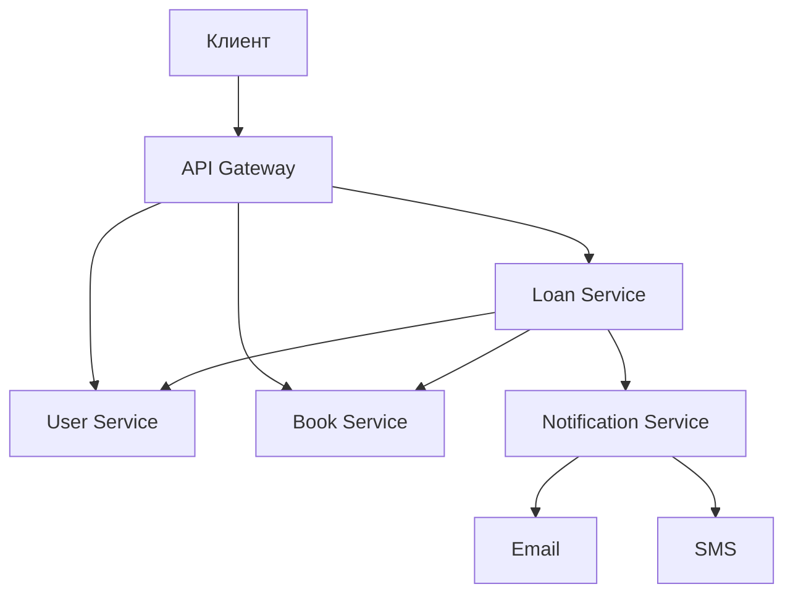
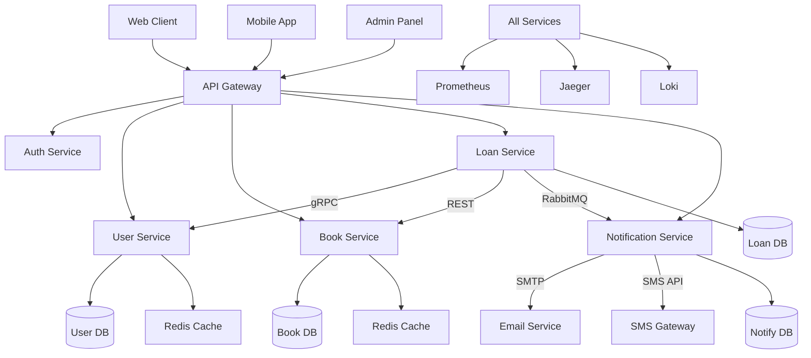

![[Pasted image 20250828233009.png]]

Отличная задача! Вот проекция библиотечной системы на микросервисную архитектуру на Go.

## Предлагаемая архитектура микросервисов

### 1. **User Service** (Сервис пользователей)
**Функционал:**
- Регистрация читателей
- Аутентификация/авторизация (JWT)
- Управление профилями пользователей
- История выданных книг

**API:**
```http
POST   /api/v1/users/register
POST   /api/v1/users/login
GET    /api/v1/users/{id}
PUT    /api/v1/users/{id}
DELETE /api/v1/users/{id}
```

### 2. **Book Service** (Сервис книг)
**Функционал:**
- Добавление/удаление книг из библиотеки
- Поиск и каталогизация книг
- Учет количества экземпляров
- Информация о книгах (метаданные)

**API:**
```http
GET    /api/v1/books
POST   /api/v1/books
GET    /api/v1/books/{id}
PUT    /api/v1/books/{id}
DELETE /api/v1/books/{id}
```

### 3. **Loan Service** (Сервис выдачи книг)
**Функционал:**
- Выдача книг читателям
- Прием возвращенных книг
- Продление аренды
- Учет сроков аренды
- Расчет штрафов за просрочку

**API:**
```http
POST   /api/v1/loans/issue
POST   /api/v1/loans/return
POST   /api/v1/loans/{id}/renew
GET    /api/v1/loans/user/{userId}
```

### 4. **Notification Service** (Сервис уведомлений)
**Функционал:**
- Уведомления о просрочках
- Напоминания о возврате
- Уведомления о доступности книг

## Взаимодействие микросервисов



## Технологический стек для Go

| Сервис | Основные пакеты |
|--------|-----------------|
| **API Gateway** | `gin`, `echo`, `http` |
| **User Service** | `jwt-go`, `bcrypt`, `gorm` |
| **Book Service** | `gorm`, `elasticsearch` |
| **Loan Service** | `gorm`, `cron` |
| **Communication** | `gRPC`, `RabbitMQ`, `Redis` |
| **Базы данных** | PostgreSQL, Redis |
| **Очереди** | RabbitMQ, Kafka |

## Пример реализации на Go

### User Service (фрагмент)
```go
// user_service/main.go
package main

import (
    "github.com/gin-gonic/gin"
    "gorm.io/gorm"
)

type User struct {
    gorm.Model
    Email    string `json:"email"`
    Password string `json:"-"`
    Name     string `json:"name"`
}

func main() {
    r := gin.Default()
    r.POST("/api/v1/users/register", registerHandler)
    r.POST("/api/v1/users/login", loginHandler)
    r.Run(":8081")
}

func registerHandler(c *gin.Context) {
    // Регистрация пользователя
}
```

### Loan Service (фрагмент)
```go
// loan_service/main.go
package main

import (
    "context"
    "github.com/gin-gonic/gin"
    "google.golang.org/grpc"
)

func main() {
    // gRPC клиент для User Service
    userConn, _ := grpc.Dial("user-service:8081", grpc.WithInsecure())
    defer userConn.Close()
    
    r := gin.Default()
    r.POST("/api/v1/loans/issue", issueBookHandler)
    r.Run(":8083")
}

func issueBookHandler(c *gin.Context) {
    // Проверка пользователя через gRPC
    // Проверка книги через HTTP REST
    // Создание записи о выдаче
}
```

## Важные моменты реализации

1. **API Gateway** - единая точка входа для клиентов
2. **Service Discovery** - consul или etcd для обнаружения сервисов
3. **Circuit Breaker** - паттерн для обработки сбоев
4. **Distributed Tracing** - Jaeger или Zipkin для мониторинга
5. **Metrics** - Prometheus для сбора метрик

## Docker Compose конфигурация

```yaml
version: '3'
services:
  api-gateway:
    build: ./api-gateway
    ports: ["8080:8080"]
  
  user-service:
    build: ./user-service
    ports: ["8081:8081"]
  
  book-service:
    build: ./book-service
    ports: ["8082:8082"]
  
  loan-service:
    build: ./loan-service
    ports: ["8083:8083"]
  
  postgres:
    image: postgres:13
    environment:
      POSTGRES_DB: library
```

Такая архитектура обеспечивает масштабируемость, отказоустойчивость и легкость поддержки системы.

# Детальная архитектура библиотечной системы на микросервисах (Go)

## Общая архитектурная схема



## Детальное описание микросервисов

### 1. **API Gateway** - Единая точка входа
**Назначение:** Маршрутизация, аутентификация, rate limiting, кеширование

**Технологии:**
- **Framework:** `gin-gonic/gin` или `labstack/echo`
- **Аутентификация:** `golang-jwt/jwt`
- **Кеширование:** `redis/go-redis`
- **Rate limiting:** `ulule/limiter`

**Конфигурация:**
```yaml
ports:
  - http: 8080
  - grpc: 9090
routes:
  - /api/v1/users/* -> user-service:8081
  - /api/v1/books/* -> book-service:8082
  - /api/v1/loans/* -> loan-service:8083
```

### 2. **Auth Service** - Сервис аутентификации
**Назначение:** JWT генерация/валидация, OAuth2, права доступа

**Технологии:**
- **JWT:** `golang-jwt/jwt`
- **Password hashing:** `golang.org/x/crypto/bcrypt`
- **Storage:** Redis для blacklist токенов

```go
// Пример middleware аутентификации
func AuthMiddleware() gin.HandlerFunc {
    return func(c *gin.Context) {
        tokenString := c.GetHeader("Authorization")
        // Валидация JWT
        claims, err := ValidateToken(tokenString)
        if err != nil {
            c.AbortWithStatus(401)
            return
        }
        c.Set("userID", claims.UserID)
        c.Next()
    }
}
```

### 3. **User Service** - Управление пользователями
**Функционал:** Регистрация, профили, история, роли

**Технологии:**
- **DB:** PostgreSQL + `jackc/pgx`
- **ORM:** `go-gorm/gorm`
- **Cache:** Redis

**API endpoints:**
```http
POST   /api/v1/users/register     # Регистрация
POST   /api/v1/users/login        # Логин
GET    /api/v1/users/{id}         # Профиль
PUT    /api/v1/users/{id}         # Обновление
GET    /api/v1/users/{id}/history # История книг
```

### 4. **Book Service** - Каталог книг
**Функционал:** CRUD книг, поиск, инвентаризация

**Технологии:**
- **DB:** PostgreSQL + Full-text search
- **Search:** ElasticSearch или `blevesearch/bleve`
- **Cache:** Redis для популярных книг

**Модель данных:**
```go
type Book struct {
    ID          uint      `json:"id" gorm:"primaryKey"`
    ISBN        string    `json:"isbn" gorm:"uniqueIndex"`
    Title       string    `json:"title"`
    Author      string    `json:"author"`
    Description string    `json:"description"`
    TotalCopies int       `json:"total_copies"`
    Available   int       `json:"available"`
    CreatedAt   time.Time `json:"created_at"`
}
```

### 5. **Loan Service** - Выдача и возврат книг
**Функционал:** Аренда, продление, штрафы, лимиты

**Технологии:**
- **DB:** PostgreSQL
- **gRPC:** `google.golang.org/grpc`
- **Messaging:** RabbitMQ с `streadway/amqp`

**Критическая бизнес-логика:**
```go
func (s *LoanService) IssueBook(userID, bookID uint) (*Loan, error) {
    // Проверка лимитов пользователя (gRPC к User Service)
    // Проверка доступности книги (REST к Book Service)
    // Создание записи о выдаче
    // Отправка уведомления (RabbitMQ)
}
```

### 6. **Notification Service** - Уведомления
**Функционал:** Email, SMS, push-уведомления

**Технологии:**
- **Email:** `go-mail/mail`
- **SMS:** Twilio API или SMSC
- **Queue:** RabbitMQ consumer

```go
func (s *NotificationService) StartConsumer() {
    msgs, _ := s.channel.Consume(
        "notifications",
        "",
        true,
        false,
        false,
        false,
        nil,
    )
    
    for msg := range msgs {
        var notification Notification
        json.Unmarshal(msg.Body, &notification)
        s.sendNotification(notification)
    }
}
```

## Технологический стек

### Базы данных
| Сервис | База данных | Драйвер |
|--------|-------------|---------|
| User Service | PostgreSQL | `jackc/pgx` |
| Book Service | PostgreSQL + ElasticSearch | `go-gorm/gorm` |
| Loan Service | PostgreSQL | `go-gorm/gorm` |
| Кеширование | Redis | `redis/go-redis` |

### Коммуникация
```yaml
Внутренняя коммуникация:
  - Синхронная: gRPC + protobuf
  - Асинхронная: RabbitMQ + JSON
  - Кеширование: Redis

Внешняя коммуникация:
  - REST API: JSON over HTTP
  - WebSocket: для real-time уведомлений
```

### Мониторинг и observability
```go
import (
    "github.com/prometheus/client_golang/prometheus"
    "go.opentelemetry.io/otel"
    "github.com/sirupsen/logrus"
)

// Metrics
var requestsCounter = prometheus.NewCounterVec(
    prometheus.CounterOpts{
        Name: "http_requests_total",
        Help: "Total HTTP requests",
    },
    []string{"method", "endpoint", "status"},
)

// Tracing
func handlerFunc(c *gin.Context) {
    tracer := otel.Tracer("loan-service")
    ctx, span := tracer.Start(c.Request.Context(), "IssueBook")
    defer span.End()
}
```

### Конфигурация и deployment
```yaml
# docker-compose.yml
version: '3.8'
services:
  api-gateway:
    build: ./api-gateway
    ports: ["8080:8080"]
    environment:
      - REDIS_URL=redis:6379
      - USER_SERVICE_URL=user-service:8081
    depends_on:
      - redis
      - user-service

  user-service:
    build: ./user-service
    environment:
      - DB_HOST=postgres
      - DB_PORT=5432
      - REDIS_URL=redis:6379
    depends_on:
      - postgres
      - redis

  postgres:
    image: postgres:14-alpine
    environment:
      POSTGRES_DB: library
      POSTGRES_USER: user
      POSTGRES_PASSWORD: pass

  redis:
    image: redis:7-alpine

  jaeger:
    image: jaegertracing/all-in-one:1.35
    ports: ["16686:16686"]
```

## Безопасность

1. **mTLS** между сервисами
2. **JWT** для аутентификации
3. **Rate limiting** на API Gateway
4. **Input validation** всех входящих данных
5. **SQL injection protection** через ORM/prepared statements

Такая архитектура обеспечивает высокую масштабируемость, отказоустойчивость и легкость разработки отдельных компонентов системы.

Отличный вопрос! В микросервисной архитектуре коммуникация между сервисами — это критически важная составляющая. Вот подробное описание, **как именно микросервисы в предложенной архитектуре будут общаться друг с другом**.

---

## 1. Синхронное взаимодействие (REST и gRPC)

Используется, когда сервису **немедленно** нужен ответ от другого сервиса для продолжения работы.

### a) **REST API (HTTP/JSON)**
**Для чего:** Общедоступные, простые запросы, где человекочитаемость или простота интеграции важнее скорости.

*   **Пример: `Loan Service` -> `Book Service`**
    *   **Сценарий:** При выдаче книги нужно проверить, доступна ли она.
    *   **Запрос:** `Loan Service` делает HTTP GET запрос к `Book Service`.
    *   **Эндпоинт:** `GET http://book-service:8082/api/v1/books/{id}`
    *   **Ответ (JSON):**
        ```json
        {
          "id": 123,
          "title": "The Go Programming Language",
          "available": 5,
          "total_copies": 10
        }
        ```
    *   **Технологии в Go:** Стандартная библиотека `net/http` или фреймворки типа `Gin`, `Echo`.

### b) **gRPC (HTTP/2 + Protobuf)**
**Для чего:** Внутренняя высокопроизводительная коммуникация, особенно когда важны низкие задержки и эффективность.

*   **Пример: `Loan Service` -> `User Service`**
    *   **Сценарий:** При выдаче книги нужно проверить, не превысил ли пользователь лимит на книг и нет ли у него просрочек. Это сложный запрос, требующий быстрого ответа.
    *   **Как это работает:**
        1.  **Определение контракта:** Создается файл `.proto`, описывающий методы и структуры данных.
            ```protobuf
            // user_service.proto
            syntax = "proto3";
            package user;

            service UserService {
              rpc GetUserLoanInfo (UserRequest) returns (UserLoanInfo) {}
            }

            message UserRequest {
              uint32 user_id = 1;
            }

            message UserLoanInfo {
              uint32 active_loans_count = 1;
              bool has_overdue = 2;
              uint32 max_loan_limit = 3;
            }
            ```
        2.  **Генерация кода:** Компилятор `protoc` генерирует Go-код для клиента и сервера из `.proto` файла.
        3.  **Вызов:** `Loan Service` (клиент) вызывает сгенерированный метод `GetUserLoanInfo` как локальную функцию, а под капотом gRPC отправляет бинарное сообщение `UserService` (серверу).
    *   **Преимущество:** В разы быстрее JSON, поддерживает двунаправленные потоковые соединения.

---

## 2. Асинхронное взаимодействие (через брокер сообщений)

Используется, когда не требуется немедленный ответ. Сервис отправляет сообщение ("событие") в очередь и продолжает работу. Другие сервисы обрабатывают это сообщение, когда смогут.

**Технологии:** **RabbitMQ** (или **Kafka**) + библиотека `streadway/amqp`.

### a) **Команды (Commands)**
**Для чего:** Выполнение действия в другом сервисе.

*   **Пример: `Loan Service` -> `Notification Service`**
    *   **Сценарий:** После успешной выдачи книги нужно отправить email-подтверждение.
    *   **Как это работает:**
        1.  `Loan Service` публикует сообщение в очередь `notifications.email`:
            ```json
            // Сообщение в очереди
            {
              "type": "loan_issued",
              "user_id": 456,
              "user_email": "reader@example.com",
              "book_title": "The Go Programming Language",
              "due_date": "2023-12-01"
            }
            ```
        2.  `Loan Service` немедленно возвращает ответ пользователю, не дожидаясь отправки email.
        3.  `Notification Service` постоянно "слушает" (consumes) очередь `notifications.email`. Как только появляется новое сообщение, он его забирает, формирует и отправляет письмо.

### b) **События (Events)**
**Для чего:** Уведомить другие сервисы о том, что что-то произошло. Сервис-источник не знает и не cares о том, кто воспользуется этим событием.

*   **Пример: `Book Service` -> (Все подписчики)**
    *   **Сценарий:** В библиотеку добавили новую книгу популярного автора. Нужно уведомить всех пользователей, которые были в "листе ожидания" на этого автора.
    *   **Как это работает:**
        1.  `Book Service` публикует событие в обменник (exchange) `book.events` с темой `book.added`:
            ```json
            {
              "event_type": "book.added",
              "book_id": 789,
              "author": "Donovan & Kernighan",
              "title": "The Go Programming Language"
            }
            ```
        2.  **Сервис Уведомлений (`Notification Service`)** уже создал для себя очередь и привязал ее к обменнику `book.events` с фильтром по теме `book.added`. Он получит это сообщение и разошлет email-анонсы.
        3.  **Сервис Аналитики (если появится в будущем)** может так же подписаться на это событие, чтобы строить графики популярности авторов.

---

## 3. Service Discovery

**Проблема:** Жестко прописать в коде `http://book-service:8082` — это плохо. Что если адрес изменится? Как масштабировать сервис на несколько инстансов?

**Решение:** Сервисы не знают точных адресов друг друга. Они находят их через **Service Discovery**.

*   **Как это работает в Kubernetes (наиболее частый случай):**
    1.  Каждый сервис при старте регистрируется в **встроенном DNS**.
    2.  `Loan Service` делает запрос не на `http://book-service:8082`, а на `http://book-service.default.svc.cluster.local:8082`.
    3.  Внутренний DNS Kubernetes знает все IP-адреса подов (контейнеров), на которых запущен `book-service`, и выполняет **балансировку нагрузки** между ними.

*   **Как это работает с отдельными инструментами (Consul, etcd):**
    1.  Сервисы при старте регистрируются в **Consul**.
    2.  Сервис-потребитель спрашивает у Consul: "Где мне найти `book-service`?"
    3.  Consul возвращает список доступных и здоровых инстансов.
    4.  Сервис-потребитель кэширует этот список и обращается к ним напрямую (или через sidecar-прокси like **Consul Connect**).

---

## Итоговая схема коммуникации для ключевого сценария "Выдача книги"

```mermaid
sequenceDiagram
    participant C as Client (UI)
    participant G as API Gateway
    participant L as Loan Service
    participant U as User Service (gRPC)
    participant B as Book Service (REST)
    participant Q as RabbitMQ
    participant N as Notification Service

    C->>G: POST /api/v1/loans {book_id}
    G->>L: Запрос на выдачу книги
    Note over L,U: Синхронный gRPC вызов
    L->>U: GetUserLoanInfo(user_id)
    U-->>L: {active_loans: 2, has_overdue: false}
    Note over L,B: Синхронный REST вызов
    L->>B: GET /api/v1/books/{book_id}
    B-->>L: {title: "...", available: 5}
    L->>L: Валидация бизнес-правил
    L->>L: Сохранение в своей БД
    Note over L,Q,N: Асинхронное сообщение
    L->>Q: Publish "loan_issued" event
    Q-->>N: Consume message
    N->>N: Send email
    L-->>G: 201 Created
    G-->>C: Книга успешно выдана!
```

Таким образом, комбинация **синхронных (REST/gRPC)** и **асинхронных (очереди)** взаимодействий позволяет построить отказчивую, производительную и масштабируемую систему.